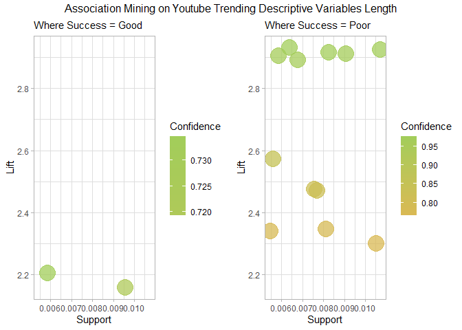
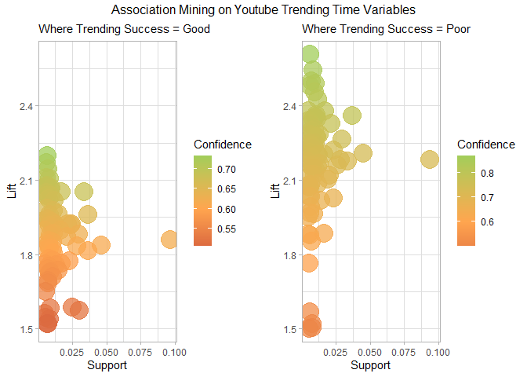
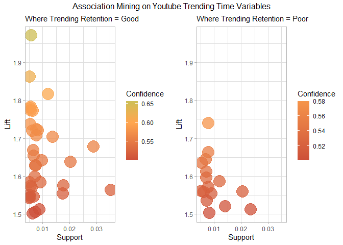
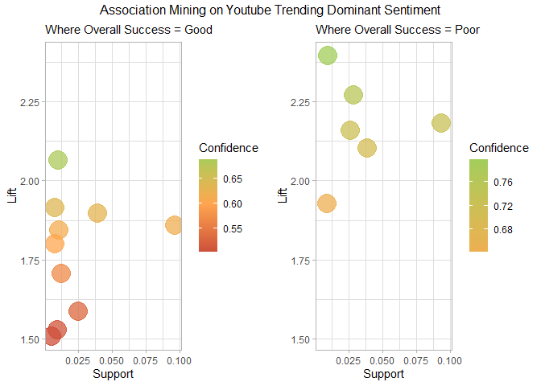
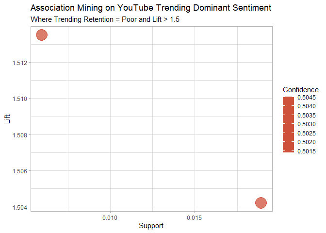
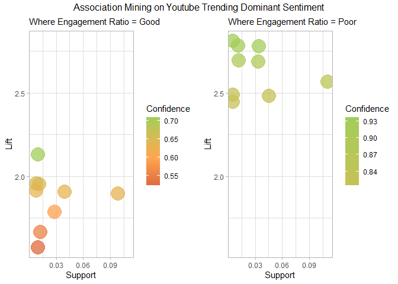
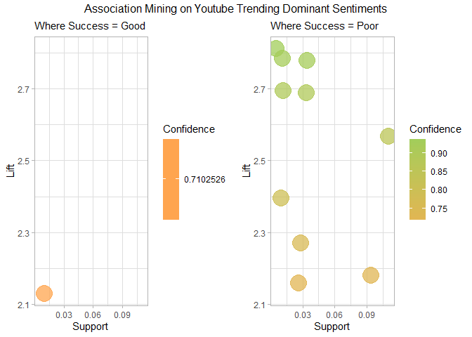

Association Mining
================
Alina Hagen
2025-07-29

## Data and Text Mining Final Project: Maximizing Success on YouTube’s Trending Page: Content Optimization Strategies Based on Analysis of the Top 200 Videos Over the Last Four Years

**Topic:** Success Factors on YouTube Trending Videos

**Question:** What are common trends among the top trending YouTube
videos in the US, and how do different factors impact their success on
the trending page?

**Goal:** To analyze data from each day’s top 200 trending YouTube
videos from August 2020 to April 2024 and identify success factors among
the most successful videos in the U.S. This analysis will evaluate a
video’s success on the trending page based on the following success
metrics:

- *Engagement Ratio:* The total audience interaction (sum of comments,
  likes, and dislikes) relative to the view count as recorded on the
  final day the video appears on the trending list (representing the
  highest engagement level captured in the dataset)

- *Trending Speed:* How long a video took to reach the trending page

- *Trending Retention:* How long a video remains on the trending page

------------------------------------------------------------------------

## Section 3.1: Association Mining Data Prep

The arules algorithm works best with categorical data, therefore, for
this section of the project, success metrics had to be classified into
categorical values to enable meaningful association mining. This
analysis used Tertile-Based Categorization due to the large amount of
outliers identified in each success metric in Section 1.5

    ## 'Good' represents top-performing metrics, 'Mid' represents mixed success, and 'Poor' represents low performance.
    ##  
    ## For each of the success metrics, the following guidelines are used:
    ##  - 'days_until_trending': The lower this metric, the better. A shorter time to trend is preferred.
    ##  - 'trending_retention': The higher this metric, the better. Videos that remain trending for a longer period are more successful.
    ##  - 'engagement_ratio': The higher this metric, the better. High engagement indicates better viewer interaction.
    ##  
    ## To calculate the overall success of each video relative to the dataset, all success metrics are normalized and then an equally weighted sum is computed. This aggregate score allows for the classification of videos based on their overall performance and can be used to identify associations between various factors and overall success.
    ##  
    ## **Note**: It should be noted that while some videos are categorized as having 'Poor' success, all videos in this dataset did reach the YouTube Trending page. Therefore, the 'Poor' success classification is relative to other successful trending videos and does not imply failure to trend.

``` r
# Determining what the cutoffs for the Tertitle categorization
tertile_cutoffs_speed <- quantile(unique_video_data$days_until_trending, probs = c(0, 1/3, 2/3, 1))
print(tertile_cutoffs_speed)
```

    ##        0% 33.33333% 66.66667%      100% 
    ##         0         1         2        28

``` r
tertile_cutoffs_reten <- quantile(unique_video_data$trending_retention, probs = c(0, 1/3, 2/3, 1))
print(tertile_cutoffs_reten)
```

    ##        0% 33.33333% 66.66667%      100% 
    ##         1         5         6        37

``` r
tertile_cutoffs_engage <- quantile(unique_video_data$engagement_ratio, probs = c(0, 1/3, 2/3, 1))
print(tertile_cutoffs_engage)
```

    ##         0%  33.33333%  66.66667%       100% 
    ## 0.00000000 0.04130532 0.07651958 0.56947307

``` r
arules_df <- unique_video_data %>%
  mutate(
    # Create categories based on Tertiles
    days_until_trending_category = ntile(days_until_trending, 3),
    trending_retention_category = ntile(trending_retention, 3),
    engagement_ratio_category = ntile(engagement_ratio, 3),
    
    # Recode categories into descriptive labels
    days_until_trending_category = case_when(
      days_until_trending_category == 1 ~ "Good",
      days_until_trending_category == 2 ~ "Mid", 
      days_until_trending_category == 3 ~ "Poor"),
    trending_retention_category = case_when(
      trending_retention_category == 1 ~ "Poor", 
      trending_retention_category == 2 ~ "Mid", 
      trending_retention_category == 3 ~ "Good"),
    engagement_ratio_category = case_when(
      engagement_ratio_category == 1 ~ "Poor", 
      engagement_ratio_category == 2 ~ "Mid", 
      engagement_ratio_category == 3 ~ "Good"),
    
    # Normalize the metrics
    days_until_trending_scaled = (1 - (days_until_trending / 
                                        max(days_until_trending, na.rm = TRUE))),
    trending_retention_scaled = (trending_retention / max(trending_retention, na.rm = TRUE)),
    engagement_ratio_scaled = (engagement_ratio / max(engagement_ratio, na.rm = TRUE)),
    
    # Calculate success score into a single variable, giving equal weight to all success metrics
    success_score = (1/3) * days_until_trending_scaled + 
                    (1/3) * trending_retention_scaled + 
                    (1/3) * engagement_ratio_scaled
  ) %>%
  mutate(
    # Categorize overall success based on the success score
    overall_success = ntile(success_score, 3),
    overall_success = case_when(
      overall_success == 1 ~ "Poor",
      overall_success == 2 ~ "Mid", 
      overall_success == 3 ~ "Good")
  )


# Initialize the final rules tables data.frame
Good.rules_table <- data.frame( 
  rules =character(),
  support = numeric(),
  confidence = numeric(),
  coverage = numeric(),
  lift = numeric(),
  count = integer()
)[0, ]

Poor.rules_table <- data.frame( 
  rules =character(),
  support = numeric(),
  confidence = numeric(),
  coverage = numeric(),
  lift = numeric(),
  count = integer()
)[0, ]

# Intialize a function to facilitate rules plotting
am_plot <- function(df1, df2, metric, eval1, eval2, test) {
  a <- min(df1$support, df2$support)
  b = max(df1$support, df2$support)
   
  c <- min(df1$lift, df2$lift)
  d <- max(df1$lift, df2$lift)
  
  p1 <- ggplot(df1, aes(x = support, y = lift, color = confidence)) +
    geom_point(size = 8, alpha = 0.75) +  # Adjusted size for better visualization
    scale_color_gradient2(low = "tomato3", mid = "tan1", high = "darkolivegreen3", 
                          midpoint = 0.6, name = "Confidence") + 
    theme_light() +
    labs(
      x = "Support",
      y = "Lift",
      subtitle = paste("Where", metric,  "=", eval1)) +
    xlim(a,b) + ylim(c,d)
  
  p2 <- ggplot(df2, aes(x = support, y = lift, color = confidence)) +
    geom_point(size = 8, alpha = 0.75) +  # Adjusted size for better visualization
    scale_color_gradient2(low = "tomato3", mid = "tan1", high = "darkolivegreen3", 
                          midpoint = 0.6, name = "Confidence") + 
    theme_light() +
    labs(
      x = "Support",
      y = "Lift",
      subtitle = paste("Where", metric,  "=", eval2)) +
    xlim(a,b) + ylim(c,d)
  
  p <- grid.arrange(
    p1, p2, 
    ncol = 2,
    top = textGrob(paste("Association Mining on Youtube Trending", test))
    )
 
  return(p)
}

# Initialize a function to clean the outputted rules tables
clean_rules_tables <- function (df) {
  metrics <- c("overall_success", "days_until_trending_category", "trending_retention_category", "engagement_ratio_category")
  
df <- df %>%
  mutate(
    # Create a new column that reports the channel category of each rule
    category = map_chr(rules, ~ {
      # Check for matches of category_name phrases in the 'rules' text
       matched_phrase <- purrr::detect(category_name, function(cat) str_detect(.x, fixed(cat)))
      # If a match is found, return it; otherwise, return NA
      ifelse(length(matched_phrase) > 0, matched_phrase, NA_character_)
    }),
    metric = map_chr(rules, ~ {
      matched_phrase <- purrr::detect(metrics, function(cat) str_detect(.x, fixed(cat)))
      ifelse(length(matched_phrase) > 0, matched_phrase, NA_character_)
    })
  ) %>%
  group_by(category, metric) %>%
  slice_max(order_by = confidence, n = 3) %>%
  filter(confidence > 0.7) %>%
  arrange(category, desc(confidence))

return(df)
}
```

## Section 3.2: Length of User Set Descriptive Variables Associations

Are the lengths of user set descriptive variables (title, description,
and tags) associated with better success metrics?

Data Prep and Function Creation:

``` r
# Calculate the number of tags and categorize tag usage without expanding rows
am.1_df <- arules_df %>%
  mutate(
    # Calculate the number of tags for each video (count of comma-separated tags)
    tag_usage = str_count(tags, ",") + 1,  # str_count counts commas, add 1 for the number of tags
    tag_usage_category = ntile(tag_usage, 3)  # Create categories based on tag usage
  ) %>%
  mutate(
    tag_usage_category = case_when(
      is.na(tag_usage_category) ~ "No Tags Used",  # If no tags used
      tag_usage_category == 1 ~ "Low", 
      tag_usage_category == 2 ~ "Mid", 
      tag_usage_category == 3 ~ "High"
    )
  ) %>%
  # Calculate title and description lengths, then categorize them
  mutate(
    title_length = nchar(title),
    description_length = nchar(description),
    title_length_category = ntile(title_length, 3),  
    description_length_category = ntile(description_length, 3)
  ) %>%
  mutate(
    title_length_category = case_when(
      title_length_category == 1 ~ "Short",
      title_length_category == 2 ~ "Mid", 
      title_length_category == 3 ~ "Long"
    ),
    description_length_category = case_when(
      is.na(description_length) ~ "No Description",  # If no description provided
      description_length_category == 1 ~ "Short",
      description_length_category == 2 ~ "Mid", 
      description_length_category == 3 ~ "Long"
    )
  ) %>%
  # Select only relevant columns for the final output
  select(category_name, tag_usage, tag_usage_category, title_length, title_length_category, description_length, description_length_category, overall_success, days_until_trending_category, trending_retention_category,engagement_ratio_category)

# Determining what the cutoffs for the Tertitle categorization
tertile_cutoffs_tags <- quantile(am.1_df$tag_usage, probs = c(0, 1/3, 2/3, 1), na.rm = TRUE)
# Low Tag Usage = 1 - 13 Tags
# High Tag Usage = 24 - 78 Tags

tertile_cutoffs_title <- quantile(am.1_df$title_length, probs = c(0, 1/3, 2/3, 1), na.rm = TRUE)
# Short Titles = 1 - 40 Characters 
# Long Titles = 57 - 124 Characters

tertile_cutoffs_description <- quantile(am.1_df$description_length, probs = c(0, 1/3, 2/3, 1), na.rm = TRUE)
# Short Descriptions = 2 - 513 Characters 
# Long Descriptions = 1086 - 5072 Characters


length_mining <- function(metric, eval) {
  df <-  am.1_df %>%
    select(category_name, tag_usage_category, title_length_category,
           description_length_category, metric)  
  
  # Convert the data frame into a transactions object
  transactions <- as(df, "transactions")
  
  rhs = paste0(metric, "=", eval)
  
  # Generate association rules using the apriori algorithm
  rules <- apriori(
    transactions,
    parameter = list(support = 0.005, confidence = 0.5),
    appearance = list(default = "lhs", rhs = rhs)
  )
  
  if (length(rules) == 0) {
    return("There are no rules for this metric")
  }
  
  # Convert rules to data frame, filter by lift > 2, and arrange them by descending lift
  rules_df <- as(rules, "data.frame") %>%
    filter(lift > 1.5) %>%
    arrange(desc(lift))
  
  if (nrow(rules_df) == 0) {
    return("There are no rules with a lift higher than 2 for this metric")
  }
  
  return(rules_df)
}
```

Overall Success:

``` r
length_overall_success <- length_mining("overall_success", "Good")
inverse.length_overall_success <- length_mining("overall_success", "Poor")
```

``` r
am_plot(length_overall_success, inverse.length_overall_success,"Trending Success", "Good", "Poor", "Descriptive Variable Lengths")
```

<!-- -->

    ## TableGrob (2 x 2) "arrange": 3 grobs
    ##   z     cells    name                grob
    ## 1 1 (2-2,1-1) arrange      gtable[layout]
    ## 2 2 (2-2,2-2) arrange      gtable[layout]
    ## 3 3 (1-1,1-2) arrange text[GRID.text.966]

``` r
Good.rules_table <- bind_rows(Good.rules_table, length_overall_success,)
Poor.rules_table <- bind_rows(Poor.rules_table, inverse.length_overall_success)
```

Trending Speed:

``` r
length_speed_success <- length_mining("days_until_trending_category", "Good")
inverse.length_speed_success <- length_mining("days_until_trending_category", "Poor")
```

``` r
print(length_speed_success)
```

    ## [1] "There are no rules for this metric"

``` r
print(inverse.length_speed_success)
```

    ## [1] "There are no rules for this metric"

Trending Retention:

``` r
length_retention_success <- length_mining("trending_retention_category", "Good")
inverse.length_retention_success <- length_mining("trending_retention_category", "Poor")
```

``` r
print(length_retention_success)
```

    ## [1] "There are no rules for this metric"

``` r
ggplot(inverse.length_retention_success, aes(x = support, y = lift, color = confidence)) +
    geom_point(size = 8, alpha = 0.75) +  # Adjusted size for better visualization
    scale_color_gradient2(low = "tomato3", mid = "tan1", high = "darkolivegreen3", 
                          midpoint = 0.6, name = "Confidence") + 
    theme_light() +
    labs(
      title = "Association Mining on Youtube Trending Descriptive Variable Lengths",
      x = "Support",
      y = "Lift",
      subtitle = paste("Where Trending Retention = Poor and Lift > 1.5")) 
```

<!-- -->

``` r
Poor.rules_table <- bind_rows(Poor.rules_table, inverse.length_retention_success)
```

Engagement Ratio:

``` r
length_engage_success <- length_mining("engagement_ratio_category", "Good")
inverse.length_engage_success <- length_mining("engagement_ratio_category", "Poor")
```

``` r
am_plot(length_engage_success, inverse.length_engage_success,"Engagement Ratio", "Good", "Poor", "Descriptive Variable Lengths")
```

<!-- -->

    ## TableGrob (2 x 2) "arrange": 3 grobs
    ##   z     cells    name                 grob
    ## 1 1 (2-2,1-1) arrange       gtable[layout]
    ## 2 2 (2-2,2-2) arrange       gtable[layout]
    ## 3 3 (1-1,1-2) arrange text[GRID.text.1125]

``` r
Good.rules_table <- bind_rows(Good.rules_table, length_engage_success)
Poor.rules_table <- bind_rows(Poor.rules_table, inverse.length_engage_success)
```

Final Rules Table for Descriptive Variable Lengths

``` r
length_rules_good <- Good.rules_table
length_rules_poor <- Poor.rules_table

length_rules_good <- clean_rules_tables(length_rules_good)
length_rules_poor <- clean_rules_tables(length_rules_poor)

mean(length_rules_good$confidence) 
```

    ## [1] 0.7270231

``` r
mean(length_rules_poor$confidence)
```

    ## [1] 0.8883277

<!-- -->

    ## TableGrob (2 x 2) "arrange": 3 grobs
    ##   z     cells    name                 grob
    ## 1 1 (2-2,1-1) arrange       gtable[layout]
    ## 2 2 (2-2,2-2) arrange       gtable[layout]
    ## 3 3 (1-1,1-2) arrange text[GRID.text.1230]

<table class="table table-striped table-hover table-condensed" style="color: black; width: auto !important; margin-left: auto; margin-right: auto;">

<caption>

Length of Descriptive Varibales *Good* Success Rules
</caption>

<thead>

<tr>

<th style="text-align:left;font-weight: bold;background-color: rgba(245, 245, 245, 255) !important;">

rules
</th>

<th style="text-align:right;font-weight: bold;background-color: rgba(245, 245, 245, 255) !important;">

support
</th>

<th style="text-align:right;font-weight: bold;background-color: rgba(245, 245, 245, 255) !important;">

confidence
</th>

<th style="text-align:right;font-weight: bold;background-color: rgba(245, 245, 245, 255) !important;">

coverage
</th>

<th style="text-align:right;font-weight: bold;background-color: rgba(245, 245, 245, 255) !important;">

lift
</th>

<th style="text-align:right;font-weight: bold;background-color: rgba(245, 245, 245, 255) !important;">

count
</th>

<th style="text-align:left;font-weight: bold;background-color: rgba(245, 245, 245, 255) !important;">

category
</th>

<th style="text-align:left;font-weight: bold;background-color: rgba(245, 245, 245, 255) !important;">

metric
</th>

</tr>

</thead>

<tbody>

<tr>

<td style="text-align:left;width: 3cm; font-weight: bold;">

{category_name=Comedy,tag_usage_category=Low,title_length_category=Short}
=\> {engagement_ratio_category=Good}
</td>

<td style="text-align:right;width: 2cm; ">

0.0058781
</td>

<td style="text-align:right;width: 2cm; ">

0.7347480
</td>

<td style="text-align:right;width: 2cm; ">

0.0080002
</td>

<td style="text-align:right;width: 2cm; ">

2.204244
</td>

<td style="text-align:right;width: 2cm; ">

277
</td>

<td style="text-align:left;width: 2cm; ">

Comedy
</td>

<td style="text-align:left;width: 2cm; ">

engagement_ratio_category
</td>

</tr>

<tr>

<td style="text-align:left;width: 3cm; font-weight: bold;">

{category_name=Music,title_length_category=Short,description_length_category=Long}
=\> {engagement_ratio_category=Good}
</td>

<td style="text-align:right;width: 2cm; ">

0.0095705
</td>

<td style="text-align:right;width: 2cm; ">

0.7192982
</td>

<td style="text-align:right;width: 2cm; ">

0.0133053
</td>

<td style="text-align:right;width: 2cm; ">

2.157895
</td>

<td style="text-align:right;width: 2cm; ">

451
</td>

<td style="text-align:left;width: 2cm; ">

Music
</td>

<td style="text-align:left;width: 2cm; ">

engagement_ratio_category
</td>

</tr>

</tbody>

</table>

<table class="table table-striped table-hover table-condensed" style="color: black; width: auto !important; margin-left: auto; margin-right: auto;">

<caption>

Length of Descriptive Variables *Poor* Success Rules
</caption>

<thead>

<tr>

<th style="text-align:left;font-weight: bold;background-color: rgba(245, 245, 245, 255) !important;">

rules
</th>

<th style="text-align:right;font-weight: bold;background-color: rgba(245, 245, 245, 255) !important;">

support
</th>

<th style="text-align:right;font-weight: bold;background-color: rgba(245, 245, 245, 255) !important;">

confidence
</th>

<th style="text-align:right;font-weight: bold;background-color: rgba(245, 245, 245, 255) !important;">

coverage
</th>

<th style="text-align:right;font-weight: bold;background-color: rgba(245, 245, 245, 255) !important;">

lift
</th>

<th style="text-align:right;font-weight: bold;background-color: rgba(245, 245, 245, 255) !important;">

count
</th>

<th style="text-align:left;font-weight: bold;background-color: rgba(245, 245, 245, 255) !important;">

category
</th>

<th style="text-align:left;font-weight: bold;background-color: rgba(245, 245, 245, 255) !important;">

metric
</th>

</tr>

</thead>

<tbody>

<tr>

<td style="text-align:left;width: 3cm; font-weight: bold;">

{category_name=News &
Politics,title_length_category=Long,description_length_category=Mid} =\>
{engagement_ratio_category=Poor}
</td>

<td style="text-align:right;width: 2cm; ">

0.0082548
</td>

<td style="text-align:right;width: 2cm; ">

0.9725000
</td>

<td style="text-align:right;width: 2cm; ">

0.0084882
</td>

<td style="text-align:right;width: 2cm; ">

2.917500
</td>

<td style="text-align:right;width: 2cm; ">

389
</td>

<td style="text-align:left;width: 2cm; ">

News & Politics
</td>

<td style="text-align:left;width: 2cm; ">

engagement_ratio_category
</td>

</tr>

<tr>

<td style="text-align:left;width: 3cm; font-weight: bold;">

{category_name=News &
Politics,tag_usage_category=Low,description_length_category=Mid} =\>
{engagement_ratio_category=Poor}
</td>

<td style="text-align:right;width: 2cm; ">

0.0058781
</td>

<td style="text-align:right;width: 2cm; ">

0.9685315
</td>

<td style="text-align:right;width: 2cm; ">

0.0060691
</td>

<td style="text-align:right;width: 2cm; ">

2.905594
</td>

<td style="text-align:right;width: 2cm; ">

277
</td>

<td style="text-align:left;width: 2cm; ">

News & Politics
</td>

<td style="text-align:left;width: 2cm; ">

engagement_ratio_category
</td>

</tr>

<tr>

<td style="text-align:left;width: 3cm; font-weight: bold;">

{category_name=News &
Politics,tag_usage_category=Low,title_length_category=Long,description_length_category=Short}
=\> {engagement_ratio_category=Poor}
</td>

<td style="text-align:right;width: 2cm; ">

0.0067694
</td>

<td style="text-align:right;width: 2cm; ">

0.9637462
</td>

<td style="text-align:right;width: 2cm; ">

0.0070240
</td>

<td style="text-align:right;width: 2cm; ">

2.891239
</td>

<td style="text-align:right;width: 2cm; ">

319
</td>

<td style="text-align:left;width: 2cm; ">

News & Politics
</td>

<td style="text-align:left;width: 2cm; ">

engagement_ratio_category
</td>

</tr>

<tr>

<td style="text-align:left;width: 3cm; font-weight: bold;">

{category_name=News &
Politics,tag_usage_category=Low,description_length_category=Short} =\>
{overall_success=Poor}
</td>

<td style="text-align:right;width: 2cm; ">

0.0081275
</td>

<td style="text-align:right;width: 2cm; ">

0.7816327
</td>

<td style="text-align:right;width: 2cm; ">

0.0103981
</td>

<td style="text-align:right;width: 2cm; ">

2.344898
</td>

<td style="text-align:right;width: 2cm; ">

383
</td>

<td style="text-align:left;width: 2cm; ">

News & Politics
</td>

<td style="text-align:left;width: 2cm; ">

overall_success
</td>

</tr>

<tr>

<td style="text-align:left;width: 3cm; font-weight: bold;">

{category_name=News &
Politics,tag_usage_category=Low,title_length_category=Long,description_length_category=Short}
=\> {overall_success=Poor}
</td>

<td style="text-align:right;width: 2cm; ">

0.0054749
</td>

<td style="text-align:right;width: 2cm; ">

0.7794562
</td>

<td style="text-align:right;width: 2cm; ">

0.0070240
</td>

<td style="text-align:right;width: 2cm; ">

2.338369
</td>

<td style="text-align:right;width: 2cm; ">

258
</td>

<td style="text-align:left;width: 2cm; ">

News & Politics
</td>

<td style="text-align:left;width: 2cm; ">

overall_success
</td>

</tr>

<tr>

<td style="text-align:left;width: 3cm; font-weight: bold;">

{category_name=News &
Politics,tag_usage_category=Low,title_length_category=Long} =\>
{overall_success=Poor}
</td>

<td style="text-align:right;width: 2cm; ">

0.0105254
</td>

<td style="text-align:right;width: 2cm; ">

0.7666151
</td>

<td style="text-align:right;width: 2cm; ">

0.0137297
</td>

<td style="text-align:right;width: 2cm; ">

2.299845
</td>

<td style="text-align:right;width: 2cm; ">

496
</td>

<td style="text-align:left;width: 2cm; ">

News & Politics
</td>

<td style="text-align:left;width: 2cm; ">

overall_success
</td>

</tr>

<tr>

<td style="text-align:left;width: 3cm; font-weight: bold;">

{category_name=Sports,tag_usage_category=No Tags
Used,title_length_category=Long,description_length_category=Short} =\>
{engagement_ratio_category=Poor}
</td>

<td style="text-align:right;width: 2cm; ">

0.0063874
</td>

<td style="text-align:right;width: 2cm; ">

0.9772727
</td>

<td style="text-align:right;width: 2cm; ">

0.0065359
</td>

<td style="text-align:right;width: 2cm; ">

2.931818
</td>

<td style="text-align:right;width: 2cm; ">

301
</td>

<td style="text-align:left;width: 2cm; ">

Sports
</td>

<td style="text-align:left;width: 2cm; ">

engagement_ratio_category
</td>

</tr>

<tr>

<td style="text-align:left;width: 3cm; font-weight: bold;">

{category_name=Sports,tag_usage_category=Mid,title_length_category=Long,description_length_category=Long}
=\> {engagement_ratio_category=Poor}
</td>

<td style="text-align:right;width: 2cm; ">

0.0107164
</td>

<td style="text-align:right;width: 2cm; ">

0.9749035
</td>

<td style="text-align:right;width: 2cm; ">

0.0109923
</td>

<td style="text-align:right;width: 2cm; ">

2.924710
</td>

<td style="text-align:right;width: 2cm; ">

505
</td>

<td style="text-align:left;width: 2cm; ">

Sports
</td>

<td style="text-align:left;width: 2cm; ">

engagement_ratio_category
</td>

</tr>

<tr>

<td style="text-align:left;width: 3cm; font-weight: bold;">

{category_name=Sports,tag_usage_category=Low,title_length_category=Long,description_length_category=Mid}
=\> {engagement_ratio_category=Poor}
</td>

<td style="text-align:right;width: 2cm; ">

0.0090824
</td>

<td style="text-align:right;width: 2cm; ">

0.9705215
</td>

<td style="text-align:right;width: 2cm; ">

0.0093583
</td>

<td style="text-align:right;width: 2cm; ">

2.911565
</td>

<td style="text-align:right;width: 2cm; ">

428
</td>

<td style="text-align:left;width: 2cm; ">

Sports
</td>

<td style="text-align:left;width: 2cm; ">

engagement_ratio_category
</td>

</tr>

<tr>

<td style="text-align:left;width: 3cm; font-weight: bold;">

{category_name=Sports,tag_usage_category=No Tags
Used,title_length_category=Long,description_length_category=Short} =\>
{overall_success=Poor}
</td>

<td style="text-align:right;width: 2cm; ">

0.0056022
</td>

<td style="text-align:right;width: 2cm; ">

0.8571429
</td>

<td style="text-align:right;width: 2cm; ">

0.0065359
</td>

<td style="text-align:right;width: 2cm; ">

2.571429
</td>

<td style="text-align:right;width: 2cm; ">

264
</td>

<td style="text-align:left;width: 2cm; ">

Sports
</td>

<td style="text-align:left;width: 2cm; ">

overall_success
</td>

</tr>

<tr>

<td style="text-align:left;width: 3cm; font-weight: bold;">

{category_name=Sports,tag_usage_category=Low,title_length_category=Long,description_length_category=Short}
=\> {overall_success=Poor}
</td>

<td style="text-align:right;width: 2cm; ">

0.0075758
</td>

<td style="text-align:right;width: 2cm; ">

0.8244804
</td>

<td style="text-align:right;width: 2cm; ">

0.0091885
</td>

<td style="text-align:right;width: 2cm; ">

2.473441
</td>

<td style="text-align:right;width: 2cm; ">

357
</td>

<td style="text-align:left;width: 2cm; ">

Sports
</td>

<td style="text-align:left;width: 2cm; ">

overall_success
</td>

</tr>

<tr>

<td style="text-align:left;width: 3cm; font-weight: bold;">

{category_name=Sports,tag_usage_category=Low,title_length_category=Long,description_length_category=Mid}
=\> {overall_success=Poor}
</td>

<td style="text-align:right;width: 2cm; ">

0.0077031
</td>

<td style="text-align:right;width: 2cm; ">

0.8231293
</td>

<td style="text-align:right;width: 2cm; ">

0.0093583
</td>

<td style="text-align:right;width: 2cm; ">

2.469388
</td>

<td style="text-align:right;width: 2cm; ">

363
</td>

<td style="text-align:left;width: 2cm; ">

Sports
</td>

<td style="text-align:left;width: 2cm; ">

overall_success
</td>

</tr>

</tbody>

</table>

    ## 
    ## **Association Rules Analysis**
    ##  Descriptive Variable Length Categories were categorize based on the following Tertile Categorization: 
    ##  - Low Tag Usage = 1 - 13 Tags
    ##  - High Tag Usage = 24 - 78 Tags
    ##  - Short Titles = 1 - 40 Characters 
    ##  - Long Titles = 57 - 124 Characters
    ##  - Short Descriptions = 2 - 513 Characters 
    ##  - Long Descriptions = 1086 - 5072 Characters
    ##  
    ## The rules table was filtered to include only those with a minimum of 70% confidence. The final table includes associations for Good and Poor Success metrics based on descriptive variable lengths in videos, with the following results:
    ##  - Good Success: 2 rules across two channel categories (Music and Comedy)
    ##  - Poor Success: 12 rules across two channel categories (Sports, News & Politics)
    ##  
    ## As seen in the association mining chart, the number of rules and the confidence in those rules is much higher for Poor Success associations compared to Good Success associations. The average confidence for Good Success rules was 72.7% (N = 2), while the average confidence for Poor Success rules was 88.8% (N = 12). This suggests that while there is no exact methodology for ensuring a video's success, there are clearly identifiable patterns to avoid in order to minimize the chances of experiencing poor success on the trending page.
    ##  
    ## **Key Insights:**
    ##  - **Comedy Category**: Channels are 2.2 times more likely to achieve Good Engagement Ratios if they keep their tag usage low and their titles short (73% Confidence).
    ##  - **Music Category**: Channels are 2.15 times more likely to achieve Good Engagement Ratios if they keep their titles short and offer more content in their descriptions (71% Confidence).
    ##  
    ## For those aiming to improve overall success in the **News & Politics** category, it is recommended to use more tags and provide more context in the descriptions. You are 2.34 times more likely to experience Poor Success in this category if you use fewer tags and have short descriptions (78% Confidence).
    ##  For those in the **Sports** category, success can be improved by using tags, keeping titles shorter, and providing more context in descriptions. You are 2.57 times more likely to experience Poor Success in this category if you fail to use tags, have long titles, and offer little context in descriptions (85.7% Confidence).

## Section 3.3: Published Timing Associations

Are videos published at specific times (Times of day, times of week,
times of month, times of year) associated with better success metrics?

Data Prep and Function Creation:

``` r
# Reinitialize the rules tables as empty data frames
Good.rules_table <- data.frame( 
  rules =character(),
  support = numeric(),
  confidence = numeric(),
  coverage = numeric(),
  lift = numeric(),
  count = integer()
)[0, ]

Poor.rules_table <- data.frame( 
  rules =character(),
  support = numeric(),
  confidence = numeric(),
  coverage = numeric(),
  lift = numeric(),
  count = integer()
)[0, ]

am.2_df <- arules_df %>%
  mutate(
    # Recode timestamp into descriptive labels
    time_of_day = case_when(
      hour(date_published) >= 0 & hour(date_published) < 6 ~"Night",
      hour(date_published) >= 6 & hour(date_published) < 12 ~ "Morning",
      hour(date_published) >= 12 & hour(date_published) < 18 ~ "Afternoon",
      hour(date_published) >= 18 ~ "Evening"),
    
    # Recode the Date into descriptive labels, such as day-of-week, time of month, and season
    time_of_week = wday(date_published, label = TRUE, abbr = FALSE),
    
    time_of_month = case_when(
      ceiling(day(date_published) / 7) == 1 ~ "Beginning",
      (ceiling(day(date_published) / 7 ) == 2 | 
         ceiling(day(date_published) / 7 ) == 3) ~ "Middle",
      ceiling(day(date_published) / 7 ) >= 4 ~ "End"),
    
    time_of_year = case_when(
      month(date_published, label = TRUE, abbr = FALSE) %in% c(
        "March", "April", "May") ~ "Spring",
      month(date_published, label = TRUE, abbr = FALSE) %in% c(
        "June", "July", "August") ~ "Summer", 
    month(date_published, label = TRUE, abbr = FALSE) %in% c(
      "September", "October", "November") ~ "Autumn",
    month(date_published, label = TRUE, abbr = FALSE) %in% c(
      "December", "January", "February") ~ "Winter")
  ) %>%
  select(category_name, time_of_day, time_of_week, time_of_month, time_of_year, overall_success, days_until_trending_category, trending_retention_category, engagement_ratio_category)


time_mining <- function(metric, eval) {
  df <-  am.2_df %>%
    select(category_name, time_of_day, time_of_week, time_of_month, time_of_year, metric)  
  
  # Convert the data frame into a transactions object
  transactions <- as(df, "transactions")
  
  rhs = paste0(metric, "=", eval)
  
  # Generate association rules using the apriori algorithm
  rules <- apriori(
    transactions,
    parameter = list(support = 0.005, confidence = 0.5),
    appearance = list(default = "lhs", rhs = rhs)
  )
  
  if (length(rules) == 0) {
    return("There are no rules for this metric")
  }
  
  # Convert rules to data frame, filter by lift > 2, and arrange them by descending lift
  rules_df <- as(rules, "data.frame") %>%
    filter(lift > 1.5) %>%
    arrange(desc(lift))
  
  if (nrow(rules_df) == 0) {
    return("There are no rules with a lift higher than 2 for this metric")
  }
  
  return(rules_df)
}
```

Overall Success:

``` r
overall_success_rules <- time_mining("overall_success", "Good")
inverse_success_rules <- time_mining("overall_success", "Poor")
```

``` r
am_plot(overall_success_rules, inverse_success_rules,"Trending Success", "Good", "Poor", "Time Variables")
```

<!-- -->

    ## TableGrob (2 x 2) "arrange": 3 grobs
    ##   z     cells    name                 grob
    ## 1 1 (2-2,1-1) arrange       gtable[layout]
    ## 2 2 (2-2,2-2) arrange       gtable[layout]
    ## 3 3 (1-1,1-2) arrange text[GRID.text.1335]

``` r
Good.rules_table <- bind_rows(Good.rules_table, overall_success_rules)
Poor.rules_table <- bind_rows(Poor.rules_table, inverse_success_rules)
```

Trending Speed:

``` r
days.until_success_rules <- time_mining("days_until_trending_category", "Good")
inverse_days.until_srules <- time_mining("days_until_trending_category", "Poor")
```

``` r
am_plot(days.until_success_rules, inverse_days.until_srules,"Trending Speed", "Good", "Poor", "Time Variables")
```

<!-- -->

    ## TableGrob (2 x 2) "arrange": 3 grobs
    ##   z     cells    name                 grob
    ## 1 1 (2-2,1-1) arrange       gtable[layout]
    ## 2 2 (2-2,2-2) arrange       gtable[layout]
    ## 3 3 (1-1,1-2) arrange text[GRID.text.1440]

``` r
Good.rules_table <- bind_rows(Good.rules_table, days.until_success_rules)
Poor.rules_table <- bind_rows(Poor.rules_table, inverse_days.until_srules)
```

Trending Retention:

``` r
retention_success_rules <- time_mining("trending_retention_category", "Good")
inverse_retention_success_rules <- time_mining("trending_retention_category", "Poor")
```

``` r
am_plot(retention_success_rules, inverse_retention_success_rules,"Trending Retention", "Good", "Poor", "Time Variables")
```

<!-- -->

    ## TableGrob (2 x 2) "arrange": 3 grobs
    ##   z     cells    name                 grob
    ## 1 1 (2-2,1-1) arrange       gtable[layout]
    ## 2 2 (2-2,2-2) arrange       gtable[layout]
    ## 3 3 (1-1,1-2) arrange text[GRID.text.1545]

``` r
Good.rules_table <- bind_rows(Good.rules_table, retention_success_rules)
Poor.rules_table <- bind_rows(Poor.rules_table, inverse_retention_success_rules)
```

Engagement Ratio:

``` r
engagement_success_rules <- time_mining("engagement_ratio_category", "Good")
inverse_engagement_rules <- time_mining("engagement_ratio_category", "Poor")
```

``` r
am_plot(engagement_success_rules, inverse_engagement_rules,"Engagement Ratio", "Good", "Poor", "Time Variables")
```

<!-- -->

    ## TableGrob (2 x 2) "arrange": 3 grobs
    ##   z     cells    name                 grob
    ## 1 1 (2-2,1-1) arrange       gtable[layout]
    ## 2 2 (2-2,2-2) arrange       gtable[layout]
    ## 3 3 (1-1,1-2) arrange text[GRID.text.1650]

``` r
Good.rules_table <- bind_rows(Good.rules_table, engagement_success_rules)
Poor.rules_table <- bind_rows(Poor.rules_table, inverse_engagement_rules)
```

Final Rules Table for Publishing Time:

``` r
time_rules_good <- Good.rules_table
time_rules_poor <- Poor.rules_table

time_rules_good <- clean_rules_tables(time_rules_good)
time_rules_poor <- clean_rules_tables(time_rules_poor)

mean(time_rules_good$confidence) 
```

    ## [1] 0.7190218

``` r
mean(time_rules_poor$confidence)
```

    ## [1] 0.8303794

<!-- -->

    ## TableGrob (2 x 2) "arrange": 3 grobs
    ##   z     cells    name                 grob
    ## 1 1 (2-2,1-1) arrange       gtable[layout]
    ## 2 2 (2-2,2-2) arrange       gtable[layout]
    ## 3 3 (1-1,1-2) arrange text[GRID.text.1755]

<table class="table table-striped table-hover table-condensed" style="color: black; width: auto !important; margin-left: auto; margin-right: auto;">

<caption>

Time Varibales *Good* Success Rules
</caption>

<thead>

<tr>

<th style="text-align:left;font-weight: bold;background-color: rgba(245, 245, 245, 255) !important;">

rules
</th>

<th style="text-align:right;font-weight: bold;background-color: rgba(245, 245, 245, 255) !important;">

support
</th>

<th style="text-align:right;font-weight: bold;background-color: rgba(245, 245, 245, 255) !important;">

confidence
</th>

<th style="text-align:right;font-weight: bold;background-color: rgba(245, 245, 245, 255) !important;">

coverage
</th>

<th style="text-align:right;font-weight: bold;background-color: rgba(245, 245, 245, 255) !important;">

lift
</th>

<th style="text-align:right;font-weight: bold;background-color: rgba(245, 245, 245, 255) !important;">

count
</th>

<th style="text-align:left;font-weight: bold;background-color: rgba(245, 245, 245, 255) !important;">

category
</th>

<th style="text-align:left;font-weight: bold;background-color: rgba(245, 245, 245, 255) !important;">

metric
</th>

</tr>

</thead>

<tbody>

<tr>

<td style="text-align:left;width: 3cm; font-weight: bold;">

{category_name=Comedy,time_of_day=Evening,time_of_month=End} =\>
{engagement_ratio_category=Good}
</td>

<td style="text-align:right;width: 2cm; ">

0.0050929
</td>

<td style="text-align:right;width: 2cm; ">

0.7185629
</td>

<td style="text-align:right;width: 2cm; ">

0.0070877
</td>

<td style="text-align:right;width: 2cm; ">

2.155689
</td>

<td style="text-align:right;width: 2cm; ">

240
</td>

<td style="text-align:left;width: 2cm; ">

Comedy
</td>

<td style="text-align:left;width: 2cm; ">

engagement_ratio_category
</td>

</tr>

<tr>

<td style="text-align:left;width: 3cm; font-weight: bold;">

{category_name=Music,time_of_day=Afternoon,time_of_year=Winter} =\>
{overall_success=Good}
</td>

<td style="text-align:right;width: 2cm; ">

0.0068543
</td>

<td style="text-align:right;width: 2cm; ">

0.7324263
</td>

<td style="text-align:right;width: 2cm; ">

0.0093583
</td>

<td style="text-align:right;width: 2cm; ">

2.197279
</td>

<td style="text-align:right;width: 2cm; ">

323
</td>

<td style="text-align:left;width: 2cm; ">

Music
</td>

<td style="text-align:left;width: 2cm; ">

overall_success
</td>

</tr>

<tr>

<td style="text-align:left;width: 3cm; font-weight: bold;">

{category_name=Music,time_of_month=End,time_of_year=Winter} =\>
{overall_success=Good}
</td>

<td style="text-align:right;width: 2cm; ">

0.0059842
</td>

<td style="text-align:right;width: 2cm; ">

0.7230769
</td>

<td style="text-align:right;width: 2cm; ">

0.0082760
</td>

<td style="text-align:right;width: 2cm; ">

2.169231
</td>

<td style="text-align:right;width: 2cm; ">

282
</td>

<td style="text-align:left;width: 2cm; ">

Music
</td>

<td style="text-align:left;width: 2cm; ">

overall_success
</td>

</tr>

<tr>

<td style="text-align:left;width: 3cm; font-weight: bold;">

{category_name=Music,time_of_day=Afternoon,time_of_month=Middle,time_of_year=Summer}
=\> {engagement_ratio_category=Good}
</td>

<td style="text-align:right;width: 2cm; ">

0.0051990
</td>

<td style="text-align:right;width: 2cm; ">

0.7205882
</td>

<td style="text-align:right;width: 2cm; ">

0.0072150
</td>

<td style="text-align:right;width: 2cm; ">

2.161765
</td>

<td style="text-align:right;width: 2cm; ">

245
</td>

<td style="text-align:left;width: 2cm; ">

Music
</td>

<td style="text-align:left;width: 2cm; ">

engagement_ratio_category
</td>

</tr>

<tr>

<td style="text-align:left;width: 3cm; font-weight: bold;">

{category_name=Music,time_of_day=Afternoon,time_of_week=Wednesday} =\>
{overall_success=Good}
</td>

<td style="text-align:right;width: 2cm; ">

0.0070240
</td>

<td style="text-align:right;width: 2cm; ">

0.7149028
</td>

<td style="text-align:right;width: 2cm; ">

0.0098251
</td>

<td style="text-align:right;width: 2cm; ">

2.144708
</td>

<td style="text-align:right;width: 2cm; ">

331
</td>

<td style="text-align:left;width: 2cm; ">

Music
</td>

<td style="text-align:left;width: 2cm; ">

overall_success
</td>

</tr>

<tr>

<td style="text-align:left;width: 3cm; font-weight: bold;">

{category_name=Music,time_of_day=Afternoon,time_of_year=Summer} =\>
{engagement_ratio_category=Good}
</td>

<td style="text-align:right;width: 2cm; ">

0.0100798
</td>

<td style="text-align:right;width: 2cm; ">

0.7132132
</td>

<td style="text-align:right;width: 2cm; ">

0.0141329
</td>

<td style="text-align:right;width: 2cm; ">

2.139640
</td>

<td style="text-align:right;width: 2cm; ">

475
</td>

<td style="text-align:left;width: 2cm; ">

Music
</td>

<td style="text-align:left;width: 2cm; ">

engagement_ratio_category
</td>

</tr>

<tr>

<td style="text-align:left;width: 3cm; font-weight: bold;">

{category_name=Music,time_of_day=Afternoon,time_of_week=Tuesday} =\>
{engagement_ratio_category=Good}
</td>

<td style="text-align:right;width: 2cm; ">

0.0055174
</td>

<td style="text-align:right;width: 2cm; ">

0.7103825
</td>

<td style="text-align:right;width: 2cm; ">

0.0077667
</td>

<td style="text-align:right;width: 2cm; ">

2.131147
</td>

<td style="text-align:right;width: 2cm; ">

260
</td>

<td style="text-align:left;width: 2cm; ">

Music
</td>

<td style="text-align:left;width: 2cm; ">

engagement_ratio_category
</td>

</tr>

</tbody>

</table>

<table class="table table-striped table-hover table-condensed" style="color: black; width: auto !important; margin-left: auto; margin-right: auto;">

<caption>

Time Variables *Poor* Success Rules
</caption>

<thead>

<tr>

<th style="text-align:left;font-weight: bold;background-color: rgba(245, 245, 245, 255) !important;">

rules
</th>

<th style="text-align:right;font-weight: bold;background-color: rgba(245, 245, 245, 255) !important;">

support
</th>

<th style="text-align:right;font-weight: bold;background-color: rgba(245, 245, 245, 255) !important;">

confidence
</th>

<th style="text-align:right;font-weight: bold;background-color: rgba(245, 245, 245, 255) !important;">

coverage
</th>

<th style="text-align:right;font-weight: bold;background-color: rgba(245, 245, 245, 255) !important;">

lift
</th>

<th style="text-align:right;font-weight: bold;background-color: rgba(245, 245, 245, 255) !important;">

count
</th>

<th style="text-align:left;font-weight: bold;background-color: rgba(245, 245, 245, 255) !important;">

category
</th>

<th style="text-align:left;font-weight: bold;background-color: rgba(245, 245, 245, 255) !important;">

metric
</th>

</tr>

</thead>

<tbody>

<tr>

<td style="text-align:left;width: 3cm; font-weight: bold;">

{category_name=Gaming,time_of_day=Evening,time_of_month=Middle,time_of_year=Summer}
=\> {days_until_trending_category=Poor}
</td>

<td style="text-align:right;width: 2cm; ">

0.0054325
</td>

<td style="text-align:right;width: 2cm; ">

0.7252125
</td>

<td style="text-align:right;width: 2cm; ">

0.0074909
</td>

<td style="text-align:right;width: 2cm; ">

2.175637
</td>

<td style="text-align:right;width: 2cm; ">

256
</td>

<td style="text-align:left;width: 2cm; ">

Gaming
</td>

<td style="text-align:left;width: 2cm; ">

days_until_trending_category
</td>

</tr>

<tr>

<td style="text-align:left;width: 3cm; font-weight: bold;">

{category_name=Gaming,time_of_day=Evening,time_of_year=Summer} =\>
{days_until_trending_category=Poor}
</td>

<td style="text-align:right;width: 2cm; ">

0.0113742
</td>

<td style="text-align:right;width: 2cm; ">

0.7052632
</td>

<td style="text-align:right;width: 2cm; ">

0.0161277
</td>

<td style="text-align:right;width: 2cm; ">

2.115789
</td>

<td style="text-align:right;width: 2cm; ">

536
</td>

<td style="text-align:left;width: 2cm; ">

Gaming
</td>

<td style="text-align:left;width: 2cm; ">

days_until_trending_category
</td>

</tr>

<tr>

<td style="text-align:left;width: 3cm; font-weight: bold;">

{category_name=News & Politics,time_of_day=Evening,time_of_month=Middle}
=\> {engagement_ratio_category=Poor}
</td>

<td style="text-align:right;width: 2cm; ">

0.0053264
</td>

<td style="text-align:right;width: 2cm; ">

0.9507576
</td>

<td style="text-align:right;width: 2cm; ">

0.0056022
</td>

<td style="text-align:right;width: 2cm; ">

2.852273
</td>

<td style="text-align:right;width: 2cm; ">

251
</td>

<td style="text-align:left;width: 2cm; ">

News & Politics
</td>

<td style="text-align:left;width: 2cm; ">

engagement_ratio_category
</td>

</tr>

<tr>

<td style="text-align:left;width: 3cm; font-weight: bold;">

{category_name=News & Politics,time_of_day=Evening} =\>
{engagement_ratio_category=Poor}
</td>

<td style="text-align:right;width: 2cm; ">

0.0109286
</td>

<td style="text-align:right;width: 2cm; ">

0.9466912
</td>

<td style="text-align:right;width: 2cm; ">

0.0115440
</td>

<td style="text-align:right;width: 2cm; ">

2.840073
</td>

<td style="text-align:right;width: 2cm; ">

515
</td>

<td style="text-align:left;width: 2cm; ">

News & Politics
</td>

<td style="text-align:left;width: 2cm; ">

engagement_ratio_category
</td>

</tr>

<tr>

<td style="text-align:left;width: 3cm; font-weight: bold;">

{category_name=News & Politics,time_of_day=Night} =\>
{engagement_ratio_category=Poor}
</td>

<td style="text-align:right;width: 2cm; ">

0.0094644
</td>

<td style="text-align:right;width: 2cm; ">

0.9429175
</td>

<td style="text-align:right;width: 2cm; ">

0.0100373
</td>

<td style="text-align:right;width: 2cm; ">

2.828753
</td>

<td style="text-align:right;width: 2cm; ">

446
</td>

<td style="text-align:left;width: 2cm; ">

News & Politics
</td>

<td style="text-align:left;width: 2cm; ">

engagement_ratio_category
</td>

</tr>

<tr>

<td style="text-align:left;width: 3cm; font-weight: bold;">

{category_name=News & Politics,time_of_year=Summer} =\>
{overall_success=Poor}
</td>

<td style="text-align:right;width: 2cm; ">

0.0071089
</td>

<td style="text-align:right;width: 2cm; ">

0.8333333
</td>

<td style="text-align:right;width: 2cm; ">

0.0085307
</td>

<td style="text-align:right;width: 2cm; ">

2.500000
</td>

<td style="text-align:right;width: 2cm; ">

335
</td>

<td style="text-align:left;width: 2cm; ">

News & Politics
</td>

<td style="text-align:left;width: 2cm; ">

overall_success
</td>

</tr>

<tr>

<td style="text-align:left;width: 3cm; font-weight: bold;">

{category_name=News & Politics,time_of_day=Evening} =\>
{overall_success=Poor}
</td>

<td style="text-align:right;width: 2cm; ">

0.0094432
</td>

<td style="text-align:right;width: 2cm; ">

0.8180147
</td>

<td style="text-align:right;width: 2cm; ">

0.0115440
</td>

<td style="text-align:right;width: 2cm; ">

2.454044
</td>

<td style="text-align:right;width: 2cm; ">

445
</td>

<td style="text-align:left;width: 2cm; ">

News & Politics
</td>

<td style="text-align:left;width: 2cm; ">

overall_success
</td>

</tr>

<tr>

<td style="text-align:left;width: 3cm; font-weight: bold;">

{category_name=News & Politics,time_of_year=Autumn} =\>
{overall_success=Poor}
</td>

<td style="text-align:right;width: 2cm; ">

0.0072787
</td>

<td style="text-align:right;width: 2cm; ">

0.7588496
</td>

<td style="text-align:right;width: 2cm; ">

0.0095917
</td>

<td style="text-align:right;width: 2cm; ">

2.276549
</td>

<td style="text-align:right;width: 2cm; ">

343
</td>

<td style="text-align:left;width: 2cm; ">

News & Politics
</td>

<td style="text-align:left;width: 2cm; ">

overall_success
</td>

</tr>

<tr>

<td style="text-align:left;width: 3cm; font-weight: bold;">

{category_name=People & Blogs,time_of_day=Evening,time_of_year=Summer}
=\> {days_until_trending_category=Poor}
</td>

<td style="text-align:right;width: 2cm; ">

0.0064511
</td>

<td style="text-align:right;width: 2cm; ">

0.7432763
</td>

<td style="text-align:right;width: 2cm; ">

0.0086792
</td>

<td style="text-align:right;width: 2cm; ">

2.229829
</td>

<td style="text-align:right;width: 2cm; ">

304
</td>

<td style="text-align:left;width: 2cm; ">

People & Blogs
</td>

<td style="text-align:left;width: 2cm; ">

days_until_trending_category
</td>

</tr>

<tr>

<td style="text-align:left;width: 3cm; font-weight: bold;">

{category_name=Sports,time_of_day=Night,time_of_week=Sunday,time_of_month=Middle}
=\> {engagement_ratio_category=Poor}
</td>

<td style="text-align:right;width: 2cm; ">

0.0050293
</td>

<td style="text-align:right;width: 2cm; ">

0.9634146
</td>

<td style="text-align:right;width: 2cm; ">

0.0052203
</td>

<td style="text-align:right;width: 2cm; ">

2.890244
</td>

<td style="text-align:right;width: 2cm; ">

237
</td>

<td style="text-align:left;width: 2cm; ">

Sports
</td>

<td style="text-align:left;width: 2cm; ">

engagement_ratio_category
</td>

</tr>

<tr>

<td style="text-align:left;width: 3cm; font-weight: bold;">

{category_name=Sports,time_of_day=Night,time_of_week=Sunday} =\>
{engagement_ratio_category=Poor}
</td>

<td style="text-align:right;width: 2cm; ">

0.0098039
</td>

<td style="text-align:right;width: 2cm; ">

0.9525773
</td>

<td style="text-align:right;width: 2cm; ">

0.0102920
</td>

<td style="text-align:right;width: 2cm; ">

2.857732
</td>

<td style="text-align:right;width: 2cm; ">

462
</td>

<td style="text-align:left;width: 2cm; ">

Sports
</td>

<td style="text-align:left;width: 2cm; ">

engagement_ratio_category
</td>

</tr>

<tr>

<td style="text-align:left;width: 3cm; font-weight: bold;">

{category_name=Sports,time_of_week=Sunday,time_of_year=Winter} =\>
{engagement_ratio_category=Poor}
</td>

<td style="text-align:right;width: 2cm; ">

0.0074484
</td>

<td style="text-align:right;width: 2cm; ">

0.9512195
</td>

<td style="text-align:right;width: 2cm; ">

0.0078304
</td>

<td style="text-align:right;width: 2cm; ">

2.853658
</td>

<td style="text-align:right;width: 2cm; ">

351
</td>

<td style="text-align:left;width: 2cm; ">

Sports
</td>

<td style="text-align:left;width: 2cm; ">

engagement_ratio_category
</td>

</tr>

<tr>

<td style="text-align:left;width: 3cm; font-weight: bold;">

{category_name=Sports,time_of_day=Evening,time_of_week=Saturday} =\>
{overall_success=Poor}
</td>

<td style="text-align:right;width: 2cm; ">

0.0063237
</td>

<td style="text-align:right;width: 2cm; ">

0.8688047
</td>

<td style="text-align:right;width: 2cm; ">

0.0072787
</td>

<td style="text-align:right;width: 2cm; ">

2.606414
</td>

<td style="text-align:right;width: 2cm; ">

298
</td>

<td style="text-align:left;width: 2cm; ">

Sports
</td>

<td style="text-align:left;width: 2cm; ">

overall_success
</td>

</tr>

<tr>

<td style="text-align:left;width: 3cm; font-weight: bold;">

{category_name=Sports,time_of_day=Evening,time_of_year=Summer} =\>
{overall_success=Poor}
</td>

<td style="text-align:right;width: 2cm; ">

0.0083821
</td>

<td style="text-align:right;width: 2cm; ">

0.8476395
</td>

<td style="text-align:right;width: 2cm; ">

0.0098888
</td>

<td style="text-align:right;width: 2cm; ">

2.542918
</td>

<td style="text-align:right;width: 2cm; ">

395
</td>

<td style="text-align:left;width: 2cm; ">

Sports
</td>

<td style="text-align:left;width: 2cm; ">

overall_success
</td>

</tr>

<tr>

<td style="text-align:left;width: 3cm; font-weight: bold;">

{category_name=Sports,time_of_day=Evening,time_of_week=Sunday} =\>
{overall_success=Poor}
</td>

<td style="text-align:right;width: 2cm; ">

0.0098676
</td>

<td style="text-align:right;width: 2cm; ">

0.8303571
</td>

<td style="text-align:right;width: 2cm; ">

0.0118835
</td>

<td style="text-align:right;width: 2cm; ">

2.491071
</td>

<td style="text-align:right;width: 2cm; ">

465
</td>

<td style="text-align:left;width: 2cm; ">

Sports
</td>

<td style="text-align:left;width: 2cm; ">

overall_success
</td>

</tr>

<tr>

<td style="text-align:left;width: 3cm; font-weight: bold;">

{category_name=Sports,time_of_day=Evening,time_of_year=Summer} =\>
{days_until_trending_category=Poor}
</td>

<td style="text-align:right;width: 2cm; ">

0.0072362
</td>

<td style="text-align:right;width: 2cm; ">

0.7317597
</td>

<td style="text-align:right;width: 2cm; ">

0.0098888
</td>

<td style="text-align:right;width: 2cm; ">

2.195279
</td>

<td style="text-align:right;width: 2cm; ">

341
</td>

<td style="text-align:left;width: 2cm; ">

Sports
</td>

<td style="text-align:left;width: 2cm; ">

days_until_trending_category
</td>

</tr>

<tr>

<td style="text-align:left;width: 3cm; font-weight: bold;">

{time_of_day=Evening,time_of_month=Beginning,time_of_year=Summer} =\>
{days_until_trending_category=Poor}
</td>

<td style="text-align:right;width: 2cm; ">

0.0116077
</td>

<td style="text-align:right;width: 2cm; ">

0.7432065
</td>

<td style="text-align:right;width: 2cm; ">

0.0156184
</td>

<td style="text-align:right;width: 2cm; ">

2.229620
</td>

<td style="text-align:right;width: 2cm; ">

547
</td>

<td style="text-align:left;width: 2cm; ">

NA
</td>

<td style="text-align:left;width: 2cm; ">

days_until_trending_category
</td>

</tr>

<tr>

<td style="text-align:left;width: 3cm; font-weight: bold;">

{time_of_day=Evening,time_of_week=Friday,time_of_year=Summer} =\>
{days_until_trending_category=Poor}
</td>

<td style="text-align:right;width: 2cm; ">

0.0072150
</td>

<td style="text-align:right;width: 2cm; ">

0.7343413
</td>

<td style="text-align:right;width: 2cm; ">

0.0098251
</td>

<td style="text-align:right;width: 2cm; ">

2.203024
</td>

<td style="text-align:right;width: 2cm; ">

340
</td>

<td style="text-align:left;width: 2cm; ">

NA
</td>

<td style="text-align:left;width: 2cm; ">

days_until_trending_category
</td>

</tr>

<tr>

<td style="text-align:left;width: 3cm; font-weight: bold;">

{time_of_day=Evening,time_of_week=Thursday,time_of_year=Summer} =\>
{days_until_trending_category=Poor}
</td>

<td style="text-align:right;width: 2cm; ">

0.0079577
</td>

<td style="text-align:right;width: 2cm; ">

0.7295720
</td>

<td style="text-align:right;width: 2cm; ">

0.0109074
</td>

<td style="text-align:right;width: 2cm; ">

2.188716
</td>

<td style="text-align:right;width: 2cm; ">

375
</td>

<td style="text-align:left;width: 2cm; ">

NA
</td>

<td style="text-align:left;width: 2cm; ">

days_until_trending_category
</td>

</tr>

</tbody>

</table>

    ## 
    ## **Association Rules Analysis**
    ##  Times of Day were categorized based on the follow categorizations: 
    ##  - Night = 12AM - 6 AM
    ##  - Morning = 6AM - 12PM
    ##  - Afternoon = 12PM - 6PM 
    ##  - Evning = 6PM - 12AM 
    ##  
    ## The rules table was filtered to include only those with a minimum of 70% confidence. The final table includes associations for Good and Poor Success metrics based the time of posting, with the following results:
    ##  - Good Success: 7 rules across two channel categories (Again, in Music and Comedy)
    ##  - Poor Success: 19 rules across five channel categories (Again, Sports and News & Politics, but also in Gaming, People & Blogs, and General Channel Insights)
    ##  
    ## Once again the number of rules and the confidence in those rules is much higher for Poor Success associations compared to Good Success associations, however, the margins are much closer in this section than they were in the descriptive variable lengths section. The average confidence for Good Success rules was 71.9% (N = 7), while the average confidence for Poor Success rules was 83% (N = 19). This still suggests that while there is no exact methodology for ensuring a video's success based on the post timing, however, there are clearly identifiable patterns to avoid in order to minimize the chances of experiencing poor success on the trending page.
    ##  
    ## **Key Insights:**
    ##  Good Success:
    ##  - **Comedy Category**: Channels are 2.15 times more likely to achieve Good Engagement Ratios if they post in the evenings at the end of the month (71.8% Confidence).
    ##  - **Music Category**: Channels are more likely to achieve Good Overall Success if they post in the afternoons during the Winter(2.19x) or Wednesdays(2.14x) (73.2% / 71.2% Confidence).
    ##  
    ## Poor Success: 
    ## For those posting in the **News & Politics** category, they are 2.8 times likely to experiance poor engagement ratios if they post durings the evenings(94.6% Confidence) and 2.5 times likely to experiance poor overall success during the Summer (83.3% Confidence).
    ##  For those posting in the **Sports** category, they are 2.89x times likely to experiance poor engagement ratios if they post durings the night time on Sundays in the middle of the month and (96.3.6% Confidence) and 2.61 times likely to experiance poor overall success during the evenings on Saturdays (86.8% Confidence).
    ##  People posting in the People & Blogs or the Gaming category experiance low trending speeds when they post in the Evenings during the summer (Blogs: 2.2x | 74.3% Confidence) (Gaming: 2.1x | 70.1% Confidence)
    ##  Finally, all three rules associated with Poor Trending speed for all channel categories report that posting during Evenings in the summer increases your chances of poor success by more than 2.1 times (Roughly 72-74% Confidence)

## Section 3.4: Dominant Sentiments Associations

Are videos of certain sentiments associated with better success metrics
across different channel categories?

Data Prep and Function Creation:

``` r
# Reinitialize the rules tables as empty data frames
Good.rules_table <- data.frame( 
  rules =character(),
  support = numeric(),
  confidence = numeric(),
  coverage = numeric(),
  lift = numeric(),
  count = integer()
)[0, ]

Poor.rules_table <- data.frame( 
  rules =character(),
  support = numeric(),
  confidence = numeric(),
  coverage = numeric(),
  lift = numeric(),
  count = integer()
)[0, ]

# No Recoding Required as Dominant Sentiments is already a categorical factor
sentiment_mining <- function(metric, eval) {
  df <-  arules_df %>%
    select(category_name, dominant_sentiment, metric)  
  
  # Convert the data frame into a transactions object
  transactions <- as(df, "transactions")
  
  rhs = paste0(metric, "=", eval)
  
  # Generate association rules using the apriori algorithm
  rules <- apriori(
    transactions,
    parameter = list(support = 0.005, confidence = 0.5),
    appearance = list(default = "lhs", rhs = rhs)
  )
  
  if (length(rules) == 0) {
    return("There are no rules for this metric")
  }
  
  # Convert rules to data frame, filter by lift > 2, and arrange them by descending lift
  rules_df <- as(rules, "data.frame") %>%
    filter(lift > 1.5) %>%
    arrange(desc(lift))
  
  if (nrow(rules_df) == 0) {
    return("There are no rules with a lift higher than 2 for this metric")
  }
  
  return(rules_df)
}
```

Overall Success:

``` r
sentiment_overall_rules <- sentiment_mining("overall_success", "Good")
inverse.sentiment_overall_rules <- sentiment_mining("overall_success", "Poor")
```

``` r
am_plot(sentiment_overall_rules, inverse.sentiment_overall_rules,"Overall Success", "Good", "Poor", "Dominant Sentiment")
```

<!-- -->

    ## TableGrob (2 x 2) "arrange": 3 grobs
    ##   z     cells    name                 grob
    ## 1 1 (2-2,1-1) arrange       gtable[layout]
    ## 2 2 (2-2,2-2) arrange       gtable[layout]
    ## 3 3 (1-1,1-2) arrange text[GRID.text.1860]

``` r
Good.rules_table <- bind_rows(Good.rules_table, sentiment_overall_rules)
Poor.rules_table <- bind_rows(Poor.rules_table, inverse.sentiment_overall_rules)
```

Trending Speed:

``` r
sentiment_speed_rules <- sentiment_mining("days_until_trending_category", "Good")
inverse.sentiment_speed_rules <- sentiment_mining("days_until_trending_category", "Poor")
```

``` r
print(sentiment_speed_rules)
```

    ## [1] "There are no rules for this metric"

``` r
print(inverse.sentiment_speed_rules)
```

    ## [1] "There are no rules for this metric"

Trending Retention:

``` r
sentiment_retention_rules <- sentiment_mining("trending_retention_category", "Good")
inverse.sentiment_retention_rules <- sentiment_mining("trending_retention_category", "Poor")
```

``` r
print(sentiment_retention_rules)
```

    ## [1] "There are no rules for this metric"

``` r
ggplot(inverse.sentiment_retention_rules, aes(x = support, y = lift, color = confidence)) +
    geom_point(size = 8, alpha = 0.75) +  # Adjusted size for better visualization
    scale_color_gradient2(low = "tomato3", mid = "tan1", high = "darkolivegreen3", 
                          midpoint = 0.6, name = "Confidence") + 
    theme_light() +
    labs(
      title = "Association Mining on YouTube Trending Dominant Sentiment",
      x = "Support",
      y = "Lift",
      subtitle = paste("Where Trending Retention = Poor and Lift > 1.5")) 
```

<!-- -->

``` r
Poor.rules_table <- bind_rows(Poor.rules_table, inverse.sentiment_retention_rules)
```

Engagement Ratio:

``` r
sentiment_engage_rules <- sentiment_mining("engagement_ratio_category", "Good")
inverse.sentiment_engage_rules <- sentiment_mining("engagement_ratio_category", "Poor")
```

``` r
am_plot(sentiment_engage_rules, inverse.sentiment_engage_rules,"Engagement Ratio", "Good", "Poor", "Dominant Sentiment")
```

<!-- -->

    ## TableGrob (2 x 2) "arrange": 3 grobs
    ##   z     cells    name                 grob
    ## 1 1 (2-2,1-1) arrange       gtable[layout]
    ## 2 2 (2-2,2-2) arrange       gtable[layout]
    ## 3 3 (1-1,1-2) arrange text[GRID.text.2019]

``` r
Good.rules_table <- bind_rows(Good.rules_table, sentiment_engage_rules)
Poor.rules_table <- bind_rows(Poor.rules_table, inverse.sentiment_engage_rules)
```

Final Rules Table for Dominant Sentiment

``` r
sentiment_rules_good <- Good.rules_table
sentiment_rules_poor <- Poor.rules_table

sentiment_rules_good <- clean_rules_tables(sentiment_rules_good)
sentiment_rules_poor <- clean_rules_tables(sentiment_rules_poor)

mean(sentiment_rules_good$confidence) 
```

    ## [1] 0.7102526

``` r
mean(sentiment_rules_poor$confidence)
```

    ## [1] 0.8442663

<!-- -->

    ## TableGrob (2 x 2) "arrange": 3 grobs
    ##   z     cells    name                 grob
    ## 1 1 (2-2,1-1) arrange       gtable[layout]
    ## 2 2 (2-2,2-2) arrange       gtable[layout]
    ## 3 3 (1-1,1-2) arrange text[GRID.text.2124]

<table class="table table-striped table-hover table-condensed" style="color: black; width: auto !important; margin-left: auto; margin-right: auto;">

<caption>

Dominant Sentiment *Good* Success Rules
</caption>

<thead>

<tr>

<th style="text-align:left;font-weight: bold;background-color: rgba(245, 245, 245, 255) !important;">

rules
</th>

<th style="text-align:right;font-weight: bold;background-color: rgba(245, 245, 245, 255) !important;">

support
</th>

<th style="text-align:right;font-weight: bold;background-color: rgba(245, 245, 245, 255) !important;">

confidence
</th>

<th style="text-align:right;font-weight: bold;background-color: rgba(245, 245, 245, 255) !important;">

coverage
</th>

<th style="text-align:right;font-weight: bold;background-color: rgba(245, 245, 245, 255) !important;">

lift
</th>

<th style="text-align:right;font-weight: bold;background-color: rgba(245, 245, 245, 255) !important;">

count
</th>

<th style="text-align:left;font-weight: bold;background-color: rgba(245, 245, 245, 255) !important;">

category
</th>

<th style="text-align:left;font-weight: bold;background-color: rgba(245, 245, 245, 255) !important;">

metric
</th>

</tr>

</thead>

<tbody>

<tr>

<td style="text-align:left;width: 3cm; font-weight: bold;">

{category_name=Music,dominant_sentiment=trust} =\>
{engagement_ratio_category=Good}
</td>

<td style="text-align:right;width: 2cm; ">

0.0101435
</td>

<td style="text-align:right;width: 2cm; ">

0.7102526
</td>

<td style="text-align:right;width: 2cm; ">

0.0142815
</td>

<td style="text-align:right;width: 2cm; ">

2.130758
</td>

<td style="text-align:right;width: 2cm; ">

478
</td>

<td style="text-align:left;width: 2cm; ">

Music
</td>

<td style="text-align:left;width: 2cm; ">

engagement_ratio_category
</td>

</tr>

</tbody>

</table>

<table class="table table-striped table-hover table-condensed" style="color: black; width: auto !important; margin-left: auto; margin-right: auto;">

<caption>

Dominant Sentiment *Poor* Success Rules
</caption>

<thead>

<tr>

<th style="text-align:left;font-weight: bold;background-color: rgba(245, 245, 245, 255) !important;">

rules
</th>

<th style="text-align:right;font-weight: bold;background-color: rgba(245, 245, 245, 255) !important;">

support
</th>

<th style="text-align:right;font-weight: bold;background-color: rgba(245, 245, 245, 255) !important;">

confidence
</th>

<th style="text-align:right;font-weight: bold;background-color: rgba(245, 245, 245, 255) !important;">

coverage
</th>

<th style="text-align:right;font-weight: bold;background-color: rgba(245, 245, 245, 255) !important;">

lift
</th>

<th style="text-align:right;font-weight: bold;background-color: rgba(245, 245, 245, 255) !important;">

count
</th>

<th style="text-align:left;font-weight: bold;background-color: rgba(245, 245, 245, 255) !important;">

category
</th>

<th style="text-align:left;font-weight: bold;background-color: rgba(245, 245, 245, 255) !important;">

metric
</th>

</tr>

</thead>

<tbody>

<tr>

<td style="text-align:left;width: 3cm; font-weight: bold;">

{category_name=News & Politics,dominant_sentiment=anticipation} =\>
{engagement_ratio_category=Poor}
</td>

<td style="text-align:right;width: 2cm; ">

0.0053688
</td>

<td style="text-align:right;width: 2cm; ">

0.9370370
</td>

<td style="text-align:right;width: 2cm; ">

0.0057296
</td>

<td style="text-align:right;width: 2cm; ">

2.811111
</td>

<td style="text-align:right;width: 2cm; ">

253
</td>

<td style="text-align:left;width: 2cm; ">

News & Politics
</td>

<td style="text-align:left;width: 2cm; ">

engagement_ratio_category
</td>

</tr>

<tr>

<td style="text-align:left;width: 3cm; font-weight: bold;">

{category_name=News & Politics} =\> {engagement_ratio_category=Poor}
</td>

<td style="text-align:right;width: 2cm; ">

0.0339954
</td>

<td style="text-align:right;width: 2cm; ">

0.9260116
</td>

<td style="text-align:right;width: 2cm; ">

0.0367117
</td>

<td style="text-align:right;width: 2cm; ">

2.778035
</td>

<td style="text-align:right;width: 2cm; ">

1602
</td>

<td style="text-align:left;width: 2cm; ">

News & Politics
</td>

<td style="text-align:left;width: 2cm; ">

engagement_ratio_category
</td>

</tr>

<tr>

<td style="text-align:left;width: 3cm; font-weight: bold;">

{category_name=News & Politics,dominant_sentiment=positive} =\>
{engagement_ratio_category=Poor}
</td>

<td style="text-align:right;width: 2cm; ">

0.0121382
</td>

<td style="text-align:right;width: 2cm; ">

0.8979592
</td>

<td style="text-align:right;width: 2cm; ">

0.0135175
</td>

<td style="text-align:right;width: 2cm; ">

2.693878
</td>

<td style="text-align:right;width: 2cm; ">

572
</td>

<td style="text-align:left;width: 2cm; ">

News & Politics
</td>

<td style="text-align:left;width: 2cm; ">

engagement_ratio_category
</td>

</tr>

<tr>

<td style="text-align:left;width: 3cm; font-weight: bold;">

{category_name=News & Politics} =\> {overall_success=Poor}
</td>

<td style="text-align:right;width: 2cm; ">

0.0264197
</td>

<td style="text-align:right;width: 2cm; ">

0.7196532
</td>

<td style="text-align:right;width: 2cm; ">

0.0367117
</td>

<td style="text-align:right;width: 2cm; ">

2.158959
</td>

<td style="text-align:right;width: 2cm; ">

1245
</td>

<td style="text-align:left;width: 2cm; ">

News & Politics
</td>

<td style="text-align:left;width: 2cm; ">

overall_success
</td>

</tr>

<tr>

<td style="text-align:left;width: 3cm; font-weight: bold;">

{category_name=Sports,dominant_sentiment=trust} =\>
{engagement_ratio_category=Poor}
</td>

<td style="text-align:right;width: 2cm; ">

0.0112257
</td>

<td style="text-align:right;width: 2cm; ">

0.9280702
</td>

<td style="text-align:right;width: 2cm; ">

0.0120957
</td>

<td style="text-align:right;width: 2cm; ">

2.784210
</td>

<td style="text-align:right;width: 2cm; ">

529
</td>

<td style="text-align:left;width: 2cm; ">

Sports
</td>

<td style="text-align:left;width: 2cm; ">

engagement_ratio_category
</td>

</tr>

<tr>

<td style="text-align:left;width: 3cm; font-weight: bold;">

{category_name=Sports,dominant_sentiment=anticipation} =\>
{engagement_ratio_category=Poor}
</td>

<td style="text-align:right;width: 2cm; ">

0.0338257
</td>

<td style="text-align:right;width: 2cm; ">

0.8960090
</td>

<td style="text-align:right;width: 2cm; ">

0.0377515
</td>

<td style="text-align:right;width: 2cm; ">

2.688027
</td>

<td style="text-align:right;width: 2cm; ">

1594
</td>

<td style="text-align:left;width: 2cm; ">

Sports
</td>

<td style="text-align:left;width: 2cm; ">

engagement_ratio_category
</td>

</tr>

<tr>

<td style="text-align:left;width: 3cm; font-weight: bold;">

{category_name=Sports} =\> {engagement_ratio_category=Poor}
</td>

<td style="text-align:right;width: 2cm; ">

0.1103259
</td>

<td style="text-align:right;width: 2cm; ">

0.8560843
</td>

<td style="text-align:right;width: 2cm; ">

0.1288728
</td>

<td style="text-align:right;width: 2cm; ">

2.568253
</td>

<td style="text-align:right;width: 2cm; ">

5199
</td>

<td style="text-align:left;width: 2cm; ">

Sports
</td>

<td style="text-align:left;width: 2cm; ">

engagement_ratio_category
</td>

</tr>

<tr>

<td style="text-align:left;width: 3cm; font-weight: bold;">

{category_name=Sports,dominant_sentiment=trust} =\>
{overall_success=Poor}
</td>

<td style="text-align:right;width: 2cm; ">

0.0096554
</td>

<td style="text-align:right;width: 2cm; ">

0.7982456
</td>

<td style="text-align:right;width: 2cm; ">

0.0120957
</td>

<td style="text-align:right;width: 2cm; ">

2.394737
</td>

<td style="text-align:right;width: 2cm; ">

455
</td>

<td style="text-align:left;width: 2cm; ">

Sports
</td>

<td style="text-align:left;width: 2cm; ">

overall_success
</td>

</tr>

<tr>

<td style="text-align:left;width: 3cm; font-weight: bold;">

{category_name=Sports,dominant_sentiment=anticipation} =\>
{overall_success=Poor}
</td>

<td style="text-align:right;width: 2cm; ">

0.0285629
</td>

<td style="text-align:right;width: 2cm; ">

0.7566048
</td>

<td style="text-align:right;width: 2cm; ">

0.0377515
</td>

<td style="text-align:right;width: 2cm; ">

2.269814
</td>

<td style="text-align:right;width: 2cm; ">

1346
</td>

<td style="text-align:left;width: 2cm; ">

Sports
</td>

<td style="text-align:left;width: 2cm; ">

overall_success
</td>

</tr>

<tr>

<td style="text-align:left;width: 3cm; font-weight: bold;">

{category_name=Sports} =\> {overall_success=Poor}
</td>

<td style="text-align:right;width: 2cm; ">

0.0936890
</td>

<td style="text-align:right;width: 2cm; ">

0.7269883
</td>

<td style="text-align:right;width: 2cm; ">

0.1288728
</td>

<td style="text-align:right;width: 2cm; ">

2.180965
</td>

<td style="text-align:right;width: 2cm; ">

4415
</td>

<td style="text-align:left;width: 2cm; ">

Sports
</td>

<td style="text-align:left;width: 2cm; ">

overall_success
</td>

</tr>

</tbody>

</table>

    ## 
    ## **Association Rules Analysis**
    ##  The rules table was filtered to include only those with a minimum of 70% confidence. The final table includes associations for Good and Poor Success metrics based on dominant sentiments expressed in the video description, with the following results:
    ##  - Good Success: Only 1 rule in the Music Category
    ##  - Poor Success: 10 rules across two channel categories (Sports, News & Politics)
    ##  
    ## More so than in the previous two categories, the differences between the the Good Rules and Poor rules is apparent. In this section, only 1 rule for good success associations made it past the 70% confidence filter, where 10 rules for poor success associations made it through. Coincidently, the same channel categories as the precious two sections are present once again in this results page. The confidence for Good Success rule is 71% (N = 1), while the average confidence for Poor Success rules was 84.4% (N = 10). This final association test affirms the idea that while there is no exact methodology for ensuring a video's success, there are clearly identifiable patterns to avoid in order to minimize the chances of experiencing poor success on the trending page.
    ##  
    ## **Key Insights:**
    ##  - **Music Category**: Channels are 2.13 times more likely to achieve Good Engagement Ratios if the dominant sentiment in their video descriptions is trust (71% Confidence).
    ##  
    ## For those aiming to improve their engagement ratio in the **News & Politics** category, it is recommended to uavoid the anticipation sentiment in your video descriptions. You are 2.8 times more likely to experience Poor Success in this category if that is the dominant emotion in your video description (93.7% Confidence).
    ##  For those in the **Sports** category, overall success and engagement ratio can be improved by avoiding the trust and anticipation sentiments. You are respectively 2.39 times and 2.26 times more likely to experience Poor Success in this category if you use these sentiments in your video descriptions (79.8% / 75.6% Confidence).

## Section 3.6: Final Association Rules

``` r
Good.rules_table <- rbind(length_rules_good, time_rules_good, sentiment_rules_good)
Poor.rules_table <- rbind(length_rules_poor, time_rules_poor, sentiment_rules_poor)

mean(Good.rules_table$confidence) 
```

    ## [1] 0.7197452

``` r
mean(Poor.rules_table$confidence)
```

    ## [1] 0.8507269

``` r
# Plotting Final Association Rules Tables
am_plot(Good.rules_table, Poor.rules_table,"Success", "Good", "Poor", "Data")
```

<!-- -->

    ## TableGrob (2 x 2) "arrange": 3 grobs
    ##   z     cells    name                 grob
    ## 1 1 (2-2,1-1) arrange       gtable[layout]
    ## 2 2 (2-2,2-2) arrange       gtable[layout]
    ## 3 3 (1-1,1-2) arrange text[GRID.text.2229]

    ## 
    ## **Association Mining Insights**
    ##  Our analysis of the combined results from all three association mining methods reveals that there is no one-size-fits-all strategy for guaranteed success on the trending page. While we cannot offer a foolproof formula, we can highlight behaviors to avoid in certain content categories to minimize the risk of poor performance. By steering clear of these pitfalls, our clients can reduce their chances of underperforming.
    ##  Achieving better success most likely depends on more nuanced factors, such as content quality, community engagement, and broader strategies that go beyond simple behaviors like tag usage or posting times. In summary, clients should focus on avoiding these negative patterns, but also recognize that enhancing success requires a balanced and thoughtful content strategy.
