Complete Code
================
Alina Hagen, Joshua Motte, Brodie Vancil, Sherman LaCost
2025-07-29

## Data and Text Mining Final Project: Maximizing Success on YouTube’s Trending Page: Content Optimization Strategies Based on Analysis of the Top 200 Videos Over the Last Four Years

**Topic:** Success Factors on YouTube Trending Videos

**Question:** What are common trends among the top trending YouTube
videos in the US, and how do different factors impact their success on
the trending page?

**Goal:** To analyze data from each day’s top 200 trending YouTube
videos from August 2020 to April 2024 and identify success factors among
the most successful videos in the U.S. This analysis will evaluate a
video’s success on the trending page based on the following success
metrics:

- *Engagement Ratio:* The total audience interaction (sum of comments,
  likes, and dislikes) relative to the view count as recorded on the
  final day the video appears on the trending list (representing the
  highest engagement level captured in the dataset)

- *Trending Speed:* How long a video took to reach the trending page

- *Trending Retention:* How long a video remains on the trending page

------------------------------------------------------------------------

## Libraries

``` r
# Libraries / Packages
library(arules)
library(dplyr)
library(ggplot2)
library(ggrepel)
library(grid)
library(gridExtra)
library(jsonlite)
library(kableExtra)
library(knitr)
library(lubridate)
library(purrr)
library(reshape2)
library(stringr)
library(syuzhet)
library(textdata)
library(tidytext)
library(tidyr)
```

## Data Processing, Cleaning, and Unique Video DF Creation

``` r
#loading in data
yt <- read.csv("data/US_youtube_trending_data.csv")

#get rid of columns we aren't using
yt$channelId <- NULL
yt$thumbnail_link <- NULL


#normalize the column names
colnames(yt) <- c("video_id", "title", "date_published", "channel_title", 
                  "category_id", "date_trending", "tags", "views", "likes",
                  "dislikes", "comments", "comments_disabled", "ratings_disabled",
                  "description")


#turn publishedAt and trending_date to date type
yt$date_published <- ymd_hms(yt$date_published)
yt$date_trending <- ymd_hms(yt$date_trending)


#turn comments_disabled and ratings_disabled to 0s and 1s
disabled_to_binary <- function(x) {
  if (x == "True") {
    return(1)
  } else if (x == "False") {
    return(0)
  } else {
    return(NULL)
  }
}

yt$comments_disabled <- sapply(yt$comments_disabled, disabled_to_binary)
yt$ratings_disabled <- sapply(yt$ratings_disabled, disabled_to_binary)

#separating tags using commas, not |
yt$tags <- gsub("\\|", ",", yt$tags)

#adding the category name
json_data <- fromJSON("data/US_category_id.json")

category_id <- json_data$items$id
category_name <- json_data$items$snippet$title
category_identification <- data.frame(category_id, category_name)

yt_new <- merge(yt, category_identification, by = "category_id", all.x = TRUE)
yt_new$category_id <- NULL

# replacing things with [None] and "" to NA
yt_new$tags[yt_new$tags == "[None]"] <- NA
yt_new$description[yt_new$description == ""] <- NA

#getting rid of videos with 0 views
yt_new <- yt_new[yt_new$views != 0, ]

#get rid of top 3 highest viewed videos (fake views that automatically happened when discord opened)
yt_new <- yt_new[yt_new$views < 628718636, ]

#reordering columns to organize data better
yt_new <- yt_new[c("video_id", "title", "channel_title", "category_name", "description", "tags", "views", "likes", "dislikes", "comments", "date_published", "date_trending", "comments_disabled", "ratings_disabled")]

#naming the final cleaned data frame
video_data <- yt_new
```

``` r
# Create unique_video_data with video success metrics 

#using dplyr and grouping by video_id to use aggregate functions and calculate success metrics
unique_video_data <- video_data %>%
  group_by(video_id) %>%
  summarize(
    
    #character data
    video_id = first(video_id),
    title = first(title),
    channel_title = first(channel_title),
    category_name = first(category_name),
    description = first(description),
    tags = first(tags),
    
    #aggregated data
    max_views = max(views, na.rm = TRUE),
    max_likes = max(likes, na.rm = TRUE),
    max_dislikes = max(dislikes, na.rm = TRUE),
    max_comments = max(comments, na.rm = TRUE),
    
    #dates
    date_published = first(date_published),
    first_date_trending = min(date_trending),
    last_date_trending = max(date_trending),
    
    #success metrics
    days_until_trending = as.numeric(as.Date(min(date_trending, na.rm = TRUE)) - as.Date(min(date_published, na.rm = TRUE))),
    trending_retention = as.numeric(max(date_trending, na.rm = TRUE) - min(date_trending, na.rm = TRUE)) + 1,
    engagement_ratio = max((likes + comments) / views, na.rm = TRUE),
    
    #binary data
    comments_disabled = first(comments_disabled),
    ratings_disabled = first(ratings_disabled)
  ) %>%
  ungroup()
```

## Section 1.1 Descriptive Statistics

Descriptive Statistics Fundamentals (See above, mean, median, mode, etc)

``` r
descriptive_stats <- yt_new %>%
  summarise(
    total_videos = n(),
    total_unique_videos = n_distinct(video_id),
    total_views = sum(views, na.rm = TRUE),
    mean_views = round(mean(views, na.rm = TRUE)),
    median_views = median(views, na.rm = TRUE),
    mode_views = as.numeric(names(sort(table(views), decreasing = TRUE)[1])),
    mean_likes = round(mean(likes, na.rm = TRUE)),
    median_likes = median(likes, na.rm = TRUE),
    mode_likes = as.numeric(names(sort(table(likes), decreasing = TRUE)[1])),
    mean_comments = round(mean(comments, na.rm = TRUE)),
    median_comments = median(comments, na.rm = TRUE),
    mode_comments = as.numeric(names(sort(table(comments), decreasing = TRUE)[1]))
  )

category_stats <- yt_new %>%
  group_by(category_name) %>%
  summarise(
    total_videos = n(),
    total_views = sum(views, na.rm = TRUE),
    mean_views = round(mean(views, na.rm = TRUE)),
    median_views = median(views, na.rm = TRUE),
    mode_views = as.numeric(names(sort(table(views), decreasing = TRUE)[1])),
    mean_likes = round(mean(likes, na.rm = TRUE)),
    median_likes = median(likes, na.rm = TRUE),
    mode_likes = as.numeric(names(sort(table(likes), decreasing = TRUE)[1])),
    mean_comments = round(mean(comments, na.rm = TRUE)),
    median_comments = median(comments, na.rm = TRUE),
    mode_comments = as.numeric(names(sort(table(comments), decreasing = TRUE)[1]))
  ) %>%
  arrange(desc(total_videos))

dataset_summary <- function(descriptive_stats, column_name) {
  # Check which column is selected and retrieve the relevant statistics
  if (column_name == "views") {
    mean_value <- descriptive_stats$mean_views
    median_value <- descriptive_stats$median_views
    mode_value <- descriptive_stats$mode_views
  } else if (column_name == "likes") {
    mean_value <- descriptive_stats$mean_likes
    median_value <- descriptive_stats$median_likes
    mode_value <- descriptive_stats$mode_likes
  } else if (column_name == "comments") {
    mean_value <- descriptive_stats$mean_comments
    median_value <- descriptive_stats$median_comments
    mode_value <- descriptive_stats$mode_comments
  } else {
    stop("Invalid column name. Please choose 'views', 'likes', or 'comments'.")
  }

  # Extract common statistics
  total_videos <- descriptive_stats$total_videos
  total_views <- descriptive_stats$total_views
  
  # print summary
  cat("**Dataset Summary for", column_name, "**\n")
  cat("We looked at", total_videos, "videos in this dataset.\n")
  cat("These videos collectively amassed", total_views, "views.\n")
  cat("The average number of", column_name, "was", mean_value, 
      "while the median was", median_value, ".\n")
  cat("The most frequently occurring number of", column_name, "(mode) was", mode_value, ".\n")
}
```

    ## Entire Dataset Stats

    ## **Dataset Summary for views **
    ## We looked at 268704 videos in this dataset.
    ## These videos collectively amassed 731546546361 views.
    ## The average number of views was 2722500 while the median was 937255.5 .
    ## The most frequently occurring number of views (mode) was 214641 .

    ## **Dataset Summary for likes **
    ## We looked at 268704 videos in this dataset.
    ## These videos collectively amassed 731546546361 views.
    ## The average number of likes was 131503 while the median was 40214.5 .
    ## The most frequently occurring number of likes (mode) was 0 .

    ## **Dataset Summary for comments **
    ## We looked at 268704 videos in this dataset.
    ## These videos collectively amassed 731546546361 views.
    ## The average number of comments was 10146 while the median was 2755 .
    ## The most frequently occurring number of comments (mode) was 0 .

    ## 
    ## **Descriptive Statistics**

<table class="table table-striped table-hover table-condensed" style="color: black; width: auto !important; margin-left: auto; margin-right: auto;">

<caption>

Descriptive Statistics of YouTube Dataset
</caption>

<thead>

<tr>

<th style="text-align:right;font-weight: bold;background-color: rgba(245, 245, 245, 255) !important;">

total_videos
</th>

<th style="text-align:right;font-weight: bold;background-color: rgba(245, 245, 245, 255) !important;">

total_unique_videos
</th>

<th style="text-align:right;font-weight: bold;background-color: rgba(245, 245, 245, 255) !important;">

total_views
</th>

<th style="text-align:right;font-weight: bold;background-color: rgba(245, 245, 245, 255) !important;">

mean_views
</th>

<th style="text-align:right;font-weight: bold;background-color: rgba(245, 245, 245, 255) !important;">

median_views
</th>

<th style="text-align:right;font-weight: bold;background-color: rgba(245, 245, 245, 255) !important;">

mode_views
</th>

<th style="text-align:right;font-weight: bold;background-color: rgba(245, 245, 245, 255) !important;">

mean_likes
</th>

<th style="text-align:right;font-weight: bold;background-color: rgba(245, 245, 245, 255) !important;">

median_likes
</th>

<th style="text-align:right;font-weight: bold;background-color: rgba(245, 245, 245, 255) !important;">

mode_likes
</th>

<th style="text-align:right;font-weight: bold;background-color: rgba(245, 245, 245, 255) !important;">

mean_comments
</th>

<th style="text-align:right;font-weight: bold;background-color: rgba(245, 245, 245, 255) !important;">

median_comments
</th>

<th style="text-align:right;font-weight: bold;background-color: rgba(245, 245, 245, 255) !important;">

mode_comments
</th>

</tr>

</thead>

<tbody>

<tr>

<td style="text-align:right;width: 3cm; font-weight: bold;">

268704
</td>

<td style="text-align:right;width: 2cm; ">

47124
</td>

<td style="text-align:right;width: 2cm; ">

731546546361
</td>

<td style="text-align:right;width: 2cm; ">

2722500
</td>

<td style="text-align:right;width: 2cm; ">

937255.5
</td>

<td style="text-align:right;width: 2cm; ">

214641
</td>

<td style="text-align:right;width: 2cm; ">

131503
</td>

<td style="text-align:right;width: 2cm; ">

40214.5
</td>

<td style="text-align:right;width: 2cm; ">

0
</td>

<td style="text-align:right;width: 2cm; ">

10146
</td>

<td style="text-align:right;">

2755
</td>

<td style="text-align:right;">

0
</td>

</tr>

</tbody>

</table>

<table class="table table-striped table-hover table-condensed" style="color: black; width: auto !important; margin-left: auto; margin-right: auto;">

<caption>

Descriptive Statistics of YouTube Channel Categories
</caption>

<thead>

<tr>

<th style="text-align:left;font-weight: bold;background-color: rgba(245, 245, 245, 255) !important;">

category_name
</th>

<th style="text-align:right;font-weight: bold;background-color: rgba(245, 245, 245, 255) !important;">

total_videos
</th>

<th style="text-align:right;font-weight: bold;background-color: rgba(245, 245, 245, 255) !important;">

total_views
</th>

<th style="text-align:right;font-weight: bold;background-color: rgba(245, 245, 245, 255) !important;">

mean_views
</th>

<th style="text-align:right;font-weight: bold;background-color: rgba(245, 245, 245, 255) !important;">

median_views
</th>

<th style="text-align:right;font-weight: bold;background-color: rgba(245, 245, 245, 255) !important;">

mode_views
</th>

<th style="text-align:right;font-weight: bold;background-color: rgba(245, 245, 245, 255) !important;">

mean_likes
</th>

<th style="text-align:right;font-weight: bold;background-color: rgba(245, 245, 245, 255) !important;">

median_likes
</th>

<th style="text-align:right;font-weight: bold;background-color: rgba(245, 245, 245, 255) !important;">

mode_likes
</th>

<th style="text-align:right;font-weight: bold;background-color: rgba(245, 245, 245, 255) !important;">

mean_comments
</th>

<th style="text-align:right;font-weight: bold;background-color: rgba(245, 245, 245, 255) !important;">

median_comments
</th>

<th style="text-align:right;font-weight: bold;background-color: rgba(245, 245, 245, 255) !important;">

mode_comments
</th>

</tr>

</thead>

<tbody>

<tr>

<td style="text-align:left;width: 3cm; font-weight: bold;">

Entertainment
</td>

<td style="text-align:right;width: 2cm; ">

53920
</td>

<td style="text-align:right;width: 2cm; ">

235887125209
</td>

<td style="text-align:right;width: 2cm; ">

4374761
</td>

<td style="text-align:right;width: 2cm; ">

1076687.5
</td>

<td style="text-align:right;width: 2cm; ">

198683
</td>

<td style="text-align:right;width: 2cm; ">

189045
</td>

<td style="text-align:right;width: 2cm; ">

46417.0
</td>

<td style="text-align:right;width: 2cm; ">

0
</td>

<td style="text-align:right;width: 2cm; ">

10064
</td>

<td style="text-align:right;">

2807.0
</td>

<td style="text-align:right;">

0
</td>

</tr>

<tr>

<td style="text-align:left;width: 3cm; font-weight: bold;">

Gaming
</td>

<td style="text-align:right;width: 2cm; ">

53242
</td>

<td style="text-align:right;width: 2cm; ">

89237040850
</td>

<td style="text-align:right;width: 2cm; ">

1676065
</td>

<td style="text-align:right;width: 2cm; ">

816740.5
</td>

<td style="text-align:right;width: 2cm; ">

232026
</td>

<td style="text-align:right;width: 2cm; ">

90223
</td>

<td style="text-align:right;width: 2cm; ">

37930.5
</td>

<td style="text-align:right;width: 2cm; ">

0
</td>

<td style="text-align:right;width: 2cm; ">

6762
</td>

<td style="text-align:right;">

2398.0
</td>

<td style="text-align:right;">

0
</td>

</tr>

<tr>

<td style="text-align:left;width: 3cm; font-weight: bold;">

Music
</td>

<td style="text-align:right;width: 2cm; ">

43383
</td>

<td style="text-align:right;width: 2cm; ">

187961685402
</td>

<td style="text-align:right;width: 2cm; ">

4332612
</td>

<td style="text-align:right;width: 2cm; ">

1390831.0
</td>

<td style="text-align:right;width: 2cm; ">

408443
</td>

<td style="text-align:right;width: 2cm; ">

270777
</td>

<td style="text-align:right;width: 2cm; ">

82018.0
</td>

<td style="text-align:right;width: 2cm; ">

0
</td>

<td style="text-align:right;width: 2cm; ">

27969
</td>

<td style="text-align:right;">

4736.0
</td>

<td style="text-align:right;">

0
</td>

</tr>

<tr>

<td style="text-align:left;width: 3cm; font-weight: bold;">

Sports
</td>

<td style="text-align:right;width: 2cm; ">

31327
</td>

<td style="text-align:right;width: 2cm; ">

58797298266
</td>

<td style="text-align:right;width: 2cm; ">

1876889
</td>

<td style="text-align:right;width: 2cm; ">

858367.0
</td>

<td style="text-align:right;width: 2cm; ">

269289
</td>

<td style="text-align:right;width: 2cm; ">

43335
</td>

<td style="text-align:right;width: 2cm; ">

14164.0
</td>

<td style="text-align:right;width: 2cm; ">

0
</td>

<td style="text-align:right;width: 2cm; ">

3709
</td>

<td style="text-align:right;">

1937.0
</td>

<td style="text-align:right;">

0
</td>

</tr>

<tr>

<td style="text-align:left;width: 3cm; font-weight: bold;">

People & Blogs
</td>

<td style="text-align:right;width: 2cm; ">

22648
</td>

<td style="text-align:right;width: 2cm; ">

39248710818
</td>

<td style="text-align:right;width: 2cm; ">

1732988
</td>

<td style="text-align:right;width: 2cm; ">

783044.5
</td>

<td style="text-align:right;width: 2cm; ">

479346
</td>

<td style="text-align:right;width: 2cm; ">

95463
</td>

<td style="text-align:right;width: 2cm; ">

39990.0
</td>

<td style="text-align:right;width: 2cm; ">

0
</td>

<td style="text-align:right;width: 2cm; ">

6316
</td>

<td style="text-align:right;">

2385.0
</td>

<td style="text-align:right;">

0
</td>

</tr>

<tr>

<td style="text-align:left;width: 3cm; font-weight: bold;">

Comedy
</td>

<td style="text-align:right;width: 2cm; ">

13183
</td>

<td style="text-align:right;width: 2cm; ">

20973894330
</td>

<td style="text-align:right;width: 2cm; ">

1590980
</td>

<td style="text-align:right;width: 2cm; ">

898757.0
</td>

<td style="text-align:right;width: 2cm; ">

233071
</td>

<td style="text-align:right;width: 2cm; ">

107829
</td>

<td style="text-align:right;width: 2cm; ">

60023.0
</td>

<td style="text-align:right;width: 2cm; ">

0
</td>

<td style="text-align:right;width: 2cm; ">

5618
</td>

<td style="text-align:right;">

3240.0
</td>

<td style="text-align:right;">

0
</td>

</tr>

<tr>

<td style="text-align:left;width: 3cm; font-weight: bold;">

Film & Animation
</td>

<td style="text-align:right;width: 2cm; ">

10887
</td>

<td style="text-align:right;width: 2cm; ">

29869388113
</td>

<td style="text-align:right;width: 2cm; ">

2743583
</td>

<td style="text-align:right;width: 2cm; ">

1116115.0
</td>

<td style="text-align:right;width: 2cm; ">

242753
</td>

<td style="text-align:right;width: 2cm; ">

103745
</td>

<td style="text-align:right;width: 2cm; ">

53682.0
</td>

<td style="text-align:right;width: 2cm; ">

0
</td>

<td style="text-align:right;width: 2cm; ">

7334
</td>

<td style="text-align:right;">

3444.0
</td>

<td style="text-align:right;">

0
</td>

</tr>

<tr>

<td style="text-align:left;width: 3cm; font-weight: bold;">

News & Politics
</td>

<td style="text-align:right;width: 2cm; ">

9669
</td>

<td style="text-align:right;width: 2cm; ">

18739069361
</td>

<td style="text-align:right;width: 2cm; ">

1938057
</td>

<td style="text-align:right;width: 2cm; ">

759183.0
</td>

<td style="text-align:right;width: 2cm; ">

144045
</td>

<td style="text-align:right;width: 2cm; ">

24833
</td>

<td style="text-align:right;width: 2cm; ">

7866.0
</td>

<td style="text-align:right;width: 2cm; ">

0
</td>

<td style="text-align:right;width: 2cm; ">

5649
</td>

<td style="text-align:right;">

2541.0
</td>

<td style="text-align:right;">

0
</td>

</tr>

<tr>

<td style="text-align:left;width: 3cm; font-weight: bold;">

Science & Technology
</td>

<td style="text-align:right;width: 2cm; ">

8156
</td>

<td style="text-align:right;width: 2cm; ">

22461244247
</td>

<td style="text-align:right;width: 2cm; ">

2753953
</td>

<td style="text-align:right;width: 2cm; ">

1036726.0
</td>

<td style="text-align:right;width: 2cm; ">

416617
</td>

<td style="text-align:right;width: 2cm; ">

105724
</td>

<td style="text-align:right;width: 2cm; ">

45180.5
</td>

<td style="text-align:right;width: 2cm; ">

0
</td>

<td style="text-align:right;width: 2cm; ">

5737
</td>

<td style="text-align:right;">

2707.0
</td>

<td style="text-align:right;">

0
</td>

</tr>

<tr>

<td style="text-align:left;width: 3cm; font-weight: bold;">

Howto & Style
</td>

<td style="text-align:right;width: 2cm; ">

7092
</td>

<td style="text-align:right;width: 2cm; ">

8759827539
</td>

<td style="text-align:right;width: 2cm; ">

1235170
</td>

<td style="text-align:right;width: 2cm; ">

671828.5
</td>

<td style="text-align:right;width: 2cm; ">

226743
</td>

<td style="text-align:right;width: 2cm; ">

62570
</td>

<td style="text-align:right;width: 2cm; ">

37407.5
</td>

<td style="text-align:right;width: 2cm; ">

0
</td>

<td style="text-align:right;width: 2cm; ">

4590
</td>

<td style="text-align:right;">

2551.0
</td>

<td style="text-align:right;">

0
</td>

</tr>

<tr>

<td style="text-align:left;width: 3cm; font-weight: bold;">

Education
</td>

<td style="text-align:right;width: 2cm; ">

6650
</td>

<td style="text-align:right;width: 2cm; ">

10835449070
</td>

<td style="text-align:right;width: 2cm; ">

1629391
</td>

<td style="text-align:right;width: 2cm; ">

945303.5
</td>

<td style="text-align:right;width: 2cm; ">

334127
</td>

<td style="text-align:right;width: 2cm; ">

88454
</td>

<td style="text-align:right;width: 2cm; ">

47063.0
</td>

<td style="text-align:right;width: 2cm; ">

0
</td>

<td style="text-align:right;width: 2cm; ">

5299
</td>

<td style="text-align:right;">

3218.5
</td>

<td style="text-align:right;">

0
</td>

</tr>

<tr>

<td style="text-align:left;width: 3cm; font-weight: bold;">

Autos & Vehicles
</td>

<td style="text-align:right;width: 2cm; ">

5492
</td>

<td style="text-align:right;width: 2cm; ">

5293241454
</td>

<td style="text-align:right;width: 2cm; ">

963809
</td>

<td style="text-align:right;width: 2cm; ">

651339.5
</td>

<td style="text-align:right;width: 2cm; ">

184196
</td>

<td style="text-align:right;width: 2cm; ">

43937
</td>

<td style="text-align:right;width: 2cm; ">

30216.0
</td>

<td style="text-align:right;width: 2cm; ">

0
</td>

<td style="text-align:right;width: 2cm; ">

3415
</td>

<td style="text-align:right;">

2390.0
</td>

<td style="text-align:right;">

0
</td>

</tr>

<tr>

<td style="text-align:left;width: 3cm; font-weight: bold;">

Travel & Events
</td>

<td style="text-align:right;width: 2cm; ">

1713
</td>

<td style="text-align:right;width: 2cm; ">

1570697163
</td>

<td style="text-align:right;width: 2cm; ">

916928
</td>

<td style="text-align:right;width: 2cm; ">

572029.0
</td>

<td style="text-align:right;width: 2cm; ">

331199
</td>

<td style="text-align:right;width: 2cm; ">

42395
</td>

<td style="text-align:right;width: 2cm; ">

26988.0
</td>

<td style="text-align:right;width: 2cm; ">

0
</td>

<td style="text-align:right;width: 2cm; ">

2549
</td>

<td style="text-align:right;">

1786.0
</td>

<td style="text-align:right;">

672
</td>

</tr>

<tr>

<td style="text-align:left;width: 3cm; font-weight: bold;">

Pets & Animals
</td>

<td style="text-align:right;width: 2cm; ">

1222
</td>

<td style="text-align:right;width: 2cm; ">

1631903665
</td>

<td style="text-align:right;width: 2cm; ">

1335437
</td>

<td style="text-align:right;width: 2cm; ">

881738.0
</td>

<td style="text-align:right;width: 2cm; ">

766471
</td>

<td style="text-align:right;width: 2cm; ">

48811
</td>

<td style="text-align:right;width: 2cm; ">

38137.5
</td>

<td style="text-align:right;width: 2cm; ">

0
</td>

<td style="text-align:right;width: 2cm; ">

3170
</td>

<td style="text-align:right;">

2418.5
</td>

<td style="text-align:right;">

0
</td>

</tr>

<tr>

<td style="text-align:left;width: 3cm; font-weight: bold;">

Nonprofits & Activism
</td>

<td style="text-align:right;width: 2cm; ">

120
</td>

<td style="text-align:right;width: 2cm; ">

279970874
</td>

<td style="text-align:right;width: 2cm; ">

2333091
</td>

<td style="text-align:right;width: 2cm; ">

1190719.5
</td>

<td style="text-align:right;width: 2cm; ">

109309
</td>

<td style="text-align:right;width: 2cm; ">

106978
</td>

<td style="text-align:right;width: 2cm; ">

57552.0
</td>

<td style="text-align:right;width: 2cm; ">

0
</td>

<td style="text-align:right;width: 2cm; ">

7395
</td>

<td style="text-align:right;">

3848.5
</td>

<td style="text-align:right;">

0
</td>

</tr>

</tbody>

</table>

    ## (Based on the US Trending Page from August 2020 - April 2024)

## Section 1.2: Success Metrics Correlation

Is there a correlation between engagement ratio, trending speed, and
trending retention among trending YouTube videos?

``` r
success_metrics <- unique_video_data %>%
  select(engagement_ratio, days_until_trending, trending_retention) %>%
  na.omit() # Remove rows with NA in these metrics

cat("Number of valid rows for correlation analysis:", nrow(success_metrics), "\n")
```

    ## Number of valid rows for correlation analysis: 47124

``` r
if (nrow(success_metrics) > 0) {
  # Calculate the Correlation Matrix
  correlation_matrix <- cor(success_metrics, use = "complete.obs")
  print("Correlation Matrix:")
  print(correlation_matrix)

  # Explanation for Correlations
  cat("\n**Success Metrics Correlation Analysis Explanation\n(According to the US Trending Page from August 2020 - April 2024)**\n\n")
  
  # Helper function to determine the strength of correlation
  get_correlation_strength <- function(correlation_value) {
    if (abs(correlation_value) < 0.2) {
      return("Very Weak or No Correlation")
    } else if (abs(correlation_value) < 0.4) {
      return("Weak Correlation")
    } else if (abs(correlation_value) < 0.6) {
      return("Moderate Correlation")
    } else if (abs(correlation_value) < 0.8) {
      return("Strong Correlation")
    } else {
      return("Very Strong Correlation")
    }
  }
  
  # Engagement Ratio and Trending Speed
  engagement_trending <- correlation_matrix["engagement_ratio", "days_until_trending"]
  cat("- Engagement Ratio and Trending Speed: ", round(engagement_trending, 3), "\n")
  cat("  - This correlation value suggests the nature and strength of the relationship between how engaged viewers are and how quickly a video trends.\n")
  cat("    Strength of correlation: ", get_correlation_strength(engagement_trending), "\n\n")
  
  # Engagement Ratio and Trending Retention
  engagement_retention <- correlation_matrix["engagement_ratio", "trending_retention"]
  cat("- Engagement Ratio and Trending Retention: ", round(engagement_retention, 3), "\n")
  cat("  - This value shows whether there is a relationship between viewer engagement and how long a video stays trending.\n")
  cat("    Strength of correlation: ", get_correlation_strength(engagement_retention), "\n\n")
  
  # Trending Speed and Trending Retention
  trending_retention_speed <- correlation_matrix["days_until_trending", "trending_retention"]
  cat("- Trending Speed and Trending Retention: ", round(trending_retention_speed, 3), "\n")
  cat("  - This indicates whether faster trending videos tend to stay trending for longer periods.\n")
  cat("    Strength of correlation: ", get_correlation_strength(trending_retention_speed), "\n")
  
} else {
  cat("No valid rows available for correlation analysis.\n")
}
```

    ## [1] "Correlation Matrix:"
    ##                     engagement_ratio days_until_trending trending_retention
    ## engagement_ratio          1.00000000          -0.1309861         0.07816825
    ## days_until_trending      -0.13098608           1.0000000        -0.22097199
    ## trending_retention        0.07816825          -0.2209720         1.00000000
    ## 
    ## **Success Metrics Correlation Analysis Explanation
    ## (According to the US Trending Page from August 2020 - April 2024)**
    ## 
    ## - Engagement Ratio and Trending Speed:  -0.131 
    ##   - This correlation value suggests the nature and strength of the relationship between how engaged viewers are and how quickly a video trends.
    ##     Strength of correlation:  Very Weak or No Correlation 
    ## 
    ## - Engagement Ratio and Trending Retention:  0.078 
    ##   - This value shows whether there is a relationship between viewer engagement and how long a video stays trending.
    ##     Strength of correlation:  Very Weak or No Correlation 
    ## 
    ## - Trending Speed and Trending Retention:  -0.221 
    ##   - This indicates whether faster trending videos tend to stay trending for longer periods.
    ##     Strength of correlation:  Weak Correlation

    ## Based on the conclusions of the correlation analysis, none of the success metrics were found to have any correlation with one another. Meaning, just becuase a youtube video succeeeds in one metric, does not mean that that video will necessarily succeed in other metrics.

## Section 1.3: Most Successful YouTubers in the US based on Trending Success

Who are the most successful YouTubers in the United States, as
determined by their total number of unique videos that have reached the
trending page, cumulative time spent trending, and average success
metrics?

``` r
successful_youtubers <- unique_video_data %>%
  group_by(channel_title, category_name) %>%
  summarise(
    total_trending_videos = n(), 
    total_time_trending = sum(trending_retention, na.rm = TRUE), 
    avg_engagement_ratio = round(mean(engagement_ratio, na.rm = TRUE), 3), 
    avg_trending_speed = round(mean(days_until_trending, na.rm = TRUE),), 
    avg_trending_retention = round(mean(trending_retention, na.rm = TRUE),2),
    avg_view_count = round(mean(max_views, na.rm = TRUE)) 
  ) %>%
  arrange(desc(total_trending_videos), desc(total_time_trending)) 
```

    ## `summarise()` has grouped output by 'channel_title'. You can override using the
    ## `.groups` argument.

``` r
#Display top 10 most successful categories
top_youtubers <- head(successful_youtubers, 10)
```

<table class="table table-striped table-hover table-condensed" style="color: black; width: auto !important; margin-left: auto; margin-right: auto;">

<caption>

Top 10 Most Successful YouTubers:
</caption>

<thead>

<tr>

<th style="text-align:left;font-weight: bold;background-color: rgba(245, 245, 245, 255) !important;">

channel_title
</th>

<th style="text-align:left;font-weight: bold;background-color: rgba(245, 245, 245, 255) !important;">

category_name
</th>

<th style="text-align:right;font-weight: bold;background-color: rgba(245, 245, 245, 255) !important;">

total_trending_videos
</th>

<th style="text-align:right;font-weight: bold;background-color: rgba(245, 245, 245, 255) !important;">

total_time_trending
</th>

<th style="text-align:right;font-weight: bold;background-color: rgba(245, 245, 245, 255) !important;">

avg_engagement_ratio
</th>

<th style="text-align:right;font-weight: bold;background-color: rgba(245, 245, 245, 255) !important;">

avg_trending_speed
</th>

<th style="text-align:right;font-weight: bold;background-color: rgba(245, 245, 245, 255) !important;">

avg_trending_retention
</th>

<th style="text-align:right;font-weight: bold;background-color: rgba(245, 245, 245, 255) !important;">

avg_view_count
</th>

</tr>

</thead>

<tbody>

<tr>

<td style="text-align:left;width: 3cm; font-weight: bold;">

NFL
</td>

<td style="text-align:left;width: 2cm; ">

Sports
</td>

<td style="text-align:right;width: 2cm; ">

422
</td>

<td style="text-align:right;width: 2cm; ">

1844
</td>

<td style="text-align:right;width: 2cm; ">

0.015
</td>

<td style="text-align:right;width: 2cm; ">

1
</td>

<td style="text-align:right;width: 2cm; ">

4.37
</td>

<td style="text-align:right;width: 2cm; ">

2632296
</td>

</tr>

<tr>

<td style="text-align:left;width: 3cm; font-weight: bold;">

NBA
</td>

<td style="text-align:left;width: 2cm; ">

Sports
</td>

<td style="text-align:right;width: 2cm; ">

396
</td>

<td style="text-align:right;width: 2cm; ">

1498
</td>

<td style="text-align:right;width: 2cm; ">

0.013
</td>

<td style="text-align:right;width: 2cm; ">

1
</td>

<td style="text-align:right;width: 2cm; ">

3.78
</td>

<td style="text-align:right;width: 2cm; ">

2277646
</td>

</tr>

<tr>

<td style="text-align:left;width: 3cm; font-weight: bold;">

NBC Sports
</td>

<td style="text-align:left;width: 2cm; ">

Sports
</td>

<td style="text-align:right;width: 2cm; ">

167
</td>

<td style="text-align:right;width: 2cm; ">

813
</td>

<td style="text-align:right;width: 2cm; ">

0.016
</td>

<td style="text-align:right;width: 2cm; ">

2
</td>

<td style="text-align:right;width: 2cm; ">

4.87
</td>

<td style="text-align:right;width: 2cm; ">

1315704
</td>

</tr>

<tr>

<td style="text-align:left;width: 3cm; font-weight: bold;">

ESPN
</td>

<td style="text-align:left;width: 2cm; ">

Sports
</td>

<td style="text-align:right;width: 2cm; ">

131
</td>

<td style="text-align:right;width: 2cm; ">

698
</td>

<td style="text-align:right;width: 2cm; ">

0.019
</td>

<td style="text-align:right;width: 2cm; ">

1
</td>

<td style="text-align:right;width: 2cm; ">

5.33
</td>

<td style="text-align:right;width: 2cm; ">

1190753
</td>

</tr>

<tr>

<td style="text-align:left;width: 3cm; font-weight: bold;">

SSundee
</td>

<td style="text-align:left;width: 2cm; ">

Gaming
</td>

<td style="text-align:right;width: 2cm; ">

128
</td>

<td style="text-align:right;width: 2cm; ">

619
</td>

<td style="text-align:right;width: 2cm; ">

0.069
</td>

<td style="text-align:right;width: 2cm; ">

1
</td>

<td style="text-align:right;width: 2cm; ">

4.84
</td>

<td style="text-align:right;width: 2cm; ">

3853133
</td>

</tr>

<tr>

<td style="text-align:left;width: 3cm; font-weight: bold;">

SSSniperWolf
</td>

<td style="text-align:left;width: 2cm; ">

Entertainment
</td>

<td style="text-align:right;width: 2cm; ">

115
</td>

<td style="text-align:right;width: 2cm; ">

557
</td>

<td style="text-align:right;width: 2cm; ">

0.041
</td>

<td style="text-align:right;width: 2cm; ">

2
</td>

<td style="text-align:right;width: 2cm; ">

4.84
</td>

<td style="text-align:right;width: 2cm; ">

5272206
</td>

</tr>

<tr>

<td style="text-align:left;width: 3cm; font-weight: bold;">

Genshin Impact
</td>

<td style="text-align:left;width: 2cm; ">

Gaming
</td>

<td style="text-align:right;width: 2cm; ">

105
</td>

<td style="text-align:right;width: 2cm; ">

581
</td>

<td style="text-align:right;width: 2cm; ">

0.104
</td>

<td style="text-align:right;width: 2cm; ">

1
</td>

<td style="text-align:right;width: 2cm; ">

5.53
</td>

<td style="text-align:right;width: 2cm; ">

2215282
</td>

</tr>

<tr>

<td style="text-align:left;width: 3cm; font-weight: bold;">

SpaceX
</td>

<td style="text-align:left;width: 2cm; ">

Science & Technology
</td>

<td style="text-align:right;width: 2cm; ">

105
</td>

<td style="text-align:right;width: 2cm; ">

542
</td>

<td style="text-align:right;width: 2cm; ">

0.043
</td>

<td style="text-align:right;width: 2cm; ">

1
</td>

<td style="text-align:right;width: 2cm; ">

5.16
</td>

<td style="text-align:right;width: 2cm; ">

1254764
</td>

</tr>

<tr>

<td style="text-align:left;width: 3cm; font-weight: bold;">

CBS Sports Golazo
</td>

<td style="text-align:left;width: 2cm; ">

Sports
</td>

<td style="text-align:right;width: 2cm; ">

103
</td>

<td style="text-align:right;width: 2cm; ">

530
</td>

<td style="text-align:right;width: 2cm; ">

0.013
</td>

<td style="text-align:right;width: 2cm; ">

2
</td>

<td style="text-align:right;width: 2cm; ">

5.15
</td>

<td style="text-align:right;width: 2cm; ">

1015528
</td>

</tr>

<tr>

<td style="text-align:left;width: 3cm; font-weight: bold;">

The Game Theorists
</td>

<td style="text-align:left;width: 2cm; ">

Gaming
</td>

<td style="text-align:right;width: 2cm; ">

100
</td>

<td style="text-align:right;width: 2cm; ">

665
</td>

<td style="text-align:right;width: 2cm; ">

0.079
</td>

<td style="text-align:right;width: 2cm; ">

2
</td>

<td style="text-align:right;width: 2cm; ">

6.65
</td>

<td style="text-align:right;width: 2cm; ">

3477624
</td>

</tr>

</tbody>

</table>

Are these independent creators or Companies?

``` r
# Manually Classifying Channels as Companies or Independent Creators
# Criteria for Classification - Companies are officially owned channels, or YouTube channels that have grown into company / group based effort. If a YouTube channel has a team of people editing it, then it is classified as a Company
# Originally I wanted to classify until I got to at least 10 Companies and 10 independents, but I got to 50 entries before I got to 10 independent creators, which is a conclusion in itself.
manually_classified_creators <- successful_youtubers[1:50,]
manually_classified_creators$creator_type <- c("Company", "Company", "Company", "Company", "Independent", "Independent", "Company", "Company", "Company", "Company", "Company", "Independent", "Company", "Company", "Company", "Company", "Company", "Company", "Company", "Company", "Company","Company", "Company", "Company", "Company", "Company", "Company", "Company", "Company", "Company", "Company","Company", "Company", "Company", "Company", "Company", "Company", "Independent", "Company", "Independent", "Company", "Company", "Independent", "Independent", "Company", "Company", "Company", "Company", "Company", "Company")

creator_summary <- manually_classified_creators %>%
  group_by(creator_type) %>%
  summarise(
    total_creators = n(),
    avg_trending_videos = round(mean(total_trending_videos, na.rm = TRUE)),
    avg_time_trending = round(mean(total_time_trending, na.rm = TRUE)),
    avg_engagement_ratio = round(mean(avg_engagement_ratio, na.rm = TRUE),3)
  )

#Display the top 25 creators, but this time with Creator Classification
manually_classified_creators <- manually_classified_creators[1:25,]
```

<table class="table table-striped table-hover table-condensed" style="color: black; width: auto !important; margin-left: auto; margin-right: auto;">

<caption>

Top 25 Most Successful YouTubers with Creator Classification:
</caption>

<thead>

<tr>

<th style="text-align:left;font-weight: bold;background-color: rgba(245, 245, 245, 255) !important;">

channel_title
</th>

<th style="text-align:left;font-weight: bold;background-color: rgba(245, 245, 245, 255) !important;">

category_name
</th>

<th style="text-align:right;font-weight: bold;background-color: rgba(245, 245, 245, 255) !important;">

total_trending_videos
</th>

<th style="text-align:right;font-weight: bold;background-color: rgba(245, 245, 245, 255) !important;">

total_time_trending
</th>

<th style="text-align:right;font-weight: bold;background-color: rgba(245, 245, 245, 255) !important;">

avg_engagement_ratio
</th>

<th style="text-align:right;font-weight: bold;background-color: rgba(245, 245, 245, 255) !important;">

avg_trending_speed
</th>

<th style="text-align:right;font-weight: bold;background-color: rgba(245, 245, 245, 255) !important;">

avg_trending_retention
</th>

<th style="text-align:right;font-weight: bold;background-color: rgba(245, 245, 245, 255) !important;">

avg_view_count
</th>

<th style="text-align:left;font-weight: bold;background-color: rgba(245, 245, 245, 255) !important;">

creator_type
</th>

</tr>

</thead>

<tbody>

<tr>

<td style="text-align:left;width: 3cm; font-weight: bold;">

NFL
</td>

<td style="text-align:left;width: 2cm; ">

Sports
</td>

<td style="text-align:right;width: 2cm; ">

422
</td>

<td style="text-align:right;width: 2cm; ">

1844
</td>

<td style="text-align:right;width: 2cm; ">

0.015
</td>

<td style="text-align:right;width: 2cm; ">

1
</td>

<td style="text-align:right;width: 2cm; ">

4.37
</td>

<td style="text-align:right;width: 2cm; ">

2632296
</td>

<td style="text-align:left;">

Company
</td>

</tr>

<tr>

<td style="text-align:left;width: 3cm; font-weight: bold;">

NBA
</td>

<td style="text-align:left;width: 2cm; ">

Sports
</td>

<td style="text-align:right;width: 2cm; ">

396
</td>

<td style="text-align:right;width: 2cm; ">

1498
</td>

<td style="text-align:right;width: 2cm; ">

0.013
</td>

<td style="text-align:right;width: 2cm; ">

1
</td>

<td style="text-align:right;width: 2cm; ">

3.78
</td>

<td style="text-align:right;width: 2cm; ">

2277646
</td>

<td style="text-align:left;">

Company
</td>

</tr>

<tr>

<td style="text-align:left;width: 3cm; font-weight: bold;">

NBC Sports
</td>

<td style="text-align:left;width: 2cm; ">

Sports
</td>

<td style="text-align:right;width: 2cm; ">

167
</td>

<td style="text-align:right;width: 2cm; ">

813
</td>

<td style="text-align:right;width: 2cm; ">

0.016
</td>

<td style="text-align:right;width: 2cm; ">

2
</td>

<td style="text-align:right;width: 2cm; ">

4.87
</td>

<td style="text-align:right;width: 2cm; ">

1315704
</td>

<td style="text-align:left;">

Company
</td>

</tr>

<tr>

<td style="text-align:left;width: 3cm; font-weight: bold;">

ESPN
</td>

<td style="text-align:left;width: 2cm; ">

Sports
</td>

<td style="text-align:right;width: 2cm; ">

131
</td>

<td style="text-align:right;width: 2cm; ">

698
</td>

<td style="text-align:right;width: 2cm; ">

0.019
</td>

<td style="text-align:right;width: 2cm; ">

1
</td>

<td style="text-align:right;width: 2cm; ">

5.33
</td>

<td style="text-align:right;width: 2cm; ">

1190753
</td>

<td style="text-align:left;">

Company
</td>

</tr>

<tr>

<td style="text-align:left;width: 3cm; font-weight: bold;">

SSundee
</td>

<td style="text-align:left;width: 2cm; ">

Gaming
</td>

<td style="text-align:right;width: 2cm; ">

128
</td>

<td style="text-align:right;width: 2cm; ">

619
</td>

<td style="text-align:right;width: 2cm; ">

0.069
</td>

<td style="text-align:right;width: 2cm; ">

1
</td>

<td style="text-align:right;width: 2cm; ">

4.84
</td>

<td style="text-align:right;width: 2cm; ">

3853133
</td>

<td style="text-align:left;">

Independent
</td>

</tr>

<tr>

<td style="text-align:left;width: 3cm; font-weight: bold;">

SSSniperWolf
</td>

<td style="text-align:left;width: 2cm; ">

Entertainment
</td>

<td style="text-align:right;width: 2cm; ">

115
</td>

<td style="text-align:right;width: 2cm; ">

557
</td>

<td style="text-align:right;width: 2cm; ">

0.041
</td>

<td style="text-align:right;width: 2cm; ">

2
</td>

<td style="text-align:right;width: 2cm; ">

4.84
</td>

<td style="text-align:right;width: 2cm; ">

5272206
</td>

<td style="text-align:left;">

Independent
</td>

</tr>

<tr>

<td style="text-align:left;width: 3cm; font-weight: bold;">

Genshin Impact
</td>

<td style="text-align:left;width: 2cm; ">

Gaming
</td>

<td style="text-align:right;width: 2cm; ">

105
</td>

<td style="text-align:right;width: 2cm; ">

581
</td>

<td style="text-align:right;width: 2cm; ">

0.104
</td>

<td style="text-align:right;width: 2cm; ">

1
</td>

<td style="text-align:right;width: 2cm; ">

5.53
</td>

<td style="text-align:right;width: 2cm; ">

2215282
</td>

<td style="text-align:left;">

Company
</td>

</tr>

<tr>

<td style="text-align:left;width: 3cm; font-weight: bold;">

SpaceX
</td>

<td style="text-align:left;width: 2cm; ">

Science & Technology
</td>

<td style="text-align:right;width: 2cm; ">

105
</td>

<td style="text-align:right;width: 2cm; ">

542
</td>

<td style="text-align:right;width: 2cm; ">

0.043
</td>

<td style="text-align:right;width: 2cm; ">

1
</td>

<td style="text-align:right;width: 2cm; ">

5.16
</td>

<td style="text-align:right;width: 2cm; ">

1254764
</td>

<td style="text-align:left;">

Company
</td>

</tr>

<tr>

<td style="text-align:left;width: 3cm; font-weight: bold;">

CBS Sports Golazo
</td>

<td style="text-align:left;width: 2cm; ">

Sports
</td>

<td style="text-align:right;width: 2cm; ">

103
</td>

<td style="text-align:right;width: 2cm; ">

530
</td>

<td style="text-align:right;width: 2cm; ">

0.013
</td>

<td style="text-align:right;width: 2cm; ">

2
</td>

<td style="text-align:right;width: 2cm; ">

5.15
</td>

<td style="text-align:right;width: 2cm; ">

1015528
</td>

<td style="text-align:left;">

Company
</td>

</tr>

<tr>

<td style="text-align:left;width: 3cm; font-weight: bold;">

The Game Theorists
</td>

<td style="text-align:left;width: 2cm; ">

Gaming
</td>

<td style="text-align:right;width: 2cm; ">

100
</td>

<td style="text-align:right;width: 2cm; ">

665
</td>

<td style="text-align:right;width: 2cm; ">

0.079
</td>

<td style="text-align:right;width: 2cm; ">

2
</td>

<td style="text-align:right;width: 2cm; ">

6.65
</td>

<td style="text-align:right;width: 2cm; ">

3477624
</td>

<td style="text-align:left;">

Company
</td>

</tr>

<tr>

<td style="text-align:left;width: 3cm; font-weight: bold;">

Fortnite
</td>

<td style="text-align:left;width: 2cm; ">

Gaming
</td>

<td style="text-align:right;width: 2cm; ">

97
</td>

<td style="text-align:right;width: 2cm; ">

570
</td>

<td style="text-align:right;width: 2cm; ">

0.058
</td>

<td style="text-align:right;width: 2cm; ">

1
</td>

<td style="text-align:right;width: 2cm; ">

5.88
</td>

<td style="text-align:right;width: 2cm; ">

3776815
</td>

<td style="text-align:left;">

Company
</td>

</tr>

<tr>

<td style="text-align:left;width: 3cm; font-weight: bold;">

Ryan Trahan
</td>

<td style="text-align:left;width: 2cm; ">

Entertainment
</td>

<td style="text-align:right;width: 2cm; ">

97
</td>

<td style="text-align:right;width: 2cm; ">

554
</td>

<td style="text-align:right;width: 2cm; ">

0.062
</td>

<td style="text-align:right;width: 2cm; ">

1
</td>

<td style="text-align:right;width: 2cm; ">

5.71
</td>

<td style="text-align:right;width: 2cm; ">

5123139
</td>

<td style="text-align:left;">

Independent
</td>

</tr>

<tr>

<td style="text-align:left;width: 3cm; font-weight: bold;">

ESPN FC
</td>

<td style="text-align:left;width: 2cm; ">

Sports
</td>

<td style="text-align:right;width: 2cm; ">

97
</td>

<td style="text-align:right;width: 2cm; ">

513
</td>

<td style="text-align:right;width: 2cm; ">

0.016
</td>

<td style="text-align:right;width: 2cm; ">

2
</td>

<td style="text-align:right;width: 2cm; ">

5.29
</td>

<td style="text-align:right;width: 2cm; ">

876904
</td>

<td style="text-align:left;">

Company
</td>

</tr>

<tr>

<td style="text-align:left;width: 3cm; font-weight: bold;">

JYP Entertainment
</td>

<td style="text-align:left;width: 2cm; ">

Music
</td>

<td style="text-align:right;width: 2cm; ">

95
</td>

<td style="text-align:right;width: 2cm; ">

579
</td>

<td style="text-align:right;width: 2cm; ">

0.163
</td>

<td style="text-align:right;width: 2cm; ">

1
</td>

<td style="text-align:right;width: 2cm; ">

6.09
</td>

<td style="text-align:right;width: 2cm; ">

17323731
</td>

<td style="text-align:left;">

Company
</td>

</tr>

<tr>

<td style="text-align:left;width: 3cm; font-weight: bold;">

HYBE LABELS
</td>

<td style="text-align:left;width: 2cm; ">

Music
</td>

<td style="text-align:right;width: 2cm; ">

94
</td>

<td style="text-align:right;width: 2cm; ">

611
</td>

<td style="text-align:right;width: 2cm; ">

0.185
</td>

<td style="text-align:right;width: 2cm; ">

1
</td>

<td style="text-align:right;width: 2cm; ">

6.50
</td>

<td style="text-align:right;width: 2cm; ">

23887727
</td>

<td style="text-align:left;">

Company
</td>

</tr>

<tr>

<td style="text-align:left;width: 3cm; font-weight: bold;">

NBA on TNT
</td>

<td style="text-align:left;width: 2cm; ">

Sports
</td>

<td style="text-align:right;width: 2cm; ">

94
</td>

<td style="text-align:right;width: 2cm; ">

455
</td>

<td style="text-align:right;width: 2cm; ">

0.017
</td>

<td style="text-align:right;width: 2cm; ">

1
</td>

<td style="text-align:right;width: 2cm; ">

4.84
</td>

<td style="text-align:right;width: 2cm; ">

998975
</td>

<td style="text-align:left;">

Company
</td>

</tr>

<tr>

<td style="text-align:left;width: 3cm; font-weight: bold;">

First We Feast
</td>

<td style="text-align:left;width: 2cm; ">

Entertainment
</td>

<td style="text-align:right;width: 2cm; ">

93
</td>

<td style="text-align:right;width: 2cm; ">

609
</td>

<td style="text-align:right;width: 2cm; ">

0.056
</td>

<td style="text-align:right;width: 2cm; ">

1
</td>

<td style="text-align:right;width: 2cm; ">

6.55
</td>

<td style="text-align:right;width: 2cm; ">

2909541
</td>

<td style="text-align:left;">

Company
</td>

</tr>

<tr>

<td style="text-align:left;width: 3cm; font-weight: bold;">

WWE
</td>

<td style="text-align:left;width: 2cm; ">

Sports
</td>

<td style="text-align:right;width: 2cm; ">

92
</td>

<td style="text-align:right;width: 2cm; ">

510
</td>

<td style="text-align:right;width: 2cm; ">

0.033
</td>

<td style="text-align:right;width: 2cm; ">

1
</td>

<td style="text-align:right;width: 2cm; ">

5.54
</td>

<td style="text-align:right;width: 2cm; ">

3112572
</td>

<td style="text-align:left;">

Company
</td>

</tr>

<tr>

<td style="text-align:left;width: 3cm; font-weight: bold;">

FOX Soccer
</td>

<td style="text-align:left;width: 2cm; ">

Sports
</td>

<td style="text-align:right;width: 2cm; ">

91
</td>

<td style="text-align:right;width: 2cm; ">

347
</td>

<td style="text-align:right;width: 2cm; ">

0.012
</td>

<td style="text-align:right;width: 2cm; ">

2
</td>

<td style="text-align:right;width: 2cm; ">

3.81
</td>

<td style="text-align:right;width: 2cm; ">

1578027
</td>

<td style="text-align:left;">

Company
</td>

</tr>

<tr>

<td style="text-align:left;width: 3cm; font-weight: bold;">

Apex Legends
</td>

<td style="text-align:left;width: 2cm; ">

Gaming
</td>

<td style="text-align:right;width: 2cm; ">

90
</td>

<td style="text-align:right;width: 2cm; ">

570
</td>

<td style="text-align:right;width: 2cm; ">

0.055
</td>

<td style="text-align:right;width: 2cm; ">

1
</td>

<td style="text-align:right;width: 2cm; ">

6.33
</td>

<td style="text-align:right;width: 2cm; ">

2585281
</td>

<td style="text-align:left;">

Company
</td>

</tr>

<tr>

<td style="text-align:left;width: 3cm; font-weight: bold;">

Dude Perfect
</td>

<td style="text-align:left;width: 2cm; ">

Sports
</td>

<td style="text-align:right;width: 2cm; ">

89
</td>

<td style="text-align:right;width: 2cm; ">

684
</td>

<td style="text-align:right;width: 2cm; ">

0.056
</td>

<td style="text-align:right;width: 2cm; ">

1
</td>

<td style="text-align:right;width: 2cm; ">

7.69
</td>

<td style="text-align:right;width: 2cm; ">

7739728
</td>

<td style="text-align:left;">

Company
</td>

</tr>

<tr>

<td style="text-align:left;width: 3cm; font-weight: bold;">

FORMULA 1
</td>

<td style="text-align:left;width: 2cm; ">

Sports
</td>

<td style="text-align:right;width: 2cm; ">

89
</td>

<td style="text-align:right;width: 2cm; ">

497
</td>

<td style="text-align:right;width: 2cm; ">

0.028
</td>

<td style="text-align:right;width: 2cm; ">

1
</td>

<td style="text-align:right;width: 2cm; ">

5.58
</td>

<td style="text-align:right;width: 2cm; ">

4569954
</td>

<td style="text-align:left;">

Company
</td>

</tr>

<tr>

<td style="text-align:left;width: 3cm; font-weight: bold;">

SMTOWN
</td>

<td style="text-align:left;width: 2cm; ">

Music
</td>

<td style="text-align:right;width: 2cm; ">

88
</td>

<td style="text-align:right;width: 2cm; ">

542
</td>

<td style="text-align:right;width: 2cm; ">

0.159
</td>

<td style="text-align:right;width: 2cm; ">

1
</td>

<td style="text-align:right;width: 2cm; ">

6.16
</td>

<td style="text-align:right;width: 2cm; ">

19717985
</td>

<td style="text-align:left;">

Company
</td>

</tr>

<tr>

<td style="text-align:left;width: 3cm; font-weight: bold;">

BANGTANTV
</td>

<td style="text-align:left;width: 2cm; ">

Music
</td>

<td style="text-align:right;width: 2cm; ">

88
</td>

<td style="text-align:right;width: 2cm; ">

481
</td>

<td style="text-align:right;width: 2cm; ">

0.225
</td>

<td style="text-align:right;width: 2cm; ">

1
</td>

<td style="text-align:right;width: 2cm; ">

5.47
</td>

<td style="text-align:right;width: 2cm; ">

9739265
</td>

<td style="text-align:left;">

Company
</td>

</tr>

<tr>

<td style="text-align:left;width: 3cm; font-weight: bold;">

Marvel Entertainment
</td>

<td style="text-align:left;width: 2cm; ">

Entertainment
</td>

<td style="text-align:right;width: 2cm; ">

86
</td>

<td style="text-align:right;width: 2cm; ">

596
</td>

<td style="text-align:right;width: 2cm; ">

0.056
</td>

<td style="text-align:right;width: 2cm; ">

1
</td>

<td style="text-align:right;width: 2cm; ">

6.93
</td>

<td style="text-align:right;width: 2cm; ">

9449186
</td>

<td style="text-align:left;">

Company
</td>

</tr>

</tbody>

</table>

<table class="table table-striped table-hover table-condensed" style="color: black; width: auto !important; margin-left: auto; margin-right: auto;">

<caption>

Independent Creators vs Companies Summary (Top 50 Creators)
</caption>

<thead>

<tr>

<th style="text-align:left;font-weight: bold;background-color: rgba(245, 245, 245, 255) !important;">

creator_type
</th>

<th style="text-align:right;font-weight: bold;background-color: rgba(245, 245, 245, 255) !important;">

total_creators
</th>

<th style="text-align:right;font-weight: bold;background-color: rgba(245, 245, 245, 255) !important;">

avg_trending_videos
</th>

<th style="text-align:right;font-weight: bold;background-color: rgba(245, 245, 245, 255) !important;">

avg_time_trending
</th>

<th style="text-align:right;font-weight: bold;background-color: rgba(245, 245, 245, 255) !important;">

avg_engagement_ratio
</th>

</tr>

</thead>

<tbody>

<tr>

<td style="text-align:left;width: 3cm; font-weight: bold;">

Company
</td>

<td style="text-align:right;width: 2cm; ">

43
</td>

<td style="text-align:right;width: 2cm; ">

102
</td>

<td style="text-align:right;width: 2cm; ">

581
</td>

<td style="text-align:right;width: 2cm; ">

0.059
</td>

</tr>

<tr>

<td style="text-align:left;width: 3cm; font-weight: bold;">

Independent
</td>

<td style="text-align:right;width: 2cm; ">

7
</td>

<td style="text-align:right;width: 2cm; ">

90
</td>

<td style="text-align:right;width: 2cm; ">

492
</td>

<td style="text-align:right;width: 2cm; ">

0.067
</td>

</tr>

</tbody>

</table>

## Section 1.4: Most Successful Channel Categories in the US based on Trending Success

What are the most successful channel categories in the United States, as
determined by total number of unique videos that have reached the
trending page, cumulative time spent trending, and average success
metrics?

``` r
successful_categories <- unique_video_data %>%
  group_by(category_name,) %>%
  summarise(
    total_trending_videos = n(), 
    total_time_trending = sum(trending_retention, na.rm = TRUE), 
    avg_engagement_ratio = round(mean(engagement_ratio, na.rm = TRUE), 3),  
    avg_trending_speed = round(mean(days_until_trending, na.rm = TRUE), 2), 
    avg_trending_retention = round(mean(trending_retention, na.rm = TRUE), 2),
    avg_view_count = round(mean(max_views, na.rm = TRUE)) 
  ) %>%
  arrange(desc(total_trending_videos), desc(total_time_trending)) 
```

<table class="table table-striped table-hover table-condensed" style="color: black; width: auto !important; margin-left: auto; margin-right: auto;">

<caption>

Summary of Channel Category Success:
</caption>

<thead>

<tr>

<th style="text-align:left;font-weight: bold;background-color: rgba(245, 245, 245, 255) !important;">

category_name
</th>

<th style="text-align:right;font-weight: bold;background-color: rgba(245, 245, 245, 255) !important;">

total_trending_videos
</th>

<th style="text-align:right;font-weight: bold;background-color: rgba(245, 245, 245, 255) !important;">

total_time_trending
</th>

<th style="text-align:right;font-weight: bold;background-color: rgba(245, 245, 245, 255) !important;">

avg_engagement_ratio
</th>

<th style="text-align:right;font-weight: bold;background-color: rgba(245, 245, 245, 255) !important;">

avg_trending_speed
</th>

<th style="text-align:right;font-weight: bold;background-color: rgba(245, 245, 245, 255) !important;">

avg_trending_retention
</th>

<th style="text-align:right;font-weight: bold;background-color: rgba(245, 245, 245, 255) !important;">

avg_view_count
</th>

</tr>

</thead>

<tbody>

<tr>

<td style="text-align:left;width: 3cm; font-weight: bold;">

Gaming
</td>

<td style="text-align:right;width: 2cm; ">

9436
</td>

<td style="text-align:right;width: 2cm; ">

53222
</td>

<td style="text-align:right;width: 2cm; ">

0.064
</td>

<td style="text-align:right;width: 2cm; ">

1.47
</td>

<td style="text-align:right;width: 2cm; ">

5.64
</td>

<td style="text-align:right;width: 2cm; ">

1744865
</td>

</tr>

<tr>

<td style="text-align:left;width: 3cm; font-weight: bold;">

Entertainment
</td>

<td style="text-align:right;width: 2cm; ">

9181
</td>

<td style="text-align:right;width: 2cm; ">

54535
</td>

<td style="text-align:right;width: 2cm; ">

0.063
</td>

<td style="text-align:right;width: 2cm; ">

1.52
</td>

<td style="text-align:right;width: 2cm; ">

5.94
</td>

<td style="text-align:right;width: 2cm; ">

3438793
</td>

</tr>

<tr>

<td style="text-align:left;width: 3cm; font-weight: bold;">

Music
</td>

<td style="text-align:right;width: 2cm; ">

7349
</td>

<td style="text-align:right;width: 2cm; ">

44802
</td>

<td style="text-align:right;width: 2cm; ">

0.105
</td>

<td style="text-align:right;width: 2cm; ">

1.40
</td>

<td style="text-align:right;width: 2cm; ">

6.10
</td>

<td style="text-align:right;width: 2cm; ">

4918012
</td>

</tr>

<tr>

<td style="text-align:left;width: 3cm; font-weight: bold;">

Sports
</td>

<td style="text-align:right;width: 2cm; ">

6073
</td>

<td style="text-align:right;width: 2cm; ">

31836
</td>

<td style="text-align:right;width: 2cm; ">

0.025
</td>

<td style="text-align:right;width: 2cm; ">

1.43
</td>

<td style="text-align:right;width: 2cm; ">

5.24
</td>

<td style="text-align:right;width: 2cm; ">

1668339
</td>

</tr>

<tr>

<td style="text-align:left;width: 3cm; font-weight: bold;">

People & Blogs
</td>

<td style="text-align:right;width: 2cm; ">

4034
</td>

<td style="text-align:right;width: 2cm; ">

22804
</td>

<td style="text-align:right;width: 2cm; ">

0.078
</td>

<td style="text-align:right;width: 2cm; ">

1.63
</td>

<td style="text-align:right;width: 2cm; ">

5.65
</td>

<td style="text-align:right;width: 2cm; ">

1977235
</td>

</tr>

<tr>

<td style="text-align:left;width: 3cm; font-weight: bold;">

Comedy
</td>

<td style="text-align:right;width: 2cm; ">

2251
</td>

<td style="text-align:right;width: 2cm; ">

13171
</td>

<td style="text-align:right;width: 2cm; ">

0.092
</td>

<td style="text-align:right;width: 2cm; ">

1.56
</td>

<td style="text-align:right;width: 2cm; ">

5.85
</td>

<td style="text-align:right;width: 2cm; ">

1744120
</td>

</tr>

<tr>

<td style="text-align:left;width: 3cm; font-weight: bold;">

Film & Animation
</td>

<td style="text-align:right;width: 2cm; ">

1833
</td>

<td style="text-align:right;width: 2cm; ">

11038
</td>

<td style="text-align:right;width: 2cm; ">

0.072
</td>

<td style="text-align:right;width: 2cm; ">

1.44
</td>

<td style="text-align:right;width: 2cm; ">

6.02
</td>

<td style="text-align:right;width: 2cm; ">

3089241
</td>

</tr>

<tr>

<td style="text-align:left;width: 3cm; font-weight: bold;">

News & Politics
</td>

<td style="text-align:right;width: 2cm; ">

1730
</td>

<td style="text-align:right;width: 2cm; ">

10070
</td>

<td style="text-align:right;width: 2cm; ">

0.020
</td>

<td style="text-align:right;width: 2cm; ">

1.54
</td>

<td style="text-align:right;width: 2cm; ">

5.82
</td>

<td style="text-align:right;width: 2cm; ">

1442663
</td>

</tr>

<tr>

<td style="text-align:left;width: 3cm; font-weight: bold;">

Science & Technology
</td>

<td style="text-align:right;width: 2cm; ">

1423
</td>

<td style="text-align:right;width: 2cm; ">

8212
</td>

<td style="text-align:right;width: 2cm; ">

0.055
</td>

<td style="text-align:right;width: 2cm; ">

1.46
</td>

<td style="text-align:right;width: 2cm; ">

5.77
</td>

<td style="text-align:right;width: 2cm; ">

2971341
</td>

</tr>

<tr>

<td style="text-align:left;width: 3cm; font-weight: bold;">

Howto & Style
</td>

<td style="text-align:right;width: 2cm; ">

1216
</td>

<td style="text-align:right;width: 2cm; ">

7087
</td>

<td style="text-align:right;width: 2cm; ">

0.073
</td>

<td style="text-align:right;width: 2cm; ">

1.55
</td>

<td style="text-align:right;width: 2cm; ">

5.83
</td>

<td style="text-align:right;width: 2cm; ">

1510762
</td>

</tr>

<tr>

<td style="text-align:left;width: 3cm; font-weight: bold;">

Education
</td>

<td style="text-align:right;width: 2cm; ">

1113
</td>

<td style="text-align:right;width: 2cm; ">

6630
</td>

<td style="text-align:right;width: 2cm; ">

0.073
</td>

<td style="text-align:right;width: 2cm; ">

1.44
</td>

<td style="text-align:right;width: 2cm; ">

5.96
</td>

<td style="text-align:right;width: 2cm; ">

1978680
</td>

</tr>

<tr>

<td style="text-align:left;width: 3cm; font-weight: bold;">

Autos & Vehicles
</td>

<td style="text-align:right;width: 2cm; ">

967
</td>

<td style="text-align:right;width: 2cm; ">

5499
</td>

<td style="text-align:right;width: 2cm; ">

0.062
</td>

<td style="text-align:right;width: 2cm; ">

1.43
</td>

<td style="text-align:right;width: 2cm; ">

5.69
</td>

<td style="text-align:right;width: 2cm; ">

1128668
</td>

</tr>

<tr>

<td style="text-align:left;width: 3cm; font-weight: bold;">

Travel & Events
</td>

<td style="text-align:right;width: 2cm; ">

292
</td>

<td style="text-align:right;width: 2cm; ">

1709
</td>

<td style="text-align:right;width: 2cm; ">

0.062
</td>

<td style="text-align:right;width: 2cm; ">

1.41
</td>

<td style="text-align:right;width: 2cm; ">

5.85
</td>

<td style="text-align:right;width: 2cm; ">

1142784
</td>

</tr>

<tr>

<td style="text-align:left;width: 3cm; font-weight: bold;">

Pets & Animals
</td>

<td style="text-align:right;width: 2cm; ">

207
</td>

<td style="text-align:right;width: 2cm; ">

1222
</td>

<td style="text-align:right;width: 2cm; ">

0.064
</td>

<td style="text-align:right;width: 2cm; ">

1.60
</td>

<td style="text-align:right;width: 2cm; ">

5.90
</td>

<td style="text-align:right;width: 2cm; ">

1645282
</td>

</tr>

<tr>

<td style="text-align:left;width: 3cm; font-weight: bold;">

Nonprofits & Activism
</td>

<td style="text-align:right;width: 2cm; ">

19
</td>

<td style="text-align:right;width: 2cm; ">

122
</td>

<td style="text-align:right;width: 2cm; ">

0.099
</td>

<td style="text-align:right;width: 2cm; ">

1.32
</td>

<td style="text-align:right;width: 2cm; ">

6.42
</td>

<td style="text-align:right;width: 2cm; ">

2038574
</td>

</tr>

</tbody>

</table>

## Section 1.5: Descriptive Statistics Visualizations

``` r
category_metrics <- unique_video_data %>%
  group_by(category_name) %>%
  summarise(
    total_trending_videos = n(),
    avg_view_count = round(mean(max_views, na.rm = TRUE)),
    avg_engagement_ratio = round(mean(engagement_ratio, na.rm = TRUE),3),
    avg_trending_speed = round(mean(days_until_trending, na.rm = TRUE),2),
    avg_trending_retention = round(mean(trending_retention, na.rm = TRUE),2),
    total_time_trending = sum(trending_retention, na.rm = TRUE)
  ) %>%
  arrange(desc(total_trending_videos))

#Visualization 1 Bar Chart for Category Dominance
bar_chart <- ggplot(category_metrics, aes(x = reorder(category_name, total_trending_videos), y = total_trending_videos)) +
  geom_bar(stat = "identity", fill = "steelblue") +
  coord_flip() +
  labs(
    title = "Category Dominance: Total Trending Videos by Category",
    x = "Category Name",
    y = "Total Trending Videos"
  ) +
  theme_minimal()
print(bar_chart)
```

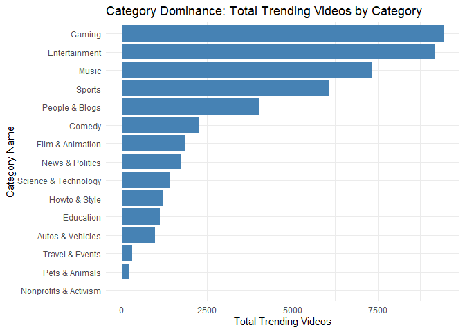<!-- -->

``` r
cat("**Explanation**: This bar chart shows the total number of trending videos for each category, highlighting which categories dominate the trending page.\n\n")
```

    ## **Explanation**: This bar chart shows the total number of trending videos for each category, highlighting which categories dominate the trending page.

``` r
#Visualization 2 Grouped Bar Chart for Overall Success
engagement_vs_views <- ggplot(category_metrics, aes(x = avg_engagement_ratio, y = avg_view_count, label = category_name)) +
  geom_point(aes(size = total_trending_videos, color = total_time_trending), alpha = 0.8) +
  scale_color_gradient(low = "blue", high = "red") +
  geom_text_repel(size = 3) +
  labs(
    title = "Engagement Ratio vs. View Count by Category",
    x = "Average Engagement Ratio",
    y = "Average View Count",
    size = "Total Trending Videos",
    color = "Total Time Trending (Days)"
  ) +
  theme_minimal()

print(engagement_vs_views)
```

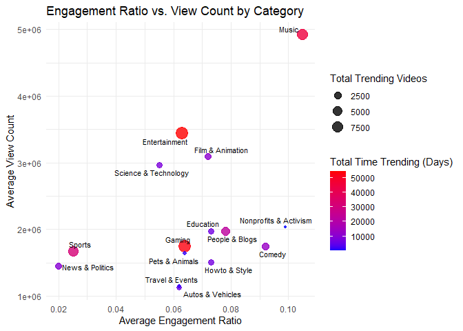<!-- -->

``` r
cat("**Explanation**: This scatter plot compares average engagement ratios and view counts for each category. Categories are sized by their total number of trending videos and colored by total time spent trending.\n\n")
```

    ## **Explanation**: This scatter plot compares average engagement ratios and view counts for each category. Categories are sized by their total number of trending videos and colored by total time spent trending.

``` r
#Visualization 3 Boxplots
ggplot(unique_video_data, aes(x = category_name, y = trending_retention)) +
  geom_boxplot(fill = "darkolivegreen3", outlier.alpha = 0.3, outlier.color = "tomato3", outlier.size = 2) +
  coord_flip() +
  labs(
    title = "Retention Trends: Time Spent Trending by Category",
    x = "Category Name",
    y = "Trending Retention (Days)"
  ) +
  theme_minimal()
```

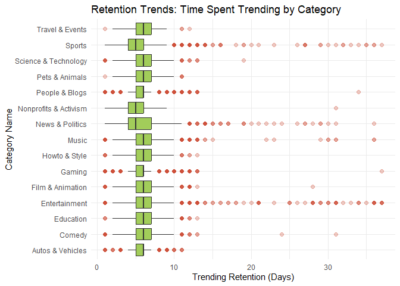<!-- -->

``` r
cat("**Explanation**: This boxplot shows the spread of time videos spend trending for each category, identifying categories with consistent or highly variable retention times.\n\n")
```

    ## **Explanation**: This boxplot shows the spread of time videos spend trending for each category, identifying categories with consistent or highly variable retention times.

``` r
ggplot(unique_video_data, aes(x = category_name, y = days_until_trending)) +
  geom_boxplot(fill = "darkolivegreen3", outlier.alpha = 0.3, outlier.color = "tomato3", outlier.size = 2) +
  coord_flip() +
  labs(
    title = "Speed Trends: Speed of Trending by Category",
    x = "Category Name",
    y = "Trending Speed (Days)"
  ) +
  theme_minimal()
```

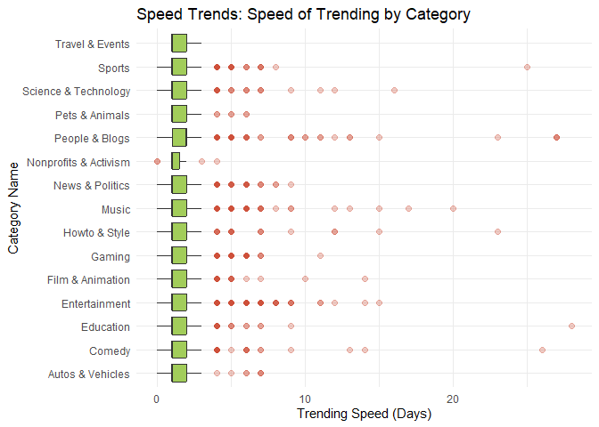<!-- -->

``` r
cat("**Explanation**: This boxplot shows the spread of the speed of videos reaching the trending page trending for each category, identifying categories with consistent or highly variable trending speed times.\n\n")
```

    ## **Explanation**: This boxplot shows the spread of the speed of videos reaching the trending page trending for each category, identifying categories with consistent or highly variable trending speed times.

``` r
ggplot(unique_video_data, aes(x = category_name, y = engagement_ratio)) +
  geom_boxplot(fill = "darkolivegreen3", outlier.alpha = 0.3, outlier.color = "tomato3", outlier.size = 2) +
  coord_flip() +
  labs(
    title = "Engagement Trends: Engagement with Trending Content by Category",
    x = "Category Name",
    y = "Enagement Ratio (likes + comments) / views"
  ) +
  theme_minimal()
```

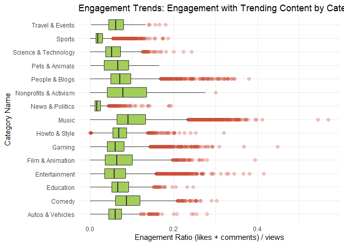<!-- -->

``` r
cat("**Explanation**: This boxplot shows the spread of engagement with trending content for each category, identifying categories with consistent or highly variable engagement ratios. ")
```

    ## **Explanation**: This boxplot shows the spread of engagement with trending content for each category, identifying categories with consistent or highly variable engagement ratios.

    ## Understanding base descriptive statistics is key for YouTube creators looking to improve their trending success. Categories that have high average engagement ratios show that creating content that encourages interaction will help creators build loyal audiences that are very retentive, and allows those creators to enhance their visability on YouTube even if they don't have the most views or likes.
    ##   
    ## For our team, these statistics were crucial as they formed the foundation for our sentiment and association analyses. They helped us interpret results more effectively and refine our categorization methods.

## Section 2.1: Sentiment Analysis

Due to data constraints, we used the video description to determine a
video’s overall sentiment. While this method provided valuable insights
into how a video’s sentiment impacts video success, it is a limitation,
as video descriptions may not full repersent the overall emotional tone
of the entire video.

------------------------------------------------------------------------

What are the average success metrics depending on video’s dominant
sentiments?

``` r
yt_new_description <- tibble(text = str_to_lower(unique_video_data$description)) 

#replace NA
yt_new_description[is.na(yt_new_description)] <- ""

#find the emotions based on description
emotions <- get_nrc_sentiment(yt_new_description$text)#find the emotions per entry

yt_new_description <- cbind(yt_new_description, emotions) #merges emotions table with description dataframe

# Summarize the number of items (count) per emotion column
emo_sum <- emotions %>%
  summarise(across(everything(), sum, na.rm = TRUE)) %>%
  pivot_longer(everything(), names_to = "emotion", values_to = "count")

yt_new_description <- cbind(unique_video_data, yt_new_description) 
yt_new_description <- yt_new_description[,-5] # Delete the original Description column
```

``` r
# Calculate average success metrics by dominant sentiment
yt_new_description$dominant_sentiment <- apply(emotions, 1, function(x) {
  max_value <- max(x)
  if (max_value == 0) {
    return("no sentiment/\nno description")
  } else {
    return(names(x)[which.max(x)])
  }
})

average_description_sentiment <- yt_new_description %>%
  group_by(dominant_sentiment) %>%
  summarise(
    total_videos = n(),
    avg_trending_speed = round(mean(days_until_trending),2),
    avg_trending_retention = round(mean(trending_retention),2),
    avg_engagement_ratio = round(mean(engagement_ratio), 3)
  ) %>%
  arrange(desc(total_videos))

#Count of Emotional Elements in Video Descriptions
ggplot(emo_sum, aes(x = reorder(emotion, -count), y = count)) +
  geom_bar(stat = 'identity', fill = "steelblue") +
  labs(title = "Count of Emotional Elements in Video Descriptions", x = "Sentiment", y = "Count")
```

<!-- -->

``` r
#Distribution of Dominant Sentiments across Trending Videos 
ggplot(average_description_sentiment, aes(x = reorder(dominant_sentiment, -total_videos), y = total_videos)) +
  geom_bar(stat = 'identity', fill = "steelblue") +
  labs(title = "Distribution of Dominant Sentiments in Trending Videos", x = "Sentiment", y = "Count")
```

<!-- -->

``` r
# Average views by dominant sentiment
ggplot(average_description_sentiment, aes(x = reorder(dominant_sentiment, -avg_trending_speed), y = avg_trending_speed)) +
  geom_bar(stat = 'identity', fill = "steelblue") +
  labs(title = "Average Trending Speed by Dominant Sentiment", x = "Sentiment", y = "Trending Speed (Days)")
```

<!-- -->

``` r
# Average likes by dominant sentiment
ggplot(average_description_sentiment, aes(x = reorder(dominant_sentiment, -avg_trending_retention), y = avg_trending_retention)) +
  geom_bar(stat = 'identity', fill = "steelblue") +
  labs(title = "Average Trending Retention by Dominant Sentiment", x = "Sentiment", y = "Trending TRetention (Days)")
```

<!-- -->

``` r
# Average comments by dominant sentiment
ggplot(average_description_sentiment, aes(x = reorder(dominant_sentiment, -avg_engagement_ratio), y = avg_engagement_ratio)) +
  geom_bar(stat = 'identity', fill = "steelblue") +
  labs(title = "Average Engagement Ratio by Dominant Sentiment", x = "Sentiment", y = "Engagement Ration ( (likes + comments) / views)")
```

<!-- -->

<table class="table table-striped table-hover table-condensed" style="color: black; width: auto !important; margin-left: auto; margin-right: auto;">

<caption>

Dominant Sentiment Average Success Metrics
</caption>

<thead>

<tr>

<th style="text-align:left;font-weight: bold;background-color: rgba(245, 245, 245, 255) !important;">

dominant_sentiment
</th>

<th style="text-align:right;font-weight: bold;background-color: rgba(245, 245, 245, 255) !important;">

total_videos
</th>

<th style="text-align:right;font-weight: bold;background-color: rgba(245, 245, 245, 255) !important;">

avg_trending_speed
</th>

<th style="text-align:right;font-weight: bold;background-color: rgba(245, 245, 245, 255) !important;">

avg_trending_retention
</th>

<th style="text-align:right;font-weight: bold;background-color: rgba(245, 245, 245, 255) !important;">

avg_engagement_ratio
</th>

</tr>

</thead>

<tbody>

<tr>

<td style="text-align:left;width: 3cm; font-weight: bold;">

positive
</td>

<td style="text-align:right;width: 2cm; ">

21246
</td>

<td style="text-align:right;width: 2cm; ">

1.46
</td>

<td style="text-align:right;width: 2cm; ">

5.85
</td>

<td style="text-align:right;">

0.064
</td>

</tr>

<tr>

<td style="text-align:left;width: 3cm; font-weight: bold;">

anticipation
</td>

<td style="text-align:right;width: 2cm; ">

8430
</td>

<td style="text-align:right;width: 2cm; ">

1.48
</td>

<td style="text-align:right;width: 2cm; ">

5.66
</td>

<td style="text-align:right;">

0.062
</td>

</tr>

<tr>

<td style="text-align:left;width: 3cm; font-weight: bold;">

negative
</td>

<td style="text-align:right;width: 2cm; ">

4803
</td>

<td style="text-align:right;width: 2cm; ">

1.51
</td>

<td style="text-align:right;width: 2cm; ">

5.74
</td>

<td style="text-align:right;">

0.069
</td>

</tr>

<tr>

<td style="text-align:left;width: 3cm; font-weight: bold;">

trust
</td>

<td style="text-align:right;width: 2cm; ">

3401
</td>

<td style="text-align:right;width: 2cm; ">

1.46
</td>

<td style="text-align:right;width: 2cm; ">

5.71
</td>

<td style="text-align:right;">

0.069
</td>

</tr>

<tr>

<td style="text-align:left;width: 3cm; font-weight: bold;">

no sentiment/ no description
</td>

<td style="text-align:right;width: 2cm; ">

        284

</tbody>

</table>

    ## 
    ## **Dominant Sentiments and Success Metrics**
    ##  The bar charts presented help visualize the distribution of dominant sentiments across all videos in this dataset (N = 47,124 unique videos), as well as the average success metrics across different dominant sentiments. One of the most surprising observations was the apparent uniformity across sentiments in terms of trending success. 
    ##  Initially, it was hypothesized that videos with more negative or anger-driven sentiments would stand out, resulting in longer trending retention, quicker trending times, or, at the very least, more engagement. This hypothesis was grounded in the common phenomenon of 'rage-bait' videos—those designed to provoke strong emotional reactions and drive more interactions through upsetting or controversial topics. These videos often capitalize on emotional engagement to boost their traction. 
    ##  However, as shown in the data, no substantial differences were found between the dominant sentiment expressed in the video description and the video's actual performance on the trending page. This finding challenges the assumption that videos with certain emotional tones would inherently perform better or worse. In the next section, we will statistically test these trends to confirm whether the metrics are as similar as they appear. Nevertheless, the lack of a clear relationship between sentiment and success was unexpected and intriguing.

## Section 2.2: Dominant Sentiment Correlation with Success

Do video sentiments have a statistically significant impact on success
metrics? (T-Test / ANOVA hypothesis test)

    ## 
    ## **ANOVA Hypothese:**
    ##  Null Hypothesis (H0): There is no significane difference in success metrics between dominant sentiments.
    ## Alternative Hypothesis (H1): There is significane difference in success metrics between dominant sentiments.

``` r
#Engagement Ratio ANOVA
engage_aov <- aov(engagement_ratio ~ dominant_sentiment, data = yt_new_description)
summary(engage_aov)
```

    ##                       Df Sum Sq Mean Sq F value Pr(>F)    
    ## dominant_sentiment    10   1.93 0.19286   85.17 <2e-16 ***
    ## Residuals          47113 106.69 0.00226                   
    ## ---
    ## Signif. codes:  0 '***' 0.001 '**' 0.01 '*' 0.05 '.' 0.1 ' ' 1

``` r
# Get residuals from the ANOVA model
residuals <- residuals(engage_aov)
# Q-Q plot to check normality visually
qqnorm(residuals)
qqline(residuals, col = "red")
```

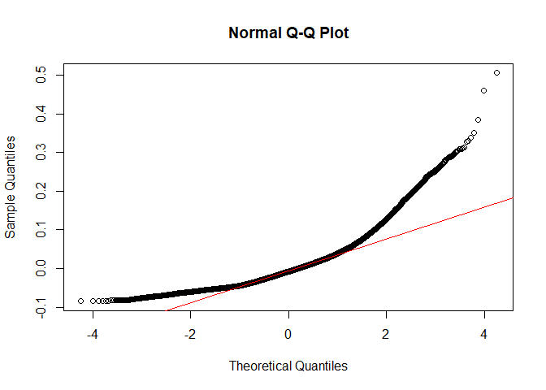<!-- -->

``` r
#Trending Speed ANOVA
speed_aov <- aov(days_until_trending ~ dominant_sentiment, data = yt_new_description)
summary(speed_aov)
```

    ##                       Df Sum Sq Mean Sq F value   Pr(>F)    
    ## dominant_sentiment    10     68   6.842   9.571 4.09e-16 ***
    ## Residuals          47113  33678   0.715                     
    ## ---
    ## Signif. codes:  0 '***' 0.001 '**' 0.01 '*' 0.05 '.' 0.1 ' ' 1

``` r
# Get residuals from the ANOVA model
residuals <- residuals(speed_aov)
# Q-Q plot to check normality visually
qqnorm(residuals)
qqline(residuals, col = "red")
```

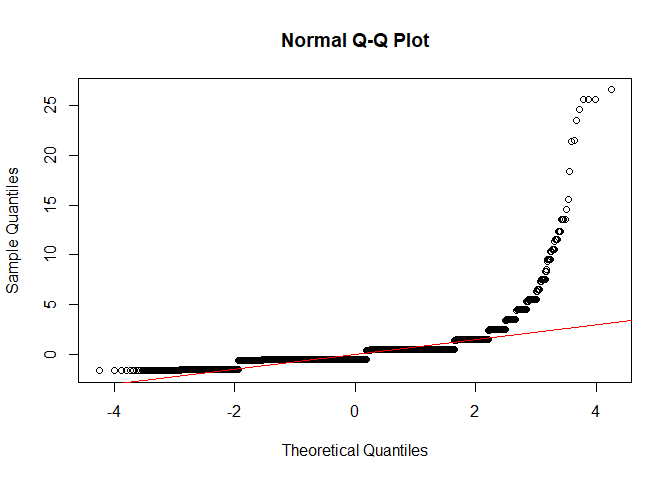<!-- -->

``` r
#Trending Retention ANOVA
retention_aov <- aov(trending_retention ~ dominant_sentiment, data = yt_new_description)
summary(retention_aov)
```

    ##                       Df Sum Sq Mean Sq F value Pr(>F)    
    ## dominant_sentiment    10    662   66.23   16.71 <2e-16 ***
    ## Residuals          47113 186710    3.96                   
    ## ---
    ## Signif. codes:  0 '***' 0.001 '**' 0.01 '*' 0.05 '.' 0.1 ' ' 1

``` r
# Get residuals from the ANOVA model
residuals <- residuals(retention_aov)
# Q-Q plot to check normality visually
qqnorm(residuals)
qqline(residuals, col = "red")
```

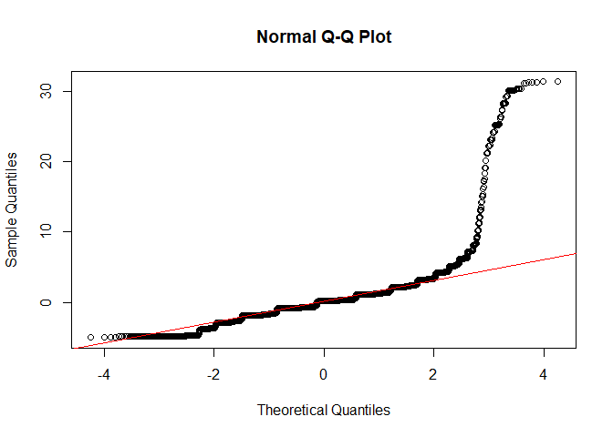<!-- -->

    ## **ANOVA Results:**
    ## 
    ## While the ANOVA results suggest that dominant sentiments in a video's written description might have a statistically significant impact on success metrics, the Quantile-Quantile (Q-Q) plot shows that the residuals don’t follow a normal distribution. This means that the normality assumption for ANOVA is violated, which makes the results less reliable. It’s possible that the significance we found is due to this assumption being violated, which could lead to a higher chance of false positives (Type I error). Because of this, we can’t confidently comment on how the dominant sentiments in a video's written description impact success metrics based on the ANOVA results alone, and we can’t draw a clear conclusion within the scope of this project.
    ## 
    ## 
    ## To get more reliable results in the future, other methods could be used. For example, we could try machine learning tools like Large Language Models (LLMs) to analyze sentiments in more detail or use generalized linear models (GLMs), which don’t require normality. Non-parametric tests like the Kruskal-Wallis test could also help since they don’t rely on the same assumptions. Additionally, advanced natural language processing (NLP) techniques, like topic modeling or multi-dimensional sentiment analysis, could give us a deeper understanding of how sentiment might relate to success metrics. Exploring these tools in a future project could lead to stronger and more reliable findings.
    ## 
    ## 
    ## That being said, while we cannot comment on Dominant Sentiment's impact on success metrics, we can offer some insights into most common sentiments across both trendings videos as a whole and within each channel category

## Section 2.3: Dominant Sentiment Frequency

Are trending videos more commonly positive, negative, or associated with
other emotions?

``` r
video_sentiment_counts <- yt_new_description %>%
  group_by(dominant_sentiment) %>%
  summarise(
    video_count = n()
  )%>%
  arrange(desc(video_count)) %>%
  slice_max(order_by = video_count, n = 5)
```

<table class="table table-striped table-hover table-condensed" style="color: black; width: auto !important; margin-left: auto; margin-right: auto;">

<caption>

Dominant Sentiment Seen on the Trending Page
</caption>

<thead>

<tr>

<th style="text-align:left;font-weight: bold;background-color: rgba(245, 245, 245, 255) !important;">

dominant_sentiment
</th>

<th style="text-align:right;font-weight: bold;background-color: rgba(245, 245, 245, 255) !important;">

video_count
</th>

</tr>

</thead>

<tbody>

<tr>

<td style="text-align:left;width: 3cm; font-weight: bold;">

positive
</td>

<td style="text-align:right;width: 2cm; ">

21246
</td>

</tr>

<tr>

<td style="text-align:left;width: 3cm; font-weight: bold;">

anticipation
</td>

<td style="text-align:right;width: 2cm; ">

8430
</td>

</tr>

<tr>

<td style="text-align:left;width: 3cm; font-weight: bold;">

negative
</td>

<td style="text-align:right;width: 2cm; ">

4803
</td>

</tr>

<tr>

<td style="text-align:left;width: 3cm; font-weight: bold;">

trust
</td>

<td style="text-align:right;width: 2cm; ">

3401
</td>

</tr>

<tr>

<td style="text-align:left;width: 3cm; font-weight: bold;">

no sentiment/ no description
</td>

<td style="text-align:right;width: 2cm; ">

       284

</tbody>

</table>

    ## The top 5 most common sentiments expressed in video descriptions in this dataset were positive, anticipation, negavtive, trust, and no sentiment/no

## Section 2.4: Dominant Sentiment per Channel Category

Do trending videos in certain channel categories lean to specific
sentiments?

``` r
category_sentiment_counts <- yt_new_description %>%
  group_by(category_name, dominant_sentiment) %>%
  summarise(
    video_count = n()
  )%>%
  slice_max(order_by = video_count, n = 2) %>%
  arrange(category_name, desc(video_count)) 
```

    ## `summarise()` has grouped output by 'category_name'. You can override using the
    ## `.groups` argument.

<table class="table table-striped table-hover table-condensed" style="color: black; width: auto !important; margin-left: auto; margin-right: auto;">

<caption>

Top 2 Dominant Sentiments per Channel Cateogry
</caption>

<thead>

<tr>

<th style="text-align:left;font-weight: bold;background-color: rgba(245, 245, 245, 255) !important;">

category_name
</th>

<th style="text-align:left;font-weight: bold;background-color: rgba(245, 245, 245, 255) !important;">

dominant_sentiment
</th>

<th style="text-align:right;font-weight: bold;background-color: rgba(245, 245, 245, 255) !important;">

video_count
</th>

</tr>

</thead>

<tbody>

<tr>

<td style="text-align:left;width: 3cm; font-weight: bold;">

Autos & Vehicles
</td>

<td style="text-align:left;width: 2cm; ">

positive
</td>

<td style="text-align:right;width: 2cm; ">

518
</td>

</tr>

<tr>

<td style="text-align:left;width: 3cm; font-weight: bold;">

Autos & Vehicles
</td>

<td style="text-align:left;width: 2cm; ">

anticipation
</td>

<td style="text-align:right;width: 2cm; ">

154
</td>

</tr>

<tr>

<td style="text-align:left;width: 3cm; font-weight: bold;">

Comedy
</td>

<td style="text-align:left;width: 2cm; ">

positive
</td>

<td style="text-align:right;width: 2cm; ">

905
</td>

</tr>

<tr>

<td style="text-align:left;width: 3cm; font-weight: bold;">

Comedy
</td>

<td style="text-align:left;width: 2cm; ">

anticipation
</td>

<td style="text-align:right;width: 2cm; ">

392
</td>

</tr>

<tr>

<td style="text-align:left;width: 3cm; font-weight: bold;">

Education
</td>

<td style="text-align:left;width: 2cm; ">

positive
</td>

<td style="text-align:right;width: 2cm; ">

775
</td>

</tr>

<tr>

<td style="text-align:left;width: 3cm; font-weight: bold;">

Education
</td>

<td style="text-align:left;width: 2cm; ">

anticipation
</td>

<td style="text-align:right;width: 2cm; ">

93
</td>

</tr>

<tr>

<td style="text-align:left;width: 3cm; font-weight: bold;">

Entertainment
</td>

<td style="text-align:left;width: 2cm; ">

positive
</td>

<td style="text-align:right;width: 2cm; ">

4421
</td>

</tr>

<tr>

<td style="text-align:left;width: 3cm; font-weight: bold;">

Entertainment
</td>

<td style="text-align:left;width: 2cm; ">

anticipation
</td>

<td style="text-align:right;width: 2cm; ">

1766
</td>

</tr>

<tr>

<td style="text-align:left;width: 3cm; font-weight: bold;">

Film & Animation
</td>

<td style="text-align:left;width: 2cm; ">

positive
</td>

<td style="text-align:right;width: 2cm; ">

942
</td>

</tr>

<tr>

<td style="text-align:left;width: 3cm; font-weight: bold;">

Film & Animation
</td>

<td style="text-align:left;width: 2cm; ">

anticipation
</td>

<td style="text-align:right;width: 2cm; ">

308
</td>

</tr>

<tr>

<td style="text-align:left;width: 3cm; font-weight: bold;">

Gaming
</td>

<td style="text-align:left;width: 2cm; ">

positive
</td>

<td style="text-align:right;width: 2cm; ">

3890
</td>

</tr>

<tr>

<td style="text-align:left;width: 3cm; font-weight: bold;">

Gaming
</td>

<td style="text-align:left;width: 2cm; ">

negative
</td>

<td style="text-align:right;width: 2cm; ">

1996
</td>

</tr>

<tr>

<td style="text-align:left;width: 3cm; font-weight: bold;">

Howto & Style
</td>

<td style="text-align:left;width: 2cm; ">

positive
</td>

<td style="text-align:right;width: 2cm; ">

806
</td>

</tr>

<tr>

<td style="text-align:left;width: 3cm; font-weight: bold;">

Howto & Style
</td>

<td style="text-align:left;width: 2cm; ">

anticipation
</td>

<td style="text-align:right;width: 2cm; ">

201
</td>

</tr>

<tr>

<td style="text-align:left;width: 3cm; font-weight: bold;">

Music
</td>

<td style="text-align:left;width: 2cm; ">

positive
</td>

<td style="text-align:right;width: 2cm; ">

2924
</td>

</tr>

<tr>

<td style="text-align:left;width: 3cm; font-weight: bold;">

Music
</td>

<td style="text-align:left;width: 2cm; ">

joy
</td>

<td style="text-align:right;width: 2cm; ">

1044
</td>

</tr>

<tr>

<td style="text-align:left;width: 3cm; font-weight: bold;">

News & Politics
</td>

<td style="text-align:left;width: 2cm; ">

positive
</td>

<td style="text-align:right;width: 2cm; ">

637
</td>

</tr>

<tr>

<td style="text-align:left;width: 3cm; font-weight: bold;">

News & Politics
</td>

<td style="text-align:left;width: 2cm; ">

anticipation
</td>

<td style="text-align:right;width: 2cm; ">

270
</td>

</tr>

<tr>

<td style="text-align:left;width: 3cm; font-weight: bold;">

Nonprofits & Activism
</td>

<td style="text-align:left;width: 2cm; ">

positive
</td>

<td style="text-align:right;width: 2cm; ">

15
</td>

</tr>

<tr>

<td style="text-align:left;width: 3cm; font-weight: bold;">

Nonprofits & Activism
</td>

<td style="text-align:left;width: 2cm; ">

anticipation
</td>

<td style="text-align:right;width: 2cm; ">

2
</td>

</tr>

<tr>

<td style="text-align:left;width: 3cm; font-weight: bold;">

People & Blogs
</td>

<td style="text-align:left;width: 2cm; ">

positive
</td>

<td style="text-align:right;width: 2cm; ">

1515
</td>

</tr>

<tr>

<td style="text-align:left;width: 3cm; font-weight: bold;">

People & Blogs
</td>

<td style="text-align:left;width: 2cm; ">

anticipation
</td>

<td style="text-align:right;width: 2cm; ">

813
</td>

</tr>

<tr>

<td style="text-align:left;width: 3cm; font-weight: bold;">

Pets & Animals
</td>

<td style="text-align:left;width: 2cm; ">

positive
</td>

<td style="text-align:right;width: 2cm; ">

119
</td>

</tr>

<tr>

<td style="text-align:left;width: 3cm; font-weight: bold;">

Pets & Animals
</td>

<td style="text-align:left;width: 2cm; ">

anticipation
</td>

<td style="text-align:right;width: 2cm; ">

29
</td>

</tr>

<tr>

<td style="text-align:left;width: 3cm; font-weight: bold;">

Science & Technology
</td>

<td style="text-align:left;width: 2cm; ">

positive
</td>

<td style="text-align:right;width: 2cm; ">

966
</td>

</tr>

<tr>

<td style="text-align:left;width: 3cm; font-weight: bold;">

Science & Technology
</td>

<td style="text-align:left;width: 2cm; ">

anticipation
</td>

<td style="text-align:right;width: 2cm; ">

186
</td>

</tr>

<tr>

<td style="text-align:left;width: 3cm; font-weight: bold;">

Sports
</td>

<td style="text-align:left;width: 2cm; ">

positive
</td>

<td style="text-align:right;width: 2cm; ">

2594
</td>

</tr>

<tr>

<td style="text-align:left;width: 3cm; font-weight: bold;">

Sports
</td>

<td style="text-align:left;width: 2cm; ">

anticipation
</td>

<td style="text-align:right;width: 2cm; ">

1779
</td>

</tr>

<tr>

<td style="text-align:left;width: 3cm; font-weight: bold;">

Travel & Events
</td>

<td style="text-align:left;width: 2cm; ">

positive
</td>

<td style="text-align:right;width: 2cm; ">

219
</td>

</tr>

<tr>

<td style="text-align:left;width: 3cm; font-weight: bold;">

Travel & Events
</td>

<td style="text-align:left;width: 2cm; ">

anticipation
</td>

<td style="text-align:right;width: 2cm; ">

29
</td>

</tr>

</tbody>

</table>

    ## Suprisingly, all 15 categories of channels had the most prominent sentiment be positivity. After positive sentiments, the next most common sentiments expressed where anticipation (Autos & Vehicles, Comedy, Education, Entertainment, Film & Animation, Howto & Style, News & Politics, Nonprofits & Activism, People & Blogs, Pets & Animals, Science & Technology, Sports, Travel & Events), Negative (Gaming), and Joy (Music)

## Section 2.5: Sentiment Analysis Conclusions

What are the overall sentiments of each Unique Video in the dataset?
(Add Output to Unique.Video_DF) What are the conclusions from the
Sentiment Analysis?

``` r
# Add Overall Video Sentiment to Unique.video_df
unique_video_data$dominant_sentiment <- yt_new_description$dominant_sentiment
```

    ## The analysis of dominant sentiments of YouTube videos revealed no significant relationship between sentiment and trending success, contrary to initial expectations. While the ANOVA results suggested significance of sentiment impact on success metrics, violations of the normality assumption raised concerns about the reliability of these findings. Despite hypotheses suggesting that negative or anger-driven sentiments might lead to longer trending times or higher engagement, the data showed uniformity across sentiment types, indicating that sentiment may not drastically affect a video's performance once it reaches the trending page.
    ##  
    ## However, the statistics did indicate that positively focused content made up the vast majority of videos, accounting for just under half of all videos that reached the US trending page between August 2020 and April 2024 (21,246 out of 47,124 videos). This suggests that videos with more positive subject matter are more likely to make it to the trending page. Once a video is trending, however, the dominant sentiment appears to have questionable impact on its ongoing success that would require more sophisticated machine learning techniques to uncover. For now, we will conclude that dominant sentiment has little effect on the success metrics of trending videos.
    ##  
    ## Based on our analysis, we recommend that our clients do not focus on tailoring content to specific emotional tones in an attempt to improve success. Our findings show that the dominant sentiment expressed in a video does not have a significant impact on its ability to trend or achieve higher success metrics. Therefore, creators should prioritize other factors, such as content quality and community engagement, rather than trying to cater to particular emotional themes.

## Section 3.1: Association Mining Data Prep

The arules algorithm works best with categorical data, therefore, for
this section of the project, success metrics had to be classified into
categorical values to enable meaningful association mining. This
analysis used Tertile-Based Categorization due to the large amount of
outliers identified in each success metric in Section 1.5

    ## 'Good' represents top-performing metrics, 'Mid' represents mixed success, and 'Poor' represents low performance.
    ##  
    ## For each of the success metrics, the following guidelines are used:
    ##  - 'days_until_trending': The lower this metric, the better. A shorter time to trend is preferred.
    ##  - 'trending_retention': The higher this metric, the better. Videos that remain trending for a longer period are more successful.
    ##  - 'engagement_ratio': The higher this metric, the better. High engagement indicates better viewer interaction.
    ##  
    ## To calculate the overall success of each video relative to the dataset, all success metrics are normalized and then an equally weighted sum is computed. This aggregate score allows for the classification of videos based on their overall performance and can be used to identify associations between various factors and overall success.
    ##  
    ## **Note**: It should be noted that while some videos are categorized as having 'Poor' success, all videos in this dataset did reach the YouTube Trending page. Therefore, the 'Poor' success classification is relative to other successful trending videos and does not imply failure to trend.

``` r
# Determining what the cutoffs for the Tertitle categorization
tertile_cutoffs_speed <- quantile(unique_video_data$days_until_trending, probs = c(0, 1/3, 2/3, 1))
print(tertile_cutoffs_speed)
```

    ##        0% 33.33333% 66.66667%      100% 
    ##         0         1         2        28

``` r
tertile_cutoffs_reten <- quantile(unique_video_data$trending_retention, probs = c(0, 1/3, 2/3, 1))
print(tertile_cutoffs_reten)
```

    ##        0% 33.33333% 66.66667%      100% 
    ##         1         5         6        37

``` r
tertile_cutoffs_engage <- quantile(unique_video_data$engagement_ratio, probs = c(0, 1/3, 2/3, 1))
print(tertile_cutoffs_engage)
```

    ##         0%  33.33333%  66.66667%       100% 
    ## 0.00000000 0.04130532 0.07651958 0.56947307

``` r
arules_df <- unique_video_data %>%
  mutate(
    # Create categories based on Tertiles
    days_until_trending_category = ntile(days_until_trending, 3),
    trending_retention_category = ntile(trending_retention, 3),
    engagement_ratio_category = ntile(engagement_ratio, 3),
    
    # Recode categories into descriptive labels
    days_until_trending_category = case_when(
      days_until_trending_category == 1 ~ "Good",
      days_until_trending_category == 2 ~ "Mid", 
      days_until_trending_category == 3 ~ "Poor"),
    trending_retention_category = case_when(
      trending_retention_category == 1 ~ "Poor", 
      trending_retention_category == 2 ~ "Mid", 
      trending_retention_category == 3 ~ "Good"),
    engagement_ratio_category = case_when(
      engagement_ratio_category == 1 ~ "Poor", 
      engagement_ratio_category == 2 ~ "Mid", 
      engagement_ratio_category == 3 ~ "Good"),
    
    # Normalize the metrics
    days_until_trending_scaled = (1 - (days_until_trending / 
                                        max(days_until_trending, na.rm = TRUE))),
    trending_retention_scaled = (trending_retention / max(trending_retention, na.rm = TRUE)),
    engagement_ratio_scaled = (engagement_ratio / max(engagement_ratio, na.rm = TRUE)),
    
    # Calculate success score into a single variable, giving equal weight to all success metrics
    success_score = (1/3) * days_until_trending_scaled + 
                    (1/3) * trending_retention_scaled + 
                    (1/3) * engagement_ratio_scaled
  ) %>%
  mutate(
    # Categorize overall success based on the success score
    overall_success = ntile(success_score, 3),
    overall_success = case_when(
      overall_success == 1 ~ "Poor",
      overall_success == 2 ~ "Mid", 
      overall_success == 3 ~ "Good")
  )


# Initialize the final rules tables data.frame
Good.rules_table <- data.frame( 
  rules =character(),
  support = numeric(),
  confidence = numeric(),
  coverage = numeric(),
  lift = numeric(),
  count = integer()
)[0, ]

Poor.rules_table <- data.frame( 
  rules =character(),
  support = numeric(),
  confidence = numeric(),
  coverage = numeric(),
  lift = numeric(),
  count = integer()
)[0, ]

# Intialize a function to facilitate rules plotting
am_plot <- function(df1, df2, metric, eval1, eval2, test) {
  a <- min(df1$support, df2$support)
  b = max(df1$support, df2$support)
   
  c <- min(df1$lift, df2$lift)
  d <- max(df1$lift, df2$lift)
  
  p1 <- ggplot(df1, aes(x = support, y = lift, color = confidence)) +
    geom_point(size = 8, alpha = 0.75) +  # Adjusted size for better visualization
    scale_color_gradient2(low = "tomato3", mid = "tan1", high = "darkolivegreen3", 
                          midpoint = 0.6, name = "Confidence") + 
    theme_light() +
    labs(
      x = "Support",
      y = "Lift",
      subtitle = paste("Where", metric,  "=", eval1)) +
    xlim(a,b) + ylim(c,d)
  
  p2 <- ggplot(df2, aes(x = support, y = lift, color = confidence)) +
    geom_point(size = 8, alpha = 0.75) +  # Adjusted size for better visualization
    scale_color_gradient2(low = "tomato3", mid = "tan1", high = "darkolivegreen3", 
                          midpoint = 0.6, name = "Confidence") + 
    theme_light() +
    labs(
      x = "Support",
      y = "Lift",
      subtitle = paste("Where", metric,  "=", eval2)) +
    xlim(a,b) + ylim(c,d)
  
  p <- grid.arrange(
    p1, p2, 
    ncol = 2,
    top = textGrob(paste("Association Mining on Youtube Trending", test))
    )
 
  return(p)
}

# Initialize a function to clean the outputted rules tables
clean_rules_tables <- function (df) {
  metrics <- c("overall_success", "days_until_trending_category", "trending_retention_category", "engagement_ratio_category")
  
df <- df %>%
  mutate(
    # Create a new column that reports the channel category of each rule
    category = map_chr(rules, ~ {
      # Check for matches of category_name phrases in the 'rules' text
       matched_phrase <- purrr::detect(category_name, function(cat) str_detect(.x, fixed(cat)))
      # If a match is found, return it; otherwise, return NA
      ifelse(length(matched_phrase) > 0, matched_phrase, NA_character_)
    }),
    metric = map_chr(rules, ~ {
      matched_phrase <- purrr::detect(metrics, function(cat) str_detect(.x, fixed(cat)))
      ifelse(length(matched_phrase) > 0, matched_phrase, NA_character_)
    })
  ) %>%
  group_by(category, metric) %>%
  slice_max(order_by = confidence, n = 3) %>%
  filter(confidence > 0.7) %>%
  arrange(category, desc(confidence))

return(df)
}
```

## Section 3.2: Length of User Set Descriptive Variables Associations

Are the lengths of user set descriptive variables (title, description,
and tags) associated with better success metrics?

Data Prep and Function Creation:

``` r
# Calculate the number of tags and categorize tag usage without expanding rows
am.1_df <- arules_df %>%
  mutate(
    # Calculate the number of tags for each video (count of comma-separated tags)
    tag_usage = str_count(tags, ",") + 1,  # str_count counts commas, add 1 for the number of tags
    tag_usage_category = ntile(tag_usage, 3)  # Create categories based on tag usage
  ) %>%
  mutate(
    tag_usage_category = case_when(
      is.na(tag_usage_category) ~ "No Tags Used",  # If no tags used
      tag_usage_category == 1 ~ "Low", 
      tag_usage_category == 2 ~ "Mid", 
      tag_usage_category == 3 ~ "High"
    )
  ) %>%
  # Calculate title and description lengths, then categorize them
  mutate(
    title_length = nchar(title),
    description_length = nchar(description),
    title_length_category = ntile(title_length, 3),  
    description_length_category = ntile(description_length, 3)
  ) %>%
  mutate(
    title_length_category = case_when(
      title_length_category == 1 ~ "Short",
      title_length_category == 2 ~ "Mid", 
      title_length_category == 3 ~ "Long"
    ),
    description_length_category = case_when(
      is.na(description_length) ~ "No Description",  # If no description provided
      description_length_category == 1 ~ "Short",
      description_length_category == 2 ~ "Mid", 
      description_length_category == 3 ~ "Long"
    )
  ) %>%
  # Select only relevant columns for the final output
  select(category_name, tag_usage, tag_usage_category, title_length, title_length_category, description_length, description_length_category, overall_success, days_until_trending_category, trending_retention_category,engagement_ratio_category)

# Determining what the cutoffs for the Tertitle categorization
tertile_cutoffs_tags <- quantile(am.1_df$tag_usage, probs = c(0, 1/3, 2/3, 1), na.rm = TRUE)
# Low Tag Usage = 1 - 13 Tags
# High Tag Usage = 24 - 78 Tags

tertile_cutoffs_title <- quantile(am.1_df$title_length, probs = c(0, 1/3, 2/3, 1), na.rm = TRUE)
# Short Titles = 1 - 40 Characters 
# Long Titles = 57 - 124 Characters

tertile_cutoffs_description <- quantile(am.1_df$description_length, probs = c(0, 1/3, 2/3, 1), na.rm = TRUE)
# Short Descriptions = 2 - 513 Characters 
# Long Descriptions = 1086 - 5072 Characters


length_mining <- function(metric, eval) {
  df <-  am.1_df %>%
    select(category_name, tag_usage_category, title_length_category,
           description_length_category, metric)  
  
  # Convert the data frame into a transactions object
  transactions <- as(df, "transactions")
  
  rhs = paste0(metric, "=", eval)
  
  # Generate association rules using the apriori algorithm
  rules <- apriori(
    transactions,
    parameter = list(support = 0.005, confidence = 0.5),
    appearance = list(default = "lhs", rhs = rhs)
  )
  
  if (length(rules) == 0) {
    return("There are no rules for this metric")
  }
  
  # Convert rules to data frame, filter by lift > 2, and arrange them by descending lift
  rules_df <- as(rules, "data.frame") %>%
    filter(lift > 1.5) %>%
    arrange(desc(lift))
  
  if (nrow(rules_df) == 0) {
    return("There are no rules with a lift higher than 2 for this metric")
  }
  
  return(rules_df)
}
```

Overall Success:

``` r
length_overall_success <- length_mining("overall_success", "Good")
inverse.length_overall_success <- length_mining("overall_success", "Poor")
```

``` r
am_plot(length_overall_success, inverse.length_overall_success,"Trending Success", "Good", "Poor", "Descriptive Variable Lengths")
```

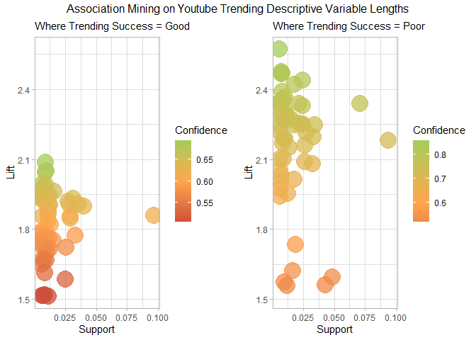<!-- -->

    ## TableGrob (2 x 2) "arrange": 3 grobs
    ##   z     cells    name                grob
    ## 1 1 (2-2,1-1) arrange      gtable[layout]
    ## 2 2 (2-2,2-2) arrange      gtable[layout]
    ## 3 3 (1-1,1-2) arrange text[GRID.text.966]

``` r
Good.rules_table <- bind_rows(Good.rules_table, length_overall_success,)
Poor.rules_table <- bind_rows(Poor.rules_table, inverse.length_overall_success)
```

Trending Speed:

``` r
length_speed_success <- length_mining("days_until_trending_category", "Good")
inverse.length_speed_success <- length_mining("days_until_trending_category", "Poor")
```

``` r
print(length_speed_success)
```

    ## [1] "There are no rules for this metric"

``` r
print(inverse.length_speed_success)
```

    ## [1] "There are no rules for this metric"

Trending Retention:

``` r
length_retention_success <- length_mining("trending_retention_category", "Good")
inverse.length_retention_success <- length_mining("trending_retention_category", "Poor")
```

``` r
print(length_retention_success)
```

    ## [1] "There are no rules for this metric"

``` r
ggplot(inverse.length_retention_success, aes(x = support, y = lift, color = confidence)) +
    geom_point(size = 8, alpha = 0.75) +  # Adjusted size for better visualization
    scale_color_gradient2(low = "tomato3", mid = "tan1", high = "darkolivegreen3", 
                          midpoint = 0.6, name = "Confidence") + 
    theme_light() +
    labs(
      title = "Association Mining on Youtube Trending Descriptive Variable Lengths",
      x = "Support",
      y = "Lift",
      subtitle = paste("Where Trending Retention = Poor and Lift > 1.5")) 
```

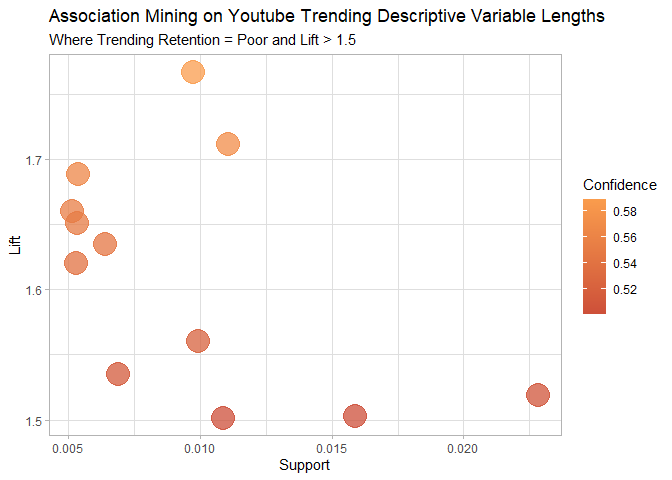<!-- -->

``` r
Poor.rules_table <- bind_rows(Poor.rules_table, inverse.length_retention_success)
```

Engagement Ratio:

``` r
length_engage_success <- length_mining("engagement_ratio_category", "Good")
inverse.length_engage_success <- length_mining("engagement_ratio_category", "Poor")
```

``` r
am_plot(length_engage_success, inverse.length_engage_success,"Engagement Ratio", "Good", "Poor", "Descriptive Variable Lengths")
```

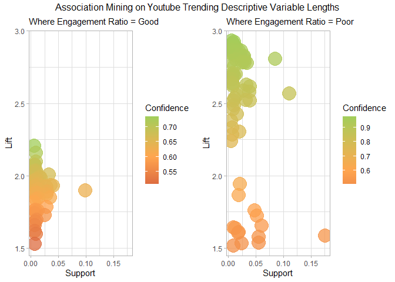<!-- -->

    ## TableGrob (2 x 2) "arrange": 3 grobs
    ##   z     cells    name                 grob
    ## 1 1 (2-2,1-1) arrange       gtable[layout]
    ## 2 2 (2-2,2-2) arrange       gtable[layout]
    ## 3 3 (1-1,1-2) arrange text[GRID.text.1125]

``` r
Good.rules_table <- bind_rows(Good.rules_table, length_engage_success)
Poor.rules_table <- bind_rows(Poor.rules_table, inverse.length_engage_success)
```

Final Rules Table for Descriptive Variable Lengths

``` r
length_rules_good <- Good.rules_table
length_rules_poor <- Poor.rules_table

length_rules_good <- clean_rules_tables(length_rules_good)
length_rules_poor <- clean_rules_tables(length_rules_poor)

mean(length_rules_good$confidence) 
```

    ## [1] 0.7270231

``` r
mean(length_rules_poor$confidence)
```

    ## [1] 0.8883277

<!-- -->

    ## TableGrob (2 x 2) "arrange": 3 grobs
    ##   z     cells    name                 grob
    ## 1 1 (2-2,1-1) arrange       gtable[layout]
    ## 2 2 (2-2,2-2) arrange       gtable[layout]
    ## 3 3 (1-1,1-2) arrange text[GRID.text.1230]

<table class="table table-striped table-hover table-condensed" style="color: black; width: auto !important; margin-left: auto; margin-right: auto;">

<caption>

Length of Descriptive Varibales *Good* Success Rules
</caption>

<thead>

<tr>

<th style="text-align:left;font-weight: bold;background-color: rgba(245, 245, 245, 255) !important;">

rules
</th>

<th style="text-align:right;font-weight: bold;background-color: rgba(245, 245, 245, 255) !important;">

support
</th>

<th style="text-align:right;font-weight: bold;background-color: rgba(245, 245, 245, 255) !important;">

confidence
</th>

<th style="text-align:right;font-weight: bold;background-color: rgba(245, 245, 245, 255) !important;">

coverage
</th>

<th style="text-align:right;font-weight: bold;background-color: rgba(245, 245, 245, 255) !important;">

lift
</th>

<th style="text-align:right;font-weight: bold;background-color: rgba(245, 245, 245, 255) !important;">

count
</th>

<th style="text-align:left;font-weight: bold;background-color: rgba(245, 245, 245, 255) !important;">

category
</th>

<th style="text-align:left;font-weight: bold;background-color: rgba(245, 245, 245, 255) !important;">

metric
</th>

</tr>

</thead>

<tbody>

<tr>

<td style="text-align:left;width: 3cm; font-weight: bold;">

{category_name=Comedy,tag_usage_category=Low,title_length_category=Short}
=\> {engagement_ratio_category=Good}
</td>

<td style="text-align:right;width: 2cm; ">

0.0058781
</td>

<td style="text-align:right;width: 2cm; ">

0.7347480
</td>

<td style="text-align:right;width: 2cm; ">

0.0080002
</td>

<td style="text-align:right;width: 2cm; ">

2.204244
</td>

<td style="text-align:right;width: 2cm; ">

277
</td>

<td style="text-align:left;width: 2cm; ">

Comedy
</td>

<td style="text-align:left;width: 2cm; ">

engagement_ratio_category
</td>

</tr>

<tr>

<td style="text-align:left;width: 3cm; font-weight: bold;">

{category_name=Music,title_length_category=Short,description_length_category=Long}
=\> {engagement_ratio_category=Good}
</td>

<td style="text-align:right;width: 2cm; ">

0.0095705
</td>

<td style="text-align:right;width: 2cm; ">

0.7192982
</td>

<td style="text-align:right;width: 2cm; ">

0.0133053
</td>

<td style="text-align:right;width: 2cm; ">

2.157895
</td>

<td style="text-align:right;width: 2cm; ">

451
</td>

<td style="text-align:left;width: 2cm; ">

Music
</td>

<td style="text-align:left;width: 2cm; ">

engagement_ratio_category
</td>

</tr>

</tbody>

</table>

<table class="table table-striped table-hover table-condensed" style="color: black; width: auto !important; margin-left: auto; margin-right: auto;">

<caption>

Length of Descriptive Variables *Poor* Success Rules
</caption>

<thead>

<tr>

<th style="text-align:left;font-weight: bold;background-color: rgba(245, 245, 245, 255) !important;">

rules
</th>

<th style="text-align:right;font-weight: bold;background-color: rgba(245, 245, 245, 255) !important;">

support
</th>

<th style="text-align:right;font-weight: bold;background-color: rgba(245, 245, 245, 255) !important;">

confidence
</th>

<th style="text-align:right;font-weight: bold;background-color: rgba(245, 245, 245, 255) !important;">

coverage
</th>

<th style="text-align:right;font-weight: bold;background-color: rgba(245, 245, 245, 255) !important;">

lift
</th>

<th style="text-align:right;font-weight: bold;background-color: rgba(245, 245, 245, 255) !important;">

count
</th>

<th style="text-align:left;font-weight: bold;background-color: rgba(245, 245, 245, 255) !important;">

category
</th>

<th style="text-align:left;font-weight: bold;background-color: rgba(245, 245, 245, 255) !important;">

metric
</th>

</tr>

</thead>

<tbody>

<tr>

<td style="text-align:left;width: 3cm; font-weight: bold;">

{category_name=News &
Politics,title_length_category=Long,description_length_category=Mid} =\>
{engagement_ratio_category=Poor}
</td>

<td style="text-align:right;width: 2cm; ">

0.0082548
</td>

<td style="text-align:right;width: 2cm; ">

0.9725000
</td>

<td style="text-align:right;width: 2cm; ">

0.0084882
</td>

<td style="text-align:right;width: 2cm; ">

2.917500
</td>

<td style="text-align:right;width: 2cm; ">

389
</td>

<td style="text-align:left;width: 2cm; ">

News & Politics
</td>

<td style="text-align:left;width: 2cm; ">

engagement_ratio_category
</td>

</tr>

<tr>

<td style="text-align:left;width: 3cm; font-weight: bold;">

{category_name=News &
Politics,tag_usage_category=Low,description_length_category=Mid} =\>
{engagement_ratio_category=Poor}
</td>

<td style="text-align:right;width: 2cm; ">

0.0058781
</td>

<td style="text-align:right;width: 2cm; ">

0.9685315
</td>

<td style="text-align:right;width: 2cm; ">

0.0060691
</td>

<td style="text-align:right;width: 2cm; ">

2.905594
</td>

<td style="text-align:right;width: 2cm; ">

277
</td>

<td style="text-align:left;width: 2cm; ">

News & Politics
</td>

<td style="text-align:left;width: 2cm; ">

engagement_ratio_category
</td>

</tr>

<tr>

<td style="text-align:left;width: 3cm; font-weight: bold;">

{category_name=News &
Politics,tag_usage_category=Low,title_length_category=Long,description_length_category=Short}
=\> {engagement_ratio_category=Poor}
</td>

<td style="text-align:right;width: 2cm; ">

0.0067694
</td>

<td style="text-align:right;width: 2cm; ">

0.9637462
</td>

<td style="text-align:right;width: 2cm; ">

0.0070240
</td>

<td style="text-align:right;width: 2cm; ">

2.891239
</td>

<td style="text-align:right;width: 2cm; ">

319
</td>

<td style="text-align:left;width: 2cm; ">

News & Politics
</td>

<td style="text-align:left;width: 2cm; ">

engagement_ratio_category
</td>

</tr>

<tr>

<td style="text-align:left;width: 3cm; font-weight: bold;">

{category_name=News &
Politics,tag_usage_category=Low,description_length_category=Short} =\>
{overall_success=Poor}
</td>

<td style="text-align:right;width: 2cm; ">

0.0081275
</td>

<td style="text-align:right;width: 2cm; ">

0.7816327
</td>

<td style="text-align:right;width: 2cm; ">

0.0103981
</td>

<td style="text-align:right;width: 2cm; ">

2.344898
</td>

<td style="text-align:right;width: 2cm; ">

383
</td>

<td style="text-align:left;width: 2cm; ">

News & Politics
</td>

<td style="text-align:left;width: 2cm; ">

overall_success
</td>

</tr>

<tr>

<td style="text-align:left;width: 3cm; font-weight: bold;">

{category_name=News &
Politics,tag_usage_category=Low,title_length_category=Long,description_length_category=Short}
=\> {overall_success=Poor}
</td>

<td style="text-align:right;width: 2cm; ">

0.0054749
</td>

<td style="text-align:right;width: 2cm; ">

0.7794562
</td>

<td style="text-align:right;width: 2cm; ">

0.0070240
</td>

<td style="text-align:right;width: 2cm; ">

2.338369
</td>

<td style="text-align:right;width: 2cm; ">

258
</td>

<td style="text-align:left;width: 2cm; ">

News & Politics
</td>

<td style="text-align:left;width: 2cm; ">

overall_success
</td>

</tr>

<tr>

<td style="text-align:left;width: 3cm; font-weight: bold;">

{category_name=News &
Politics,tag_usage_category=Low,title_length_category=Long} =\>
{overall_success=Poor}
</td>

<td style="text-align:right;width: 2cm; ">

0.0105254
</td>

<td style="text-align:right;width: 2cm; ">

0.7666151
</td>

<td style="text-align:right;width: 2cm; ">

0.0137297
</td>

<td style="text-align:right;width: 2cm; ">

2.299845
</td>

<td style="text-align:right;width: 2cm; ">

496
</td>

<td style="text-align:left;width: 2cm; ">

News & Politics
</td>

<td style="text-align:left;width: 2cm; ">

overall_success
</td>

</tr>

<tr>

<td style="text-align:left;width: 3cm; font-weight: bold;">

{category_name=Sports,tag_usage_category=No Tags
Used,title_length_category=Long,description_length_category=Short} =\>
{engagement_ratio_category=Poor}
</td>

<td style="text-align:right;width: 2cm; ">

0.0063874
</td>

<td style="text-align:right;width: 2cm; ">

0.9772727
</td>

<td style="text-align:right;width: 2cm; ">

0.0065359
</td>

<td style="text-align:right;width: 2cm; ">

2.931818
</td>

<td style="text-align:right;width: 2cm; ">

301
</td>

<td style="text-align:left;width: 2cm; ">

Sports
</td>

<td style="text-align:left;width: 2cm; ">

engagement_ratio_category
</td>

</tr>

<tr>

<td style="text-align:left;width: 3cm; font-weight: bold;">

{category_name=Sports,tag_usage_category=Mid,title_length_category=Long,description_length_category=Long}
=\> {engagement_ratio_category=Poor}
</td>

<td style="text-align:right;width: 2cm; ">

0.0107164
</td>

<td style="text-align:right;width: 2cm; ">

0.9749035
</td>

<td style="text-align:right;width: 2cm; ">

0.0109923
</td>

<td style="text-align:right;width: 2cm; ">

2.924710
</td>

<td style="text-align:right;width: 2cm; ">

505
</td>

<td style="text-align:left;width: 2cm; ">

Sports
</td>

<td style="text-align:left;width: 2cm; ">

engagement_ratio_category
</td>

</tr>

<tr>

<td style="text-align:left;width: 3cm; font-weight: bold;">

{category_name=Sports,tag_usage_category=Low,title_length_category=Long,description_length_category=Mid}
=\> {engagement_ratio_category=Poor}
</td>

<td style="text-align:right;width: 2cm; ">

0.0090824
</td>

<td style="text-align:right;width: 2cm; ">

0.9705215
</td>

<td style="text-align:right;width: 2cm; ">

0.0093583
</td>

<td style="text-align:right;width: 2cm; ">

2.911565
</td>

<td style="text-align:right;width: 2cm; ">

428
</td>

<td style="text-align:left;width: 2cm; ">

Sports
</td>

<td style="text-align:left;width: 2cm; ">

engagement_ratio_category
</td>

</tr>

<tr>

<td style="text-align:left;width: 3cm; font-weight: bold;">

{category_name=Sports,tag_usage_category=No Tags
Used,title_length_category=Long,description_length_category=Short} =\>
{overall_success=Poor}
</td>

<td style="text-align:right;width: 2cm; ">

0.0056022
</td>

<td style="text-align:right;width: 2cm; ">

0.8571429
</td>

<td style="text-align:right;width: 2cm; ">

0.0065359
</td>

<td style="text-align:right;width: 2cm; ">

2.571429
</td>

<td style="text-align:right;width: 2cm; ">

264
</td>

<td style="text-align:left;width: 2cm; ">

Sports
</td>

<td style="text-align:left;width: 2cm; ">

overall_success
</td>

</tr>

<tr>

<td style="text-align:left;width: 3cm; font-weight: bold;">

{category_name=Sports,tag_usage_category=Low,title_length_category=Long,description_length_category=Short}
=\> {overall_success=Poor}
</td>

<td style="text-align:right;width: 2cm; ">

0.0075758
</td>

<td style="text-align:right;width: 2cm; ">

0.8244804
</td>

<td style="text-align:right;width: 2cm; ">

0.0091885
</td>

<td style="text-align:right;width: 2cm; ">

2.473441
</td>

<td style="text-align:right;width: 2cm; ">

357
</td>

<td style="text-align:left;width: 2cm; ">

Sports
</td>

<td style="text-align:left;width: 2cm; ">

overall_success
</td>

</tr>

<tr>

<td style="text-align:left;width: 3cm; font-weight: bold;">

{category_name=Sports,tag_usage_category=Low,title_length_category=Long,description_length_category=Mid}
=\> {overall_success=Poor}
</td>

<td style="text-align:right;width: 2cm; ">

0.0077031
</td>

<td style="text-align:right;width: 2cm; ">

0.8231293
</td>

<td style="text-align:right;width: 2cm; ">

0.0093583
</td>

<td style="text-align:right;width: 2cm; ">

2.469388
</td>

<td style="text-align:right;width: 2cm; ">

363
</td>

<td style="text-align:left;width: 2cm; ">

Sports
</td>

<td style="text-align:left;width: 2cm; ">

overall_success
</td>

</tr>

</tbody>

</table>

    ## 
    ## **Association Rules Analysis**
    ##  Descriptive Variable Length Categories were categorize based on the following Tertile Categorization: 
    ##  - Low Tag Usage = 1 - 13 Tags
    ##  - High Tag Usage = 24 - 78 Tags
    ##  - Short Titles = 1 - 40 Characters 
    ##  - Long Titles = 57 - 124 Characters
    ##  - Short Descriptions = 2 - 513 Characters 
    ##  - Long Descriptions = 1086 - 5072 Characters
    ##  
    ## The rules table was filtered to include only those with a minimum of 70% confidence. The final table includes associations for Good and Poor Success metrics based on descriptive variable lengths in videos, with the following results:
    ##  - Good Success: 2 rules across two channel categories (Music and Comedy)
    ##  - Poor Success: 12 rules across two channel categories (Sports, News & Politics)
    ##  
    ## As seen in the association mining chart, the number of rules and the confidence in those rules is much higher for Poor Success associations compared to Good Success associations. The average confidence for Good Success rules was 72.7% (N = 2), while the average confidence for Poor Success rules was 88.8% (N = 12). This suggests that while there is no exact methodology for ensuring a video's success, there are clearly identifiable patterns to avoid in order to minimize the chances of experiencing poor success on the trending page.
    ##  
    ## **Key Insights:**
    ##  - **Comedy Category**: Channels are 2.2 times more likely to achieve Good Engagement Ratios if they keep their tag usage low and their titles short (73% Confidence).
    ##  - **Music Category**: Channels are 2.15 times more likely to achieve Good Engagement Ratios if they keep their titles short and offer more content in their descriptions (71% Confidence).
    ##  
    ## For those aiming to improve overall success in the **News & Politics** category, it is recommended to use more tags and provide more context in the descriptions. You are 2.34 times more likely to experience Poor Success in this category if you use fewer tags and have short descriptions (78% Confidence).
    ##  For those in the **Sports** category, success can be improved by using tags, keeping titles shorter, and providing more context in descriptions. You are 2.57 times more likely to experience Poor Success in this category if you fail to use tags, have long titles, and offer little context in descriptions (85.7% Confidence).

## Section 3.3: Published Timing Associations

Are videos published at specific times (Times of day, times of week,
times of month, times of year) associated with better success metrics?

Data Prep and Function Creation:

``` r
# Reinitialize the rules tables as empty data frames
Good.rules_table <- data.frame( 
  rules =character(),
  support = numeric(),
  confidence = numeric(),
  coverage = numeric(),
  lift = numeric(),
  count = integer()
)[0, ]

Poor.rules_table <- data.frame( 
  rules =character(),
  support = numeric(),
  confidence = numeric(),
  coverage = numeric(),
  lift = numeric(),
  count = integer()
)[0, ]

am.2_df <- arules_df %>%
  mutate(
    # Recode timestamp into descriptive labels
    time_of_day = case_when(
      hour(date_published) >= 0 & hour(date_published) < 6 ~"Night",
      hour(date_published) >= 6 & hour(date_published) < 12 ~ "Morning",
      hour(date_published) >= 12 & hour(date_published) < 18 ~ "Afternoon",
      hour(date_published) >= 18 ~ "Evening"),
    
    # Recode the Date into descriptive labels, such as day-of-week, time of month, and season
    time_of_week = wday(date_published, label = TRUE, abbr = FALSE),
    
    time_of_month = case_when(
      ceiling(day(date_published) / 7) == 1 ~ "Beginning",
      (ceiling(day(date_published) / 7 ) == 2 | 
         ceiling(day(date_published) / 7 ) == 3) ~ "Middle",
      ceiling(day(date_published) / 7 ) >= 4 ~ "End"),
    
    time_of_year = case_when(
      month(date_published, label = TRUE, abbr = FALSE) %in% c(
        "March", "April", "May") ~ "Spring",
      month(date_published, label = TRUE, abbr = FALSE) %in% c(
        "June", "July", "August") ~ "Summer", 
    month(date_published, label = TRUE, abbr = FALSE) %in% c(
      "September", "October", "November") ~ "Autumn",
    month(date_published, label = TRUE, abbr = FALSE) %in% c(
      "December", "January", "February") ~ "Winter")
  ) %>%
  select(category_name, time_of_day, time_of_week, time_of_month, time_of_year, overall_success, days_until_trending_category, trending_retention_category, engagement_ratio_category)


time_mining <- function(metric, eval) {
  df <-  am.2_df %>%
    select(category_name, time_of_day, time_of_week, time_of_month, time_of_year, metric)  
  
  # Convert the data frame into a transactions object
  transactions <- as(df, "transactions")
  
  rhs = paste0(metric, "=", eval)
  
  # Generate association rules using the apriori algorithm
  rules <- apriori(
    transactions,
    parameter = list(support = 0.005, confidence = 0.5),
    appearance = list(default = "lhs", rhs = rhs)
  )
  
  if (length(rules) == 0) {
    return("There are no rules for this metric")
  }
  
  # Convert rules to data frame, filter by lift > 2, and arrange them by descending lift
  rules_df <- as(rules, "data.frame") %>%
    filter(lift > 1.5) %>%
    arrange(desc(lift))
  
  if (nrow(rules_df) == 0) {
    return("There are no rules with a lift higher than 2 for this metric")
  }
  
  return(rules_df)
}
```

Overall Success:

``` r
overall_success_rules <- time_mining("overall_success", "Good")
inverse_success_rules <- time_mining("overall_success", "Poor")
```

``` r
am_plot(overall_success_rules, inverse_success_rules,"Trending Success", "Good", "Poor", "Time Variables")
```

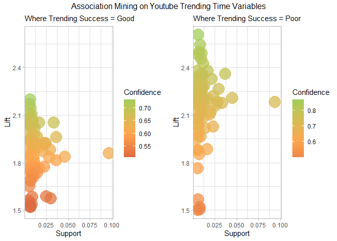<!-- -->

    ## TableGrob (2 x 2) "arrange": 3 grobs
    ##   z     cells    name                 grob
    ## 1 1 (2-2,1-1) arrange       gtable[layout]
    ## 2 2 (2-2,2-2) arrange       gtable[layout]
    ## 3 3 (1-1,1-2) arrange text[GRID.text.1335]

``` r
Good.rules_table <- bind_rows(Good.rules_table, overall_success_rules)
Poor.rules_table <- bind_rows(Poor.rules_table, inverse_success_rules)
```

Trending Speed:

``` r
days.until_success_rules <- time_mining("days_until_trending_category", "Good")
inverse_days.until_srules <- time_mining("days_until_trending_category", "Poor")
```

``` r
am_plot(days.until_success_rules, inverse_days.until_srules,"Trending Speed", "Good", "Poor", "Time Variables")
```

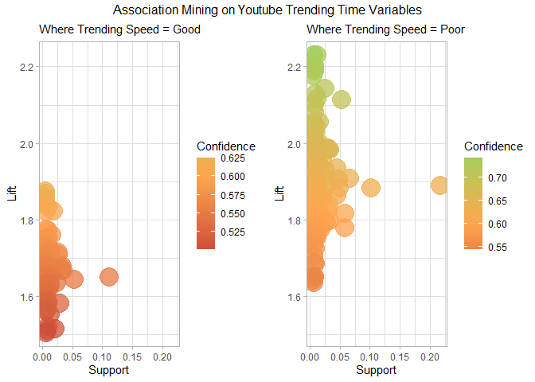<!-- -->

    ## TableGrob (2 x 2) "arrange": 3 grobs
    ##   z     cells    name                 grob
    ## 1 1 (2-2,1-1) arrange       gtable[layout]
    ## 2 2 (2-2,2-2) arrange       gtable[layout]
    ## 3 3 (1-1,1-2) arrange text[GRID.text.1440]

``` r
Good.rules_table <- bind_rows(Good.rules_table, days.until_success_rules)
Poor.rules_table <- bind_rows(Poor.rules_table, inverse_days.until_srules)
```

Trending Retention:

``` r
retention_success_rules <- time_mining("trending_retention_category", "Good")
inverse_retention_success_rules <- time_mining("trending_retention_category", "Poor")
```

``` r
am_plot(retention_success_rules, inverse_retention_success_rules,"Trending Retention", "Good", "Poor", "Time Variables")
```

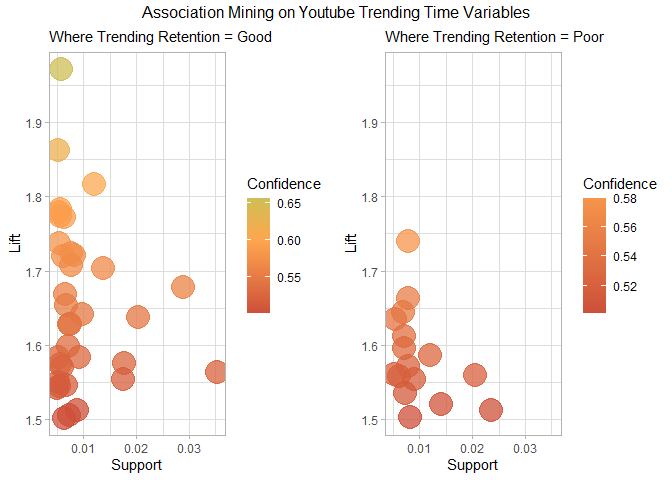<!-- -->

    ## TableGrob (2 x 2) "arrange": 3 grobs
    ##   z     cells    name                 grob
    ## 1 1 (2-2,1-1) arrange       gtable[layout]
    ## 2 2 (2-2,2-2) arrange       gtable[layout]
    ## 3 3 (1-1,1-2) arrange text[GRID.text.1545]

``` r
Good.rules_table <- bind_rows(Good.rules_table, retention_success_rules)
Poor.rules_table <- bind_rows(Poor.rules_table, inverse_retention_success_rules)
```

Engagement Ratio:

``` r
engagement_success_rules <- time_mining("engagement_ratio_category", "Good")
inverse_engagement_rules <- time_mining("engagement_ratio_category", "Poor")
```

``` r
am_plot(engagement_success_rules, inverse_engagement_rules,"Engagement Ratio", "Good", "Poor", "Time Variables")
```

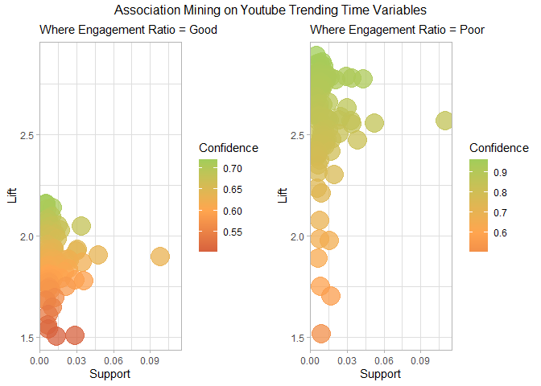<!-- -->

    ## TableGrob (2 x 2) "arrange": 3 grobs
    ##   z     cells    name                 grob
    ## 1 1 (2-2,1-1) arrange       gtable[layout]
    ## 2 2 (2-2,2-2) arrange       gtable[layout]
    ## 3 3 (1-1,1-2) arrange text[GRID.text.1650]

``` r
Good.rules_table <- bind_rows(Good.rules_table, engagement_success_rules)
Poor.rules_table <- bind_rows(Poor.rules_table, inverse_engagement_rules)
```

Final Rules Table for Publishing Time:

``` r
time_rules_good <- Good.rules_table
time_rules_poor <- Poor.rules_table

time_rules_good <- clean_rules_tables(time_rules_good)
time_rules_poor <- clean_rules_tables(time_rules_poor)

mean(time_rules_good$confidence) 
```

    ## [1] 0.7190218

``` r
mean(time_rules_poor$confidence)
```

    ## [1] 0.8303794

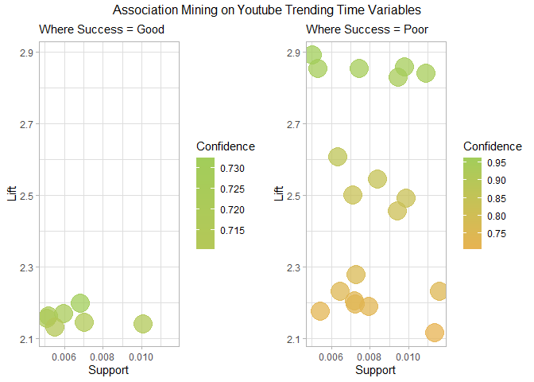<!-- -->

    ## TableGrob (2 x 2) "arrange": 3 grobs
    ##   z     cells    name                 grob
    ## 1 1 (2-2,1-1) arrange       gtable[layout]
    ## 2 2 (2-2,2-2) arrange       gtable[layout]
    ## 3 3 (1-1,1-2) arrange text[GRID.text.1755]

<table class="table table-striped table-hover table-condensed" style="color: black; width: auto !important; margin-left: auto; margin-right: auto;">

<caption>

Time Varibales *Good* Success Rules
</caption>

<thead>

<tr>

<th style="text-align:left;font-weight: bold;background-color: rgba(245, 245, 245, 255) !important;">

rules
</th>

<th style="text-align:right;font-weight: bold;background-color: rgba(245, 245, 245, 255) !important;">

support
</th>

<th style="text-align:right;font-weight: bold;background-color: rgba(245, 245, 245, 255) !important;">

confidence
</th>

<th style="text-align:right;font-weight: bold;background-color: rgba(245, 245, 245, 255) !important;">

coverage
</th>

<th style="text-align:right;font-weight: bold;background-color: rgba(245, 245, 245, 255) !important;">

lift
</th>

<th style="text-align:right;font-weight: bold;background-color: rgba(245, 245, 245, 255) !important;">

count
</th>

<th style="text-align:left;font-weight: bold;background-color: rgba(245, 245, 245, 255) !important;">

category
</th>

<th style="text-align:left;font-weight: bold;background-color: rgba(245, 245, 245, 255) !important;">

metric
</th>

</tr>

</thead>

<tbody>

<tr>

<td style="text-align:left;width: 3cm; font-weight: bold;">

{category_name=Comedy,time_of_day=Evening,time_of_month=End} =\>
{engagement_ratio_category=Good}
</td>

<td style="text-align:right;width: 2cm; ">

0.0050929
</td>

<td style="text-align:right;width: 2cm; ">

0.7185629
</td>

<td style="text-align:right;width: 2cm; ">

0.0070877
</td>

<td style="text-align:right;width: 2cm; ">

2.155689
</td>

<td style="text-align:right;width: 2cm; ">

240
</td>

<td style="text-align:left;width: 2cm; ">

Comedy
</td>

<td style="text-align:left;width: 2cm; ">

engagement_ratio_category
</td>

</tr>

<tr>

<td style="text-align:left;width: 3cm; font-weight: bold;">

{category_name=Music,time_of_day=Afternoon,time_of_year=Winter} =\>
{overall_success=Good}
</td>

<td style="text-align:right;width: 2cm; ">

0.0068543
</td>

<td style="text-align:right;width: 2cm; ">

0.7324263
</td>

<td style="text-align:right;width: 2cm; ">

0.0093583
</td>

<td style="text-align:right;width: 2cm; ">

2.197279
</td>

<td style="text-align:right;width: 2cm; ">

323
</td>

<td style="text-align:left;width: 2cm; ">

Music
</td>

<td style="text-align:left;width: 2cm; ">

overall_success
</td>

</tr>

<tr>

<td style="text-align:left;width: 3cm; font-weight: bold;">

{category_name=Music,time_of_month=End,time_of_year=Winter} =\>
{overall_success=Good}
</td>

<td style="text-align:right;width: 2cm; ">

0.0059842
</td>

<td style="text-align:right;width: 2cm; ">

0.7230769
</td>

<td style="text-align:right;width: 2cm; ">

0.0082760
</td>

<td style="text-align:right;width: 2cm; ">

2.169231
</td>

<td style="text-align:right;width: 2cm; ">

282
</td>

<td style="text-align:left;width: 2cm; ">

Music
</td>

<td style="text-align:left;width: 2cm; ">

overall_success
</td>

</tr>

<tr>

<td style="text-align:left;width: 3cm; font-weight: bold;">

{category_name=Music,time_of_day=Afternoon,time_of_month=Middle,time_of_year=Summer}
=\> {engagement_ratio_category=Good}
</td>

<td style="text-align:right;width: 2cm; ">

0.0051990
</td>

<td style="text-align:right;width: 2cm; ">

0.7205882
</td>

<td style="text-align:right;width: 2cm; ">

0.0072150
</td>

<td style="text-align:right;width: 2cm; ">

2.161765
</td>

<td style="text-align:right;width: 2cm; ">

245
</td>

<td style="text-align:left;width: 2cm; ">

Music
</td>

<td style="text-align:left;width: 2cm; ">

engagement_ratio_category
</td>

</tr>

<tr>

<td style="text-align:left;width: 3cm; font-weight: bold;">

{category_name=Music,time_of_day=Afternoon,time_of_week=Wednesday} =\>
{overall_success=Good}
</td>

<td style="text-align:right;width: 2cm; ">

0.0070240
</td>

<td style="text-align:right;width: 2cm; ">

0.7149028
</td>

<td style="text-align:right;width: 2cm; ">

0.0098251
</td>

<td style="text-align:right;width: 2cm; ">

2.144708
</td>

<td style="text-align:right;width: 2cm; ">

331
</td>

<td style="text-align:left;width: 2cm; ">

Music
</td>

<td style="text-align:left;width: 2cm; ">

overall_success
</td>

</tr>

<tr>

<td style="text-align:left;width: 3cm; font-weight: bold;">

{category_name=Music,time_of_day=Afternoon,time_of_year=Summer} =\>
{engagement_ratio_category=Good}
</td>

<td style="text-align:right;width: 2cm; ">

0.0100798
</td>

<td style="text-align:right;width: 2cm; ">

0.7132132
</td>

<td style="text-align:right;width: 2cm; ">

0.0141329
</td>

<td style="text-align:right;width: 2cm; ">

2.139640
</td>

<td style="text-align:right;width: 2cm; ">

475
</td>

<td style="text-align:left;width: 2cm; ">

Music
</td>

<td style="text-align:left;width: 2cm; ">

engagement_ratio_category
</td>

</tr>

<tr>

<td style="text-align:left;width: 3cm; font-weight: bold;">

{category_name=Music,time_of_day=Afternoon,time_of_week=Tuesday} =\>
{engagement_ratio_category=Good}
</td>

<td style="text-align:right;width: 2cm; ">

0.0055174
</td>

<td style="text-align:right;width: 2cm; ">

0.7103825
</td>

<td style="text-align:right;width: 2cm; ">

0.0077667
</td>

<td style="text-align:right;width: 2cm; ">

2.131147
</td>

<td style="text-align:right;width: 2cm; ">

260
</td>

<td style="text-align:left;width: 2cm; ">

Music
</td>

<td style="text-align:left;width: 2cm; ">

engagement_ratio_category
</td>

</tr>

</tbody>

</table>

<table class="table table-striped table-hover table-condensed" style="color: black; width: auto !important; margin-left: auto; margin-right: auto;">

<caption>

Time Variables *Poor* Success Rules
</caption>

<thead>

<tr>

<th style="text-align:left;font-weight: bold;background-color: rgba(245, 245, 245, 255) !important;">

rules
</th>

<th style="text-align:right;font-weight: bold;background-color: rgba(245, 245, 245, 255) !important;">

support
</th>

<th style="text-align:right;font-weight: bold;background-color: rgba(245, 245, 245, 255) !important;">

confidence
</th>

<th style="text-align:right;font-weight: bold;background-color: rgba(245, 245, 245, 255) !important;">

coverage
</th>

<th style="text-align:right;font-weight: bold;background-color: rgba(245, 245, 245, 255) !important;">

lift
</th>

<th style="text-align:right;font-weight: bold;background-color: rgba(245, 245, 245, 255) !important;">

count
</th>

<th style="text-align:left;font-weight: bold;background-color: rgba(245, 245, 245, 255) !important;">

category
</th>

<th style="text-align:left;font-weight: bold;background-color: rgba(245, 245, 245, 255) !important;">

metric
</th>

</tr>

</thead>

<tbody>

<tr>

<td style="text-align:left;width: 3cm; font-weight: bold;">

{category_name=Gaming,time_of_day=Evening,time_of_month=Middle,time_of_year=Summer}
=\> {days_until_trending_category=Poor}
</td>

<td style="text-align:right;width: 2cm; ">

0.0054325
</td>

<td style="text-align:right;width: 2cm; ">

0.7252125
</td>

<td style="text-align:right;width: 2cm; ">

0.0074909
</td>

<td style="text-align:right;width: 2cm; ">

2.175637
</td>

<td style="text-align:right;width: 2cm; ">

256
</td>

<td style="text-align:left;width: 2cm; ">

Gaming
</td>

<td style="text-align:left;width: 2cm; ">

days_until_trending_category
</td>

</tr>

<tr>

<td style="text-align:left;width: 3cm; font-weight: bold;">

{category_name=Gaming,time_of_day=Evening,time_of_year=Summer} =\>
{days_until_trending_category=Poor}
</td>

<td style="text-align:right;width: 2cm; ">

0.0113742
</td>

<td style="text-align:right;width: 2cm; ">

0.7052632
</td>

<td style="text-align:right;width: 2cm; ">

0.0161277
</td>

<td style="text-align:right;width: 2cm; ">

2.115789
</td>

<td style="text-align:right;width: 2cm; ">

536
</td>

<td style="text-align:left;width: 2cm; ">

Gaming
</td>

<td style="text-align:left;width: 2cm; ">

days_until_trending_category
</td>

</tr>

<tr>

<td style="text-align:left;width: 3cm; font-weight: bold;">

{category_name=News & Politics,time_of_day=Evening,time_of_month=Middle}
=\> {engagement_ratio_category=Poor}
</td>

<td style="text-align:right;width: 2cm; ">

0.0053264
</td>

<td style="text-align:right;width: 2cm; ">

0.9507576
</td>

<td style="text-align:right;width: 2cm; ">

0.0056022
</td>

<td style="text-align:right;width: 2cm; ">

2.852273
</td>

<td style="text-align:right;width: 2cm; ">

251
</td>

<td style="text-align:left;width: 2cm; ">

News & Politics
</td>

<td style="text-align:left;width: 2cm; ">

engagement_ratio_category
</td>

</tr>

<tr>

<td style="text-align:left;width: 3cm; font-weight: bold;">

{category_name=News & Politics,time_of_day=Evening} =\>
{engagement_ratio_category=Poor}
</td>

<td style="text-align:right;width: 2cm; ">

0.0109286
</td>

<td style="text-align:right;width: 2cm; ">

0.9466912
</td>

<td style="text-align:right;width: 2cm; ">

0.0115440
</td>

<td style="text-align:right;width: 2cm; ">

2.840073
</td>

<td style="text-align:right;width: 2cm; ">

515
</td>

<td style="text-align:left;width: 2cm; ">

News & Politics
</td>

<td style="text-align:left;width: 2cm; ">

engagement_ratio_category
</td>

</tr>

<tr>

<td style="text-align:left;width: 3cm; font-weight: bold;">

{category_name=News & Politics,time_of_day=Night} =\>
{engagement_ratio_category=Poor}
</td>

<td style="text-align:right;width: 2cm; ">

0.0094644
</td>

<td style="text-align:right;width: 2cm; ">

0.9429175
</td>

<td style="text-align:right;width: 2cm; ">

0.0100373
</td>

<td style="text-align:right;width: 2cm; ">

2.828753
</td>

<td style="text-align:right;width: 2cm; ">

446
</td>

<td style="text-align:left;width: 2cm; ">

News & Politics
</td>

<td style="text-align:left;width: 2cm; ">

engagement_ratio_category
</td>

</tr>

<tr>

<td style="text-align:left;width: 3cm; font-weight: bold;">

{category_name=News & Politics,time_of_year=Summer} =\>
{overall_success=Poor}
</td>

<td style="text-align:right;width: 2cm; ">

0.0071089
</td>

<td style="text-align:right;width: 2cm; ">

0.8333333
</td>

<td style="text-align:right;width: 2cm; ">

0.0085307
</td>

<td style="text-align:right;width: 2cm; ">

2.500000
</td>

<td style="text-align:right;width: 2cm; ">

335
</td>

<td style="text-align:left;width: 2cm; ">

News & Politics
</td>

<td style="text-align:left;width: 2cm; ">

overall_success
</td>

</tr>

<tr>

<td style="text-align:left;width: 3cm; font-weight: bold;">

{category_name=News & Politics,time_of_day=Evening} =\>
{overall_success=Poor}
</td>

<td style="text-align:right;width: 2cm; ">

0.0094432
</td>

<td style="text-align:right;width: 2cm; ">

0.8180147
</td>

<td style="text-align:right;width: 2cm; ">

0.0115440
</td>

<td style="text-align:right;width: 2cm; ">

2.454044
</td>

<td style="text-align:right;width: 2cm; ">

445
</td>

<td style="text-align:left;width: 2cm; ">

News & Politics
</td>

<td style="text-align:left;width: 2cm; ">

overall_success
</td>

</tr>

<tr>

<td style="text-align:left;width: 3cm; font-weight: bold;">

{category_name=News & Politics,time_of_year=Autumn} =\>
{overall_success=Poor}
</td>

<td style="text-align:right;width: 2cm; ">

0.0072787
</td>

<td style="text-align:right;width: 2cm; ">

0.7588496
</td>

<td style="text-align:right;width: 2cm; ">

0.0095917
</td>

<td style="text-align:right;width: 2cm; ">

2.276549
</td>

<td style="text-align:right;width: 2cm; ">

343
</td>

<td style="text-align:left;width: 2cm; ">

News & Politics
</td>

<td style="text-align:left;width: 2cm; ">

overall_success
</td>

</tr>

<tr>

<td style="text-align:left;width: 3cm; font-weight: bold;">

{category_name=People & Blogs,time_of_day=Evening,time_of_year=Summer}
=\> {days_until_trending_category=Poor}
</td>

<td style="text-align:right;width: 2cm; ">

0.0064511
</td>

<td style="text-align:right;width: 2cm; ">

0.7432763
</td>

<td style="text-align:right;width: 2cm; ">

0.0086792
</td>

<td style="text-align:right;width: 2cm; ">

2.229829
</td>

<td style="text-align:right;width: 2cm; ">

304
</td>

<td style="text-align:left;width: 2cm; ">

People & Blogs
</td>

<td style="text-align:left;width: 2cm; ">

days_until_trending_category
</td>

</tr>

<tr>

<td style="text-align:left;width: 3cm; font-weight: bold;">

{category_name=Sports,time_of_day=Night,time_of_week=Sunday,time_of_month=Middle}
=\> {engagement_ratio_category=Poor}
</td>

<td style="text-align:right;width: 2cm; ">

0.0050293
</td>

<td style="text-align:right;width: 2cm; ">

0.9634146
</td>

<td style="text-align:right;width: 2cm; ">

0.0052203
</td>

<td style="text-align:right;width: 2cm; ">

2.890244
</td>

<td style="text-align:right;width: 2cm; ">

237
</td>

<td style="text-align:left;width: 2cm; ">

Sports
</td>

<td style="text-align:left;width: 2cm; ">

engagement_ratio_category
</td>

</tr>

<tr>

<td style="text-align:left;width: 3cm; font-weight: bold;">

{category_name=Sports,time_of_day=Night,time_of_week=Sunday} =\>
{engagement_ratio_category=Poor}
</td>

<td style="text-align:right;width: 2cm; ">

0.0098039
</td>

<td style="text-align:right;width: 2cm; ">

0.9525773
</td>

<td style="text-align:right;width: 2cm; ">

0.0102920
</td>

<td style="text-align:right;width: 2cm; ">

2.857732
</td>

<td style="text-align:right;width: 2cm; ">

462
</td>

<td style="text-align:left;width: 2cm; ">

Sports
</td>

<td style="text-align:left;width: 2cm; ">

engagement_ratio_category
</td>

</tr>

<tr>

<td style="text-align:left;width: 3cm; font-weight: bold;">

{category_name=Sports,time_of_week=Sunday,time_of_year=Winter} =\>
{engagement_ratio_category=Poor}
</td>

<td style="text-align:right;width: 2cm; ">

0.0074484
</td>

<td style="text-align:right;width: 2cm; ">

0.9512195
</td>

<td style="text-align:right;width: 2cm; ">

0.0078304
</td>

<td style="text-align:right;width: 2cm; ">

2.853658
</td>

<td style="text-align:right;width: 2cm; ">

351
</td>

<td style="text-align:left;width: 2cm; ">

Sports
</td>

<td style="text-align:left;width: 2cm; ">

engagement_ratio_category
</td>

</tr>

<tr>

<td style="text-align:left;width: 3cm; font-weight: bold;">

{category_name=Sports,time_of_day=Evening,time_of_week=Saturday} =\>
{overall_success=Poor}
</td>

<td style="text-align:right;width: 2cm; ">

0.0063237
</td>

<td style="text-align:right;width: 2cm; ">

0.8688047
</td>

<td style="text-align:right;width: 2cm; ">

0.0072787
</td>

<td style="text-align:right;width: 2cm; ">

2.606414
</td>

<td style="text-align:right;width: 2cm; ">

298
</td>

<td style="text-align:left;width: 2cm; ">

Sports
</td>

<td style="text-align:left;width: 2cm; ">

overall_success
</td>

</tr>

<tr>

<td style="text-align:left;width: 3cm; font-weight: bold;">

{category_name=Sports,time_of_day=Evening,time_of_year=Summer} =\>
{overall_success=Poor}
</td>

<td style="text-align:right;width: 2cm; ">

0.0083821
</td>

<td style="text-align:right;width: 2cm; ">

0.8476395
</td>

<td style="text-align:right;width: 2cm; ">

0.0098888
</td>

<td style="text-align:right;width: 2cm; ">

2.542918
</td>

<td style="text-align:right;width: 2cm; ">

395
</td>

<td style="text-align:left;width: 2cm; ">

Sports
</td>

<td style="text-align:left;width: 2cm; ">

overall_success
</td>

</tr>

<tr>

<td style="text-align:left;width: 3cm; font-weight: bold;">

{category_name=Sports,time_of_day=Evening,time_of_week=Sunday} =\>
{overall_success=Poor}
</td>

<td style="text-align:right;width: 2cm; ">

0.0098676
</td>

<td style="text-align:right;width: 2cm; ">

0.8303571
</td>

<td style="text-align:right;width: 2cm; ">

0.0118835
</td>

<td style="text-align:right;width: 2cm; ">

2.491071
</td>

<td style="text-align:right;width: 2cm; ">

465
</td>

<td style="text-align:left;width: 2cm; ">

Sports
</td>

<td style="text-align:left;width: 2cm; ">

overall_success
</td>

</tr>

<tr>

<td style="text-align:left;width: 3cm; font-weight: bold;">

{category_name=Sports,time_of_day=Evening,time_of_year=Summer} =\>
{days_until_trending_category=Poor}
</td>

<td style="text-align:right;width: 2cm; ">

0.0072362
</td>

<td style="text-align:right;width: 2cm; ">

0.7317597
</td>

<td style="text-align:right;width: 2cm; ">

0.0098888
</td>

<td style="text-align:right;width: 2cm; ">

2.195279
</td>

<td style="text-align:right;width: 2cm; ">

341
</td>

<td style="text-align:left;width: 2cm; ">

Sports
</td>

<td style="text-align:left;width: 2cm; ">

days_until_trending_category
</td>

</tr>

<tr>

<td style="text-align:left;width: 3cm; font-weight: bold;">

{time_of_day=Evening,time_of_month=Beginning,time_of_year=Summer} =\>
{days_until_trending_category=Poor}
</td>

<td style="text-align:right;width: 2cm; ">

0.0116077
</td>

<td style="text-align:right;width: 2cm; ">

0.7432065
</td>

<td style="text-align:right;width: 2cm; ">

0.0156184
</td>

<td style="text-align:right;width: 2cm; ">

2.229620
</td>

<td style="text-align:right;width: 2cm; ">

547
</td>

<td style="text-align:left;width: 2cm; ">

NA
</td>

<td style="text-align:left;width: 2cm; ">

days_until_trending_category
</td>

</tr>

<tr>

<td style="text-align:left;width: 3cm; font-weight: bold;">

{time_of_day=Evening,time_of_week=Friday,time_of_year=Summer} =\>
{days_until_trending_category=Poor}
</td>

<td style="text-align:right;width: 2cm; ">

0.0072150
</td>

<td style="text-align:right;width: 2cm; ">

0.7343413
</td>

<td style="text-align:right;width: 2cm; ">

0.0098251
</td>

<td style="text-align:right;width: 2cm; ">

2.203024
</td>

<td style="text-align:right;width: 2cm; ">

340
</td>

<td style="text-align:left;width: 2cm; ">

NA
</td>

<td style="text-align:left;width: 2cm; ">

days_until_trending_category
</td>

</tr>

<tr>

<td style="text-align:left;width: 3cm; font-weight: bold;">

{time_of_day=Evening,time_of_week=Thursday,time_of_year=Summer} =\>
{days_until_trending_category=Poor}
</td>

<td style="text-align:right;width: 2cm; ">

0.0079577
</td>

<td style="text-align:right;width: 2cm; ">

0.7295720
</td>

<td style="text-align:right;width: 2cm; ">

0.0109074
</td>

<td style="text-align:right;width: 2cm; ">

2.188716
</td>

<td style="text-align:right;width: 2cm; ">

375
</td>

<td style="text-align:left;width: 2cm; ">

NA
</td>

<td style="text-align:left;width: 2cm; ">

days_until_trending_category
</td>

</tr>

</tbody>

</table>

    ## 
    ## **Association Rules Analysis**
    ##  Times of Day were categorized based on the follow categorizations: 
    ##  - Night = 12AM - 6 AM
    ##  - Morning = 6AM - 12PM
    ##  - Afternoon = 12PM - 6PM 
    ##  - Evning = 6PM - 12AM 
    ##  
    ## The rules table was filtered to include only those with a minimum of 70% confidence. The final table includes associations for Good and Poor Success metrics based the time of posting, with the following results:
    ##  - Good Success: 7 rules across two channel categories (Again, in Music and Comedy)
    ##  - Poor Success: 19 rules across five channel categories (Again, Sports and News & Politics, but also in Gaming, People & Blogs, and General Channel Insights)
    ##  
    ## Once again the number of rules and the confidence in those rules is much higher for Poor Success associations compared to Good Success associations, however, the margins are much closer in this section than they were in the descriptive variable lengths section. The average confidence for Good Success rules was 71.9% (N = 7), while the average confidence for Poor Success rules was 83% (N = 19). This still suggests that while there is no exact methodology for ensuring a video's success based on the post timing, however, there are clearly identifiable patterns to avoid in order to minimize the chances of experiencing poor success on the trending page.
    ##  
    ## **Key Insights:**
    ##  Good Success:
    ##  - **Comedy Category**: Channels are 2.15 times more likely to achieve Good Engagement Ratios if they post in the evenings at the end of the month (71.8% Confidence).
    ##  - **Music Category**: Channels are more likely to achieve Good Overall Success if they post in the afternoons during the Winter(2.19x) or Wednesdays(2.14x) (73.2% / 71.2% Confidence).
    ##  
    ## Poor Success: 
    ## For those posting in the **News & Politics** category, they are 2.8 times likely to experiance poor engagement ratios if they post durings the evenings(94.6% Confidence) and 2.5 times likely to experiance poor overall success during the Summer (83.3% Confidence).
    ##  For those posting in the **Sports** category, they are 2.89x times likely to experiance poor engagement ratios if they post durings the night time on Sundays in the middle of the month and (96.3.6% Confidence) and 2.61 times likely to experiance poor overall success during the evenings on Saturdays (86.8% Confidence).
    ##  People posting in the People & Blogs or the Gaming category experiance low trending speeds when they post in the Evenings during the summer (Blogs: 2.2x | 74.3% Confidence) (Gaming: 2.1x | 70.1% Confidence)
    ##  Finally, all three rules associated with Poor Trending speed for all channel categories report that posting during Evenings in the summer increases your chances of poor success by more than 2.1 times (Roughly 72-74% Confidence)

## Section 3.4: Dominant Sentiments Associations

Are videos of certain sentiments associated with better success metrics
across different channel categories?

Data Prep and Function Creation:

``` r
# Reinitialize the rules tables as empty data frames
Good.rules_table <- data.frame( 
  rules =character(),
  support = numeric(),
  confidence = numeric(),
  coverage = numeric(),
  lift = numeric(),
  count = integer()
)[0, ]

Poor.rules_table <- data.frame( 
  rules =character(),
  support = numeric(),
  confidence = numeric(),
  coverage = numeric(),
  lift = numeric(),
  count = integer()
)[0, ]

# No Recoding Required as Dominant Sentiments is already a categorical factor
sentiment_mining <- function(metric, eval) {
  df <-  arules_df %>%
    select(category_name, dominant_sentiment, metric)  
  
  # Convert the data frame into a transactions object
  transactions <- as(df, "transactions")
  
  rhs = paste0(metric, "=", eval)
  
  # Generate association rules using the apriori algorithm
  rules <- apriori(
    transactions,
    parameter = list(support = 0.005, confidence = 0.5),
    appearance = list(default = "lhs", rhs = rhs)
  )
  
  if (length(rules) == 0) {
    return("There are no rules for this metric")
  }
  
  # Convert rules to data frame, filter by lift > 2, and arrange them by descending lift
  rules_df <- as(rules, "data.frame") %>%
    filter(lift > 1.5) %>%
    arrange(desc(lift))
  
  if (nrow(rules_df) == 0) {
    return("There are no rules with a lift higher than 2 for this metric")
  }
  
  return(rules_df)
}
```

Overall Success:

``` r
sentiment_overall_rules <- sentiment_mining("overall_success", "Good")
inverse.sentiment_overall_rules <- sentiment_mining("overall_success", "Poor")
```

``` r
am_plot(sentiment_overall_rules, inverse.sentiment_overall_rules,"Overall Success", "Good", "Poor", "Dominant Sentiment")
```

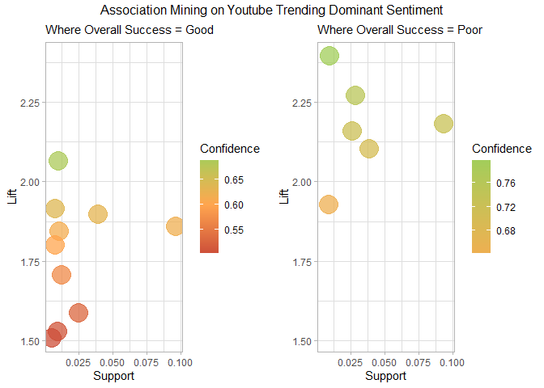<!-- -->

    ## TableGrob (2 x 2) "arrange": 3 grobs
    ##   z     cells    name                 grob
    ## 1 1 (2-2,1-1) arrange       gtable[layout]
    ## 2 2 (2-2,2-2) arrange       gtable[layout]
    ## 3 3 (1-1,1-2) arrange text[GRID.text.1860]

``` r
Good.rules_table <- bind_rows(Good.rules_table, sentiment_overall_rules)
Poor.rules_table <- bind_rows(Poor.rules_table, inverse.sentiment_overall_rules)
```

Trending Speed:

``` r
sentiment_speed_rules <- sentiment_mining("days_until_trending_category", "Good")
inverse.sentiment_speed_rules <- sentiment_mining("days_until_trending_category", "Poor")
```

``` r
print(sentiment_speed_rules)
```

    ## [1] "There are no rules for this metric"

``` r
print(inverse.sentiment_speed_rules)
```

    ## [1] "There are no rules for this metric"

Trending Retention:

``` r
sentiment_retention_rules <- sentiment_mining("trending_retention_category", "Good")
inverse.sentiment_retention_rules <- sentiment_mining("trending_retention_category", "Poor")
```

``` r
print(sentiment_retention_rules)
```

    ## [1] "There are no rules for this metric"

``` r
ggplot(inverse.sentiment_retention_rules, aes(x = support, y = lift, color = confidence)) +
    geom_point(size = 8, alpha = 0.75) +  # Adjusted size for better visualization
    scale_color_gradient2(low = "tomato3", mid = "tan1", high = "darkolivegreen3", 
                          midpoint = 0.6, name = "Confidence") + 
    theme_light() +
    labs(
      title = "Association Mining on YouTube Trending Dominant Sentiment",
      x = "Support",
      y = "Lift",
      subtitle = paste("Where Trending Retention = Poor and Lift > 1.5")) 
```

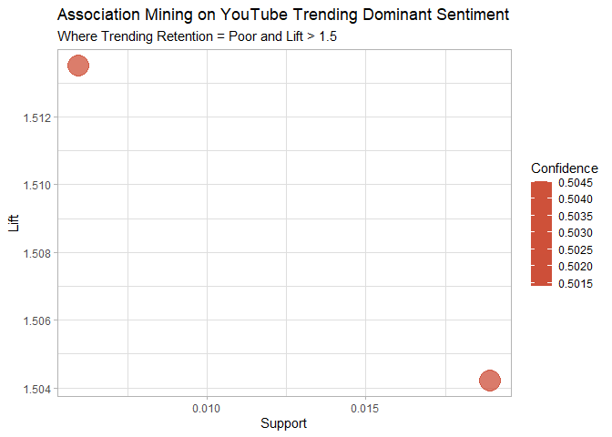<!-- -->

``` r
Poor.rules_table <- bind_rows(Poor.rules_table, inverse.sentiment_retention_rules)
```

Engagement Ratio:

``` r
sentiment_engage_rules <- sentiment_mining("engagement_ratio_category", "Good")
inverse.sentiment_engage_rules <- sentiment_mining("engagement_ratio_category", "Poor")
```

``` r
am_plot(sentiment_engage_rules, inverse.sentiment_engage_rules,"Engagement Ratio", "Good", "Poor", "Dominant Sentiment")
```

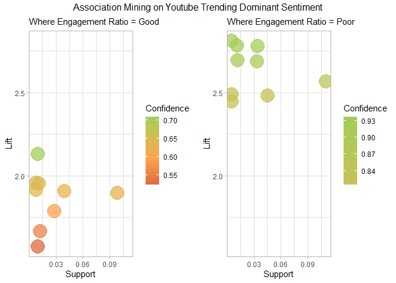<!-- -->

    ## TableGrob (2 x 2) "arrange": 3 grobs
    ##   z     cells    name                 grob
    ## 1 1 (2-2,1-1) arrange       gtable[layout]
    ## 2 2 (2-2,2-2) arrange       gtable[layout]
    ## 3 3 (1-1,1-2) arrange text[GRID.text.2019]

``` r
Good.rules_table <- bind_rows(Good.rules_table, sentiment_engage_rules)
Poor.rules_table <- bind_rows(Poor.rules_table, inverse.sentiment_engage_rules)
```

Final Rules Table for Dominant Sentiment

``` r
sentiment_rules_good <- Good.rules_table
sentiment_rules_poor <- Poor.rules_table

sentiment_rules_good <- clean_rules_tables(sentiment_rules_good)
sentiment_rules_poor <- clean_rules_tables(sentiment_rules_poor)

mean(sentiment_rules_good$confidence) 
```

    ## [1] 0.7102526

``` r
mean(sentiment_rules_poor$confidence)
```

    ## [1] 0.8442663

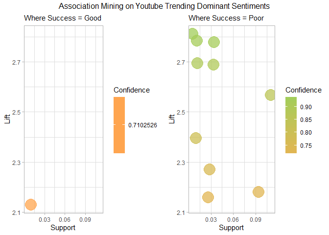<!-- -->

    ## TableGrob (2 x 2) "arrange": 3 grobs
    ##   z     cells    name                 grob
    ## 1 1 (2-2,1-1) arrange       gtable[layout]
    ## 2 2 (2-2,2-2) arrange       gtable[layout]
    ## 3 3 (1-1,1-2) arrange text[GRID.text.2124]

<table class="table table-striped table-hover table-condensed" style="color: black; width: auto !important; margin-left: auto; margin-right: auto;">

<caption>

Dominant Sentiment *Good* Success Rules
</caption>

<thead>

<tr>

<th style="text-align:left;font-weight: bold;background-color: rgba(245, 245, 245, 255) !important;">

rules
</th>

<th style="text-align:right;font-weight: bold;background-color: rgba(245, 245, 245, 255) !important;">

support
</th>

<th style="text-align:right;font-weight: bold;background-color: rgba(245, 245, 245, 255) !important;">

confidence
</th>

<th style="text-align:right;font-weight: bold;background-color: rgba(245, 245, 245, 255) !important;">

coverage
</th>

<th style="text-align:right;font-weight: bold;background-color: rgba(245, 245, 245, 255) !important;">

lift
</th>

<th style="text-align:right;font-weight: bold;background-color: rgba(245, 245, 245, 255) !important;">

count
</th>

<th style="text-align:left;font-weight: bold;background-color: rgba(245, 245, 245, 255) !important;">

category
</th>

<th style="text-align:left;font-weight: bold;background-color: rgba(245, 245, 245, 255) !important;">

metric
</th>

</tr>

</thead>

<tbody>

<tr>

<td style="text-align:left;width: 3cm; font-weight: bold;">

{category_name=Music,dominant_sentiment=trust} =\>
{engagement_ratio_category=Good}
</td>

<td style="text-align:right;width: 2cm; ">

0.0101435
</td>

<td style="text-align:right;width: 2cm; ">

0.7102526
</td>

<td style="text-align:right;width: 2cm; ">

0.0142815
</td>

<td style="text-align:right;width: 2cm; ">

2.130758
</td>

<td style="text-align:right;width: 2cm; ">

478
</td>

<td style="text-align:left;width: 2cm; ">

Music
</td>

<td style="text-align:left;width: 2cm; ">

engagement_ratio_category
</td>

</tr>

</tbody>

</table>

<table class="table table-striped table-hover table-condensed" style="color: black; width: auto !important; margin-left: auto; margin-right: auto;">

<caption>

Dominant Sentiment *Poor* Success Rules
</caption>

<thead>

<tr>

<th style="text-align:left;font-weight: bold;background-color: rgba(245, 245, 245, 255) !important;">

rules
</th>

<th style="text-align:right;font-weight: bold;background-color: rgba(245, 245, 245, 255) !important;">

support
</th>

<th style="text-align:right;font-weight: bold;background-color: rgba(245, 245, 245, 255) !important;">

confidence
</th>

<th style="text-align:right;font-weight: bold;background-color: rgba(245, 245, 245, 255) !important;">

coverage
</th>

<th style="text-align:right;font-weight: bold;background-color: rgba(245, 245, 245, 255) !important;">

lift
</th>

<th style="text-align:right;font-weight: bold;background-color: rgba(245, 245, 245, 255) !important;">

count
</th>

<th style="text-align:left;font-weight: bold;background-color: rgba(245, 245, 245, 255) !important;">

category
</th>

<th style="text-align:left;font-weight: bold;background-color: rgba(245, 245, 245, 255) !important;">

metric
</th>

</tr>

</thead>

<tbody>

<tr>

<td style="text-align:left;width: 3cm; font-weight: bold;">

{category_name=News & Politics,dominant_sentiment=anticipation} =\>
{engagement_ratio_category=Poor}
</td>

<td style="text-align:right;width: 2cm; ">

0.0053688
</td>

<td style="text-align:right;width: 2cm; ">

0.9370370
</td>

<td style="text-align:right;width: 2cm; ">

0.0057296
</td>

<td style="text-align:right;width: 2cm; ">

2.811111
</td>

<td style="text-align:right;width: 2cm; ">

253
</td>

<td style="text-align:left;width: 2cm; ">

News & Politics
</td>

<td style="text-align:left;width: 2cm; ">

engagement_ratio_category
</td>

</tr>

<tr>

<td style="text-align:left;width: 3cm; font-weight: bold;">

{category_name=News & Politics} =\> {engagement_ratio_category=Poor}
</td>

<td style="text-align:right;width: 2cm; ">

0.0339954
</td>

<td style="text-align:right;width: 2cm; ">

0.9260116
</td>

<td style="text-align:right;width: 2cm; ">

0.0367117
</td>

<td style="text-align:right;width: 2cm; ">

2.778035
</td>

<td style="text-align:right;width: 2cm; ">

1602
</td>

<td style="text-align:left;width: 2cm; ">

News & Politics
</td>

<td style="text-align:left;width: 2cm; ">

engagement_ratio_category
</td>

</tr>

<tr>

<td style="text-align:left;width: 3cm; font-weight: bold;">

{category_name=News & Politics,dominant_sentiment=positive} =\>
{engagement_ratio_category=Poor}
</td>

<td style="text-align:right;width: 2cm; ">

0.0121382
</td>

<td style="text-align:right;width: 2cm; ">

0.8979592
</td>

<td style="text-align:right;width: 2cm; ">

0.0135175
</td>

<td style="text-align:right;width: 2cm; ">

2.693878
</td>

<td style="text-align:right;width: 2cm; ">

572
</td>

<td style="text-align:left;width: 2cm; ">

News & Politics
</td>

<td style="text-align:left;width: 2cm; ">

engagement_ratio_category
</td>

</tr>

<tr>

<td style="text-align:left;width: 3cm; font-weight: bold;">

{category_name=News & Politics} =\> {overall_success=Poor}
</td>

<td style="text-align:right;width: 2cm; ">

0.0264197
</td>

<td style="text-align:right;width: 2cm; ">

0.7196532
</td>

<td style="text-align:right;width: 2cm; ">

0.0367117
</td>

<td style="text-align:right;width: 2cm; ">

2.158959
</td>

<td style="text-align:right;width: 2cm; ">

1245
</td>

<td style="text-align:left;width: 2cm; ">

News & Politics
</td>

<td style="text-align:left;width: 2cm; ">

overall_success
</td>

</tr>

<tr>

<td style="text-align:left;width: 3cm; font-weight: bold;">

{category_name=Sports,dominant_sentiment=trust} =\>
{engagement_ratio_category=Poor}
</td>

<td style="text-align:right;width: 2cm; ">

0.0112257
</td>

<td style="text-align:right;width: 2cm; ">

0.9280702
</td>

<td style="text-align:right;width: 2cm; ">

0.0120957
</td>

<td style="text-align:right;width: 2cm; ">

2.784210
</td>

<td style="text-align:right;width: 2cm; ">

529
</td>

<td style="text-align:left;width: 2cm; ">

Sports
</td>

<td style="text-align:left;width: 2cm; ">

engagement_ratio_category
</td>

</tr>

<tr>

<td style="text-align:left;width: 3cm; font-weight: bold;">

{category_name=Sports,dominant_sentiment=anticipation} =\>
{engagement_ratio_category=Poor}
</td>

<td style="text-align:right;width: 2cm; ">

0.0338257
</td>

<td style="text-align:right;width: 2cm; ">

0.8960090
</td>

<td style="text-align:right;width: 2cm; ">

0.0377515
</td>

<td style="text-align:right;width: 2cm; ">

2.688027
</td>

<td style="text-align:right;width: 2cm; ">

1594
</td>

<td style="text-align:left;width: 2cm; ">

Sports
</td>

<td style="text-align:left;width: 2cm; ">

engagement_ratio_category
</td>

</tr>

<tr>

<td style="text-align:left;width: 3cm; font-weight: bold;">

{category_name=Sports} =\> {engagement_ratio_category=Poor}
</td>

<td style="text-align:right;width: 2cm; ">

0.1103259
</td>

<td style="text-align:right;width: 2cm; ">

0.8560843
</td>

<td style="text-align:right;width: 2cm; ">

0.1288728
</td>

<td style="text-align:right;width: 2cm; ">

2.568253
</td>

<td style="text-align:right;width: 2cm; ">

5199
</td>

<td style="text-align:left;width: 2cm; ">

Sports
</td>

<td style="text-align:left;width: 2cm; ">

engagement_ratio_category
</td>

</tr>

<tr>

<td style="text-align:left;width: 3cm; font-weight: bold;">

{category_name=Sports,dominant_sentiment=trust} =\>
{overall_success=Poor}
</td>

<td style="text-align:right;width: 2cm; ">

0.0096554
</td>

<td style="text-align:right;width: 2cm; ">

0.7982456
</td>

<td style="text-align:right;width: 2cm; ">

0.0120957
</td>

<td style="text-align:right;width: 2cm; ">

2.394737
</td>

<td style="text-align:right;width: 2cm; ">

455
</td>

<td style="text-align:left;width: 2cm; ">

Sports
</td>

<td style="text-align:left;width: 2cm; ">

overall_success
</td>

</tr>

<tr>

<td style="text-align:left;width: 3cm; font-weight: bold;">

{category_name=Sports,dominant_sentiment=anticipation} =\>
{overall_success=Poor}
</td>

<td style="text-align:right;width: 2cm; ">

0.0285629
</td>

<td style="text-align:right;width: 2cm; ">

0.7566048
</td>

<td style="text-align:right;width: 2cm; ">

0.0377515
</td>

<td style="text-align:right;width: 2cm; ">

2.269814
</td>

<td style="text-align:right;width: 2cm; ">

1346
</td>

<td style="text-align:left;width: 2cm; ">

Sports
</td>

<td style="text-align:left;width: 2cm; ">

overall_success
</td>

</tr>

<tr>

<td style="text-align:left;width: 3cm; font-weight: bold;">

{category_name=Sports} =\> {overall_success=Poor}
</td>

<td style="text-align:right;width: 2cm; ">

0.0936890
</td>

<td style="text-align:right;width: 2cm; ">

0.7269883
</td>

<td style="text-align:right;width: 2cm; ">

0.1288728
</td>

<td style="text-align:right;width: 2cm; ">

2.180965
</td>

<td style="text-align:right;width: 2cm; ">

4415
</td>

<td style="text-align:left;width: 2cm; ">

Sports
</td>

<td style="text-align:left;width: 2cm; ">

overall_success
</td>

</tr>

</tbody>

</table>

    ## 
    ## **Association Rules Analysis**
    ##  The rules table was filtered to include only those with a minimum of 70% confidence. The final table includes associations for Good and Poor Success metrics based on dominant sentiments expressed in the video description, with the following results:
    ##  - Good Success: Only 1 rule in the Music Category
    ##  - Poor Success: 10 rules across two channel categories (Sports, News & Politics)
    ##  
    ## More so than in the previous two categories, the differences between the the Good Rules and Poor rules is apparent. In this section, only 1 rule for good success associations made it past the 70% confidence filter, where 10 rules for poor success associations made it through. Coincidently, the same channel categories as the precious two sections are present once again in this results page. The confidence for Good Success rule is 71% (N = 1), while the average confidence for Poor Success rules was 84.4% (N = 10). This final association test affirms the idea that while there is no exact methodology for ensuring a video's success, there are clearly identifiable patterns to avoid in order to minimize the chances of experiencing poor success on the trending page.
    ##  
    ## **Key Insights:**
    ##  - **Music Category**: Channels are 2.13 times more likely to achieve Good Engagement Ratios if the dominant sentiment in their video descriptions is trust (71% Confidence).
    ##  
    ## For those aiming to improve their engagement ratio in the **News & Politics** category, it is recommended to uavoid the anticipation sentiment in your video descriptions. You are 2.8 times more likely to experience Poor Success in this category if that is the dominant emotion in your video description (93.7% Confidence).
    ##  For those in the **Sports** category, overall success and engagement ratio can be improved by avoiding the trust and anticipation sentiments. You are respectively 2.39 times and 2.26 times more likely to experience Poor Success in this category if you use these sentiments in your video descriptions (79.8% / 75.6% Confidence).

## Section 3.6: Final Association Rules

``` r
Good.rules_table <- rbind(length_rules_good, time_rules_good, sentiment_rules_good)
Poor.rules_table <- rbind(length_rules_poor, time_rules_poor, sentiment_rules_poor)

mean(Good.rules_table$confidence) 
```

    ## [1] 0.7197452

``` r
mean(Poor.rules_table$confidence)
```

    ## [1] 0.8507269

``` r
# Plotting Final Association Rules Tables
am_plot(Good.rules_table, Poor.rules_table,"Success", "Good", "Poor", "Data")
```

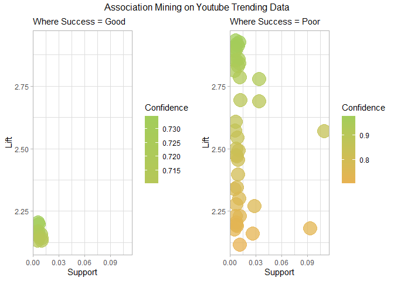<!-- -->

    ## TableGrob (2 x 2) "arrange": 3 grobs
    ##   z     cells    name                 grob
    ## 1 1 (2-2,1-1) arrange       gtable[layout]
    ## 2 2 (2-2,2-2) arrange       gtable[layout]
    ## 3 3 (1-1,1-2) arrange text[GRID.text.2229]

    ## 
    ## **Association Mining Insights**
    ##  Our analysis of the combined results from all three association mining methods reveals that there is no one-size-fits-all strategy for guaranteed success on the trending page. While we cannot offer a foolproof formula, we can highlight behaviors to avoid in certain content categories to minimize the risk of poor performance. By steering clear of these pitfalls, our clients can reduce their chances of underperforming.
    ##  Achieving better success most likely depends on more nuanced factors, such as content quality, community engagement, and broader strategies that go beyond simple behaviors like tag usage or posting times. In summary, clients should focus on avoiding these negative patterns, but also recognize that enhancing success requires a balanced and thoughtful content strategy.

## Conclusions

What are our final recommendations to YouTube Creators based on our the
descriptive statistics of our dataset, our sentiment analysis, and our
association mining?

    ## **Final Conclusions**
    ##  So what we can recommend to our clients is to keep the majority of videos focused on positivity and then try to add in aspects of anticipation and trust unless stated otherwise. There aren’t really any factors that directly increase the success of a video, but there are some shown to inhibit the success of a video. For instance, comedy channels should keep the number of tags low and titles short while music channels should keep their titles short and have a detailed description, with some sentiments of trust. Additionally, news and politics channels should use lots of tags and have a detailed description, but avoid anticipation sentiments. And lastly, sports channels should use lots of tags, have short tiles, and a detailed description, but avoid trust and anticipation sentiments. In regard to every channel, they should avoid posting during the evenings in Summer to not decrease their chance of making it on the trending page. 
    ##  Overall, there isn’t anything you can really do to guarantee success on YouTube. The best recommendation would be just to make high quality videos that keep people interested and build a following. That way, you will have people ready to watch your videos whenever you post and allow your videos to trend much faster.

Limitations:

    ##  **Limitations**
    ##  
    ## **Reccomendation Limitations:**
    ##  We began this project wanting to give reccomendations for creators on how to maximize their chances of reaching the trending page by emulating successful creators. However, through our analysis, we discovered that the data we had did not lend itself to those insights, as we only had data for videos that did reach the trending page. Becuase we were unable to compare against videos that reached the trending page and videos that hadn't, we were unable to give reccomendations for HOW to reach the trending page, only how to improve success ONCE you started trending.
    ##  **Creator vs Company:**
    ##  There was no easy way to mass quantify whether a YouTube channel was operated by a company or an independent creator. While it was possible to manually classify the top 40 or 50 channels, this approach was not scalable for the entire dataset. Using the following code:
    ##  `creator_type = ifelse(grepl('Official|VEVO|Company|Media|Productions|Studio', channel_title, ignore.case = TRUE))`
    ##  had a high error rate, as it missed companies with acronyms or simpler names, such as NBA, SpaceX, and ESPN, and incorrectly classified independent creators who included terms like 'media' or 'Productions' in their channel name. A more accurate classification could be achieved by exploring the YouTube API to see if it offers internal flags or metadata to distinguish creator types. However, due to time constraints, only the top 50 successful YouTubers were manually classified, and it was not feasible to extend this classification to the entire dataset.
    ##  
    ## **Hardware Limitations:**
    ##  The sentiment analysis and association mining processes placed significant strain on the computing resources. Several analyses took upwards of 20 to 30 minutes to run. In total, the execution time for the entire R Markdown (RMD) file was 32 minutes and 16 seconds. Due to our limited computational power, we were unable to expand this study past the US Trending data, despite the availability of data from other countries and regions. This constraint restricted the scope of the analysis, preventing a more global comparison of trends and metrics.
    ##  
    ## **Future Enhancements:**
    ##  More sophisticated models, such as large language models (LLMs) or advanced natural language processing (NLP) techniques, could potentially provide deeper insights into different factors impacts on success metrics. These models could enhance the scalability and accuracy of the analysis moving forward, however, these models would require more powerful computing resources. Secondly, expanding our hardware capabilities to be able to handle data from either other regions or video data from the same time period / region that didn't reach the trending page would allow us to offer insights how HOW creators can maximize their trending potential and success. Unforuntatly, our hardware was pushed to the limits by this data alone, and expanding our analysis to include more data points was not/is not possible until we can increase out computing power.
