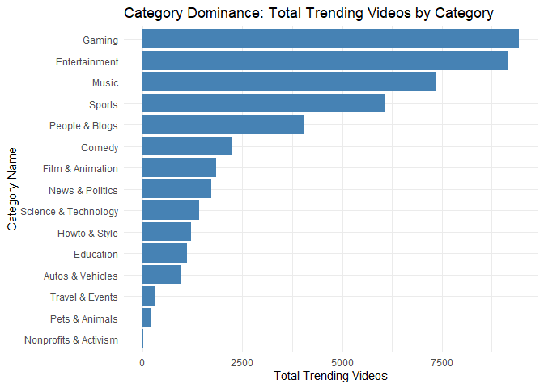
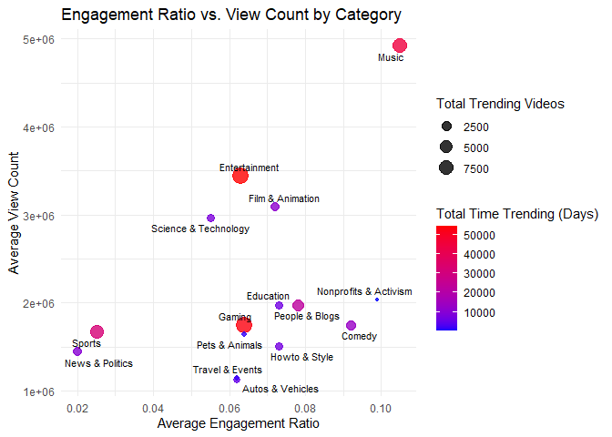
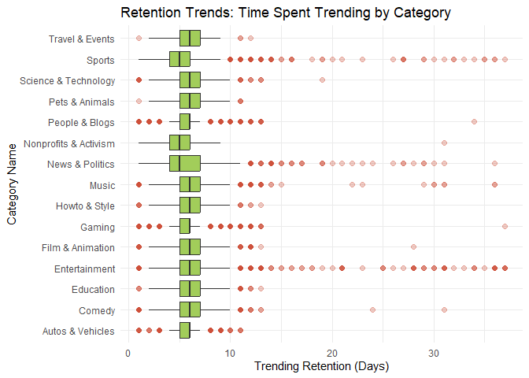
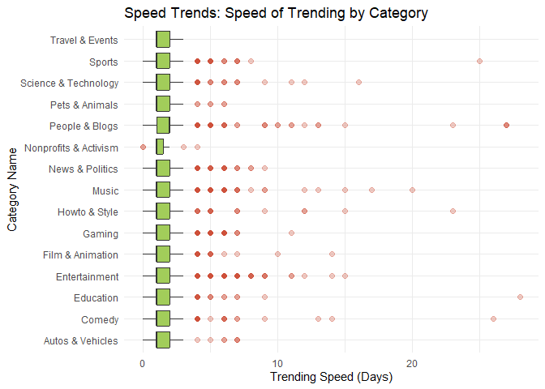
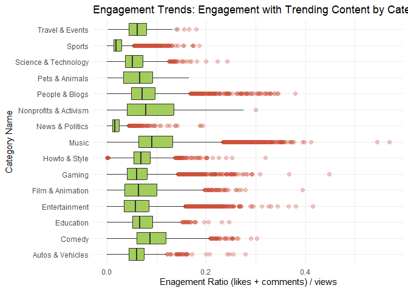

Descriptive Statistics and Visualization
================
Alina Hagen, Brodie Vancil
2025-07-29

## Data and Text Mining Final Project: Maximizing Success on YouTube’s Trending Page: Content Optimization Strategies Based on Analysis of the Top 200 Videos Over the Last Four Years

**Topic:** Success Factors on YouTube Trending Videos

**Question:** What are common trends among the top trending YouTube
videos in the US, and how do different factors impact their success on
the trending page?

**Goal:** To analyze data from each day’s top 200 trending YouTube
videos from August 2020 to April 2024 and identify success factors among
the most successful videos in the U.S. This analysis will evaluate a
video’s success on the trending page based on the following success
metrics:

- *Engagement Ratio:* The total audience interaction (sum of comments,
  likes, and dislikes) relative to the view count as recorded on the
  final day the video appears on the trending list (representing the
  highest engagement level captured in the dataset)

- *Trending Speed:* How long a video took to reach the trending page

- *Trending Retention:* How long a video remains on the trending page

------------------------------------------------------------------------

## Libraries

``` r
# Libraries / Packages
library(arules)
library(dplyr)
library(ggplot2)
library(ggrepel)
library(grid)
library(gridExtra)
library(jsonlite)
library(kableExtra)
library(knitr)
library(lubridate)
library(purrr)
library(reshape2)
library(stringr)
library(syuzhet)
library(textdata)
library(tidytext)
library(tidyr)
library(readr)
```

``` r
yt_new <- read_csv("data/cleaned_youtube_data.csv")
```

    ## Rows: 268704 Columns: 14
    ## ── Column specification ────────────────────────────────────────────────────────
    ## Delimiter: ","
    ## chr  (6): video_id, title, channel_title, category_name, description, tags
    ## dbl  (6): views, likes, dislikes, comments, comments_disabled, ratings_disabled
    ## dttm (2): date_published, date_trending
    ## 
    ## ℹ Use `spec()` to retrieve the full column specification for this data.
    ## ℹ Specify the column types or set `show_col_types = FALSE` to quiet this message.

``` r
unique_video_data <- read_csv("data/unique_video_data.csv")
```

    ## Rows: 47124 Columns: 18
    ## ── Column specification ────────────────────────────────────────────────────────
    ## Delimiter: ","
    ## chr  (6): video_id, title, channel_title, category_name, description, tags
    ## dbl  (9): max_views, max_likes, max_dislikes, max_comments, days_until_trend...
    ## dttm (3): date_published, first_date_trending, last_date_trending
    ## 
    ## ℹ Use `spec()` to retrieve the full column specification for this data.
    ## ℹ Specify the column types or set `show_col_types = FALSE` to quiet this message.

## Section 1.1 Descriptive Statistics

Descriptive Statistics Fundamentals (See above, mean, median, mode, etc)

``` r
descriptive_stats <- yt_new %>%
  summarise(
    total_videos = n(),
    total_unique_videos = n_distinct(video_id),
    total_views = sum(views, na.rm = TRUE),
    mean_views = round(mean(views, na.rm = TRUE)),
    median_views = median(views, na.rm = TRUE),
    mode_views = as.numeric(names(sort(table(views), decreasing = TRUE)[1])),
    mean_likes = round(mean(likes, na.rm = TRUE)),
    median_likes = median(likes, na.rm = TRUE),
    mode_likes = as.numeric(names(sort(table(likes), decreasing = TRUE)[1])),
    mean_comments = round(mean(comments, na.rm = TRUE)),
    median_comments = median(comments, na.rm = TRUE),
    mode_comments = as.numeric(names(sort(table(comments), decreasing = TRUE)[1]))
  )

category_stats <- yt_new %>%
  group_by(category_name) %>%
  summarise(
    total_videos = n(),
    total_views = sum(views, na.rm = TRUE),
    mean_views = round(mean(views, na.rm = TRUE)),
    median_views = median(views, na.rm = TRUE),
    mode_views = as.numeric(names(sort(table(views), decreasing = TRUE)[1])),
    mean_likes = round(mean(likes, na.rm = TRUE)),
    median_likes = median(likes, na.rm = TRUE),
    mode_likes = as.numeric(names(sort(table(likes), decreasing = TRUE)[1])),
    mean_comments = round(mean(comments, na.rm = TRUE)),
    median_comments = median(comments, na.rm = TRUE),
    mode_comments = as.numeric(names(sort(table(comments), decreasing = TRUE)[1]))
  ) %>%
  arrange(desc(total_videos))

dataset_summary <- function(descriptive_stats, column_name) {
  # Check which column is selected and retrieve the relevant statistics
  if (column_name == "views") {
    mean_value <- descriptive_stats$mean_views
    median_value <- descriptive_stats$median_views
    mode_value <- descriptive_stats$mode_views
  } else if (column_name == "likes") {
    mean_value <- descriptive_stats$mean_likes
    median_value <- descriptive_stats$median_likes
    mode_value <- descriptive_stats$mode_likes
  } else if (column_name == "comments") {
    mean_value <- descriptive_stats$mean_comments
    median_value <- descriptive_stats$median_comments
    mode_value <- descriptive_stats$mode_comments
  } else {
    stop("Invalid column name. Please choose 'views', 'likes', or 'comments'.")
  }

  # Extract common statistics
  total_videos <- descriptive_stats$total_videos
  total_views <- descriptive_stats$total_views
  
  # print summary
  cat("**Dataset Summary for", column_name, "**\n")
  cat("We looked at", total_videos, "videos in this dataset.\n")
  cat("These videos collectively amassed", total_views, "views.\n")
  cat("The average number of", column_name, "was", mean_value, 
      "while the median was", median_value, ".\n")
  cat("The most frequently occurring number of", column_name, "(mode) was", mode_value, ".\n")
}
```

    ## Entire Dataset Stats

    ## **Dataset Summary for views **
    ## We looked at 268704 videos in this dataset.
    ## These videos collectively amassed 731546546361 views.
    ## The average number of views was 2722500 while the median was 937255.5 .
    ## The most frequently occurring number of views (mode) was 214641 .

    ## **Dataset Summary for likes **
    ## We looked at 268704 videos in this dataset.
    ## These videos collectively amassed 731546546361 views.
    ## The average number of likes was 131503 while the median was 40214.5 .
    ## The most frequently occurring number of likes (mode) was 0 .

    ## **Dataset Summary for comments **
    ## We looked at 268704 videos in this dataset.
    ## These videos collectively amassed 731546546361 views.
    ## The average number of comments was 10146 while the median was 2755 .
    ## The most frequently occurring number of comments (mode) was 0 .

    ## 
    ## **Descriptive Statistics**

<table class="table table-striped table-hover table-condensed" style="color: black; width: auto !important; margin-left: auto; margin-right: auto;">

<caption>

Descriptive Statistics of YouTube Dataset
</caption>

<thead>

<tr>

<th style="text-align:right;font-weight: bold;background-color: rgba(245, 245, 245, 255) !important;">

total_videos
</th>

<th style="text-align:right;font-weight: bold;background-color: rgba(245, 245, 245, 255) !important;">

total_unique_videos
</th>

<th style="text-align:right;font-weight: bold;background-color: rgba(245, 245, 245, 255) !important;">

total_views
</th>

<th style="text-align:right;font-weight: bold;background-color: rgba(245, 245, 245, 255) !important;">

mean_views
</th>

<th style="text-align:right;font-weight: bold;background-color: rgba(245, 245, 245, 255) !important;">

median_views
</th>

<th style="text-align:right;font-weight: bold;background-color: rgba(245, 245, 245, 255) !important;">

mode_views
</th>

<th style="text-align:right;font-weight: bold;background-color: rgba(245, 245, 245, 255) !important;">

mean_likes
</th>

<th style="text-align:right;font-weight: bold;background-color: rgba(245, 245, 245, 255) !important;">

median_likes
</th>

<th style="text-align:right;font-weight: bold;background-color: rgba(245, 245, 245, 255) !important;">

mode_likes
</th>

<th style="text-align:right;font-weight: bold;background-color: rgba(245, 245, 245, 255) !important;">

mean_comments
</th>

<th style="text-align:right;font-weight: bold;background-color: rgba(245, 245, 245, 255) !important;">

median_comments
</th>

<th style="text-align:right;font-weight: bold;background-color: rgba(245, 245, 245, 255) !important;">

mode_comments
</th>

</tr>

</thead>

<tbody>

<tr>

<td style="text-align:right;width: 3cm; font-weight: bold;">

268704
</td>

<td style="text-align:right;width: 2cm; ">

47124
</td>

<td style="text-align:right;width: 2cm; ">

731546546361
</td>

<td style="text-align:right;width: 2cm; ">

2722500
</td>

<td style="text-align:right;width: 2cm; ">

937255.5
</td>

<td style="text-align:right;width: 2cm; ">

214641
</td>

<td style="text-align:right;width: 2cm; ">

131503
</td>

<td style="text-align:right;width: 2cm; ">

40214.5
</td>

<td style="text-align:right;width: 2cm; ">

0
</td>

<td style="text-align:right;width: 2cm; ">

10146
</td>

<td style="text-align:right;">

2755
</td>

<td style="text-align:right;">

0
</td>

</tr>

</tbody>

</table>

<table class="table table-striped table-hover table-condensed" style="color: black; width: auto !important; margin-left: auto; margin-right: auto;">

<caption>

Descriptive Statistics of YouTube Channel Categories
</caption>

<thead>

<tr>

<th style="text-align:left;font-weight: bold;background-color: rgba(245, 245, 245, 255) !important;">

category_name
</th>

<th style="text-align:right;font-weight: bold;background-color: rgba(245, 245, 245, 255) !important;">

total_videos
</th>

<th style="text-align:right;font-weight: bold;background-color: rgba(245, 245, 245, 255) !important;">

total_views
</th>

<th style="text-align:right;font-weight: bold;background-color: rgba(245, 245, 245, 255) !important;">

mean_views
</th>

<th style="text-align:right;font-weight: bold;background-color: rgba(245, 245, 245, 255) !important;">

median_views
</th>

<th style="text-align:right;font-weight: bold;background-color: rgba(245, 245, 245, 255) !important;">

mode_views
</th>

<th style="text-align:right;font-weight: bold;background-color: rgba(245, 245, 245, 255) !important;">

mean_likes
</th>

<th style="text-align:right;font-weight: bold;background-color: rgba(245, 245, 245, 255) !important;">

median_likes
</th>

<th style="text-align:right;font-weight: bold;background-color: rgba(245, 245, 245, 255) !important;">

mode_likes
</th>

<th style="text-align:right;font-weight: bold;background-color: rgba(245, 245, 245, 255) !important;">

mean_comments
</th>

<th style="text-align:right;font-weight: bold;background-color: rgba(245, 245, 245, 255) !important;">

median_comments
</th>

<th style="text-align:right;font-weight: bold;background-color: rgba(245, 245, 245, 255) !important;">

mode_comments
</th>

</tr>

</thead>

<tbody>

<tr>

<td style="text-align:left;width: 3cm; font-weight: bold;">

Entertainment
</td>

<td style="text-align:right;width: 2cm; ">

53920
</td>

<td style="text-align:right;width: 2cm; ">

235887125209
</td>

<td style="text-align:right;width: 2cm; ">

4374761
</td>

<td style="text-align:right;width: 2cm; ">

1076687.5
</td>

<td style="text-align:right;width: 2cm; ">

198683
</td>

<td style="text-align:right;width: 2cm; ">

189045
</td>

<td style="text-align:right;width: 2cm; ">

46417.0
</td>

<td style="text-align:right;width: 2cm; ">

0
</td>

<td style="text-align:right;width: 2cm; ">

10064
</td>

<td style="text-align:right;">

2807.0
</td>

<td style="text-align:right;">

0
</td>

</tr>

<tr>

<td style="text-align:left;width: 3cm; font-weight: bold;">

Gaming
</td>

<td style="text-align:right;width: 2cm; ">

53242
</td>

<td style="text-align:right;width: 2cm; ">

89237040850
</td>

<td style="text-align:right;width: 2cm; ">

1676065
</td>

<td style="text-align:right;width: 2cm; ">

816740.5
</td>

<td style="text-align:right;width: 2cm; ">

232026
</td>

<td style="text-align:right;width: 2cm; ">

90223
</td>

<td style="text-align:right;width: 2cm; ">

37930.5
</td>

<td style="text-align:right;width: 2cm; ">

0
</td>

<td style="text-align:right;width: 2cm; ">

6762
</td>

<td style="text-align:right;">

2398.0
</td>

<td style="text-align:right;">

0
</td>

</tr>

<tr>

<td style="text-align:left;width: 3cm; font-weight: bold;">

Music
</td>

<td style="text-align:right;width: 2cm; ">

43383
</td>

<td style="text-align:right;width: 2cm; ">

187961685402
</td>

<td style="text-align:right;width: 2cm; ">

4332612
</td>

<td style="text-align:right;width: 2cm; ">

1390831.0
</td>

<td style="text-align:right;width: 2cm; ">

408443
</td>

<td style="text-align:right;width: 2cm; ">

270777
</td>

<td style="text-align:right;width: 2cm; ">

82018.0
</td>

<td style="text-align:right;width: 2cm; ">

0
</td>

<td style="text-align:right;width: 2cm; ">

27969
</td>

<td style="text-align:right;">

4736.0
</td>

<td style="text-align:right;">

0
</td>

</tr>

<tr>

<td style="text-align:left;width: 3cm; font-weight: bold;">

Sports
</td>

<td style="text-align:right;width: 2cm; ">

31327
</td>

<td style="text-align:right;width: 2cm; ">

58797298266
</td>

<td style="text-align:right;width: 2cm; ">

1876889
</td>

<td style="text-align:right;width: 2cm; ">

858367.0
</td>

<td style="text-align:right;width: 2cm; ">

269289
</td>

<td style="text-align:right;width: 2cm; ">

43335
</td>

<td style="text-align:right;width: 2cm; ">

14164.0
</td>

<td style="text-align:right;width: 2cm; ">

0
</td>

<td style="text-align:right;width: 2cm; ">

3709
</td>

<td style="text-align:right;">

1937.0
</td>

<td style="text-align:right;">

0
</td>

</tr>

<tr>

<td style="text-align:left;width: 3cm; font-weight: bold;">

People & Blogs
</td>

<td style="text-align:right;width: 2cm; ">

22648
</td>

<td style="text-align:right;width: 2cm; ">

39248710818
</td>

<td style="text-align:right;width: 2cm; ">

1732988
</td>

<td style="text-align:right;width: 2cm; ">

783044.5
</td>

<td style="text-align:right;width: 2cm; ">

479346
</td>

<td style="text-align:right;width: 2cm; ">

95463
</td>

<td style="text-align:right;width: 2cm; ">

39990.0
</td>

<td style="text-align:right;width: 2cm; ">

0
</td>

<td style="text-align:right;width: 2cm; ">

6316
</td>

<td style="text-align:right;">

2385.0
</td>

<td style="text-align:right;">

0
</td>

</tr>

<tr>

<td style="text-align:left;width: 3cm; font-weight: bold;">

Comedy
</td>

<td style="text-align:right;width: 2cm; ">

13183
</td>

<td style="text-align:right;width: 2cm; ">

20973894330
</td>

<td style="text-align:right;width: 2cm; ">

1590980
</td>

<td style="text-align:right;width: 2cm; ">

898757.0
</td>

<td style="text-align:right;width: 2cm; ">

233071
</td>

<td style="text-align:right;width: 2cm; ">

107829
</td>

<td style="text-align:right;width: 2cm; ">

60023.0
</td>

<td style="text-align:right;width: 2cm; ">

0
</td>

<td style="text-align:right;width: 2cm; ">

5618
</td>

<td style="text-align:right;">

3240.0
</td>

<td style="text-align:right;">

0
</td>

</tr>

<tr>

<td style="text-align:left;width: 3cm; font-weight: bold;">

Film & Animation
</td>

<td style="text-align:right;width: 2cm; ">

10887
</td>

<td style="text-align:right;width: 2cm; ">

29869388113
</td>

<td style="text-align:right;width: 2cm; ">

2743583
</td>

<td style="text-align:right;width: 2cm; ">

1116115.0
</td>

<td style="text-align:right;width: 2cm; ">

242753
</td>

<td style="text-align:right;width: 2cm; ">

103745
</td>

<td style="text-align:right;width: 2cm; ">

53682.0
</td>

<td style="text-align:right;width: 2cm; ">

0
</td>

<td style="text-align:right;width: 2cm; ">

7334
</td>

<td style="text-align:right;">

3444.0
</td>

<td style="text-align:right;">

0
</td>

</tr>

<tr>

<td style="text-align:left;width: 3cm; font-weight: bold;">

News & Politics
</td>

<td style="text-align:right;width: 2cm; ">

9669
</td>

<td style="text-align:right;width: 2cm; ">

18739069361
</td>

<td style="text-align:right;width: 2cm; ">

1938057
</td>

<td style="text-align:right;width: 2cm; ">

759183.0
</td>

<td style="text-align:right;width: 2cm; ">

144045
</td>

<td style="text-align:right;width: 2cm; ">

24833
</td>

<td style="text-align:right;width: 2cm; ">

7866.0
</td>

<td style="text-align:right;width: 2cm; ">

0
</td>

<td style="text-align:right;width: 2cm; ">

5649
</td>

<td style="text-align:right;">

2541.0
</td>

<td style="text-align:right;">

0
</td>

</tr>

<tr>

<td style="text-align:left;width: 3cm; font-weight: bold;">

Science & Technology
</td>

<td style="text-align:right;width: 2cm; ">

8156
</td>

<td style="text-align:right;width: 2cm; ">

22461244247
</td>

<td style="text-align:right;width: 2cm; ">

2753953
</td>

<td style="text-align:right;width: 2cm; ">

1036726.0
</td>

<td style="text-align:right;width: 2cm; ">

416617
</td>

<td style="text-align:right;width: 2cm; ">

105724
</td>

<td style="text-align:right;width: 2cm; ">

45180.5
</td>

<td style="text-align:right;width: 2cm; ">

0
</td>

<td style="text-align:right;width: 2cm; ">

5737
</td>

<td style="text-align:right;">

2707.0
</td>

<td style="text-align:right;">

0
</td>

</tr>

<tr>

<td style="text-align:left;width: 3cm; font-weight: bold;">

Howto & Style
</td>

<td style="text-align:right;width: 2cm; ">

7092
</td>

<td style="text-align:right;width: 2cm; ">

8759827539
</td>

<td style="text-align:right;width: 2cm; ">

1235170
</td>

<td style="text-align:right;width: 2cm; ">

671828.5
</td>

<td style="text-align:right;width: 2cm; ">

226743
</td>

<td style="text-align:right;width: 2cm; ">

62570
</td>

<td style="text-align:right;width: 2cm; ">

37407.5
</td>

<td style="text-align:right;width: 2cm; ">

0
</td>

<td style="text-align:right;width: 2cm; ">

4590
</td>

<td style="text-align:right;">

2551.0
</td>

<td style="text-align:right;">

0
</td>

</tr>

<tr>

<td style="text-align:left;width: 3cm; font-weight: bold;">

Education
</td>

<td style="text-align:right;width: 2cm; ">

6650
</td>

<td style="text-align:right;width: 2cm; ">

10835449070
</td>

<td style="text-align:right;width: 2cm; ">

1629391
</td>

<td style="text-align:right;width: 2cm; ">

945303.5
</td>

<td style="text-align:right;width: 2cm; ">

334127
</td>

<td style="text-align:right;width: 2cm; ">

88454
</td>

<td style="text-align:right;width: 2cm; ">

47063.0
</td>

<td style="text-align:right;width: 2cm; ">

0
</td>

<td style="text-align:right;width: 2cm; ">

5299
</td>

<td style="text-align:right;">

3218.5
</td>

<td style="text-align:right;">

0
</td>

</tr>

<tr>

<td style="text-align:left;width: 3cm; font-weight: bold;">

Autos & Vehicles
</td>

<td style="text-align:right;width: 2cm; ">

5492
</td>

<td style="text-align:right;width: 2cm; ">

5293241454
</td>

<td style="text-align:right;width: 2cm; ">

963809
</td>

<td style="text-align:right;width: 2cm; ">

651339.5
</td>

<td style="text-align:right;width: 2cm; ">

184196
</td>

<td style="text-align:right;width: 2cm; ">

43937
</td>

<td style="text-align:right;width: 2cm; ">

30216.0
</td>

<td style="text-align:right;width: 2cm; ">

0
</td>

<td style="text-align:right;width: 2cm; ">

3415
</td>

<td style="text-align:right;">

2390.0
</td>

<td style="text-align:right;">

0
</td>

</tr>

<tr>

<td style="text-align:left;width: 3cm; font-weight: bold;">

Travel & Events
</td>

<td style="text-align:right;width: 2cm; ">

1713
</td>

<td style="text-align:right;width: 2cm; ">

1570697163
</td>

<td style="text-align:right;width: 2cm; ">

916928
</td>

<td style="text-align:right;width: 2cm; ">

572029.0
</td>

<td style="text-align:right;width: 2cm; ">

331199
</td>

<td style="text-align:right;width: 2cm; ">

42395
</td>

<td style="text-align:right;width: 2cm; ">

26988.0
</td>

<td style="text-align:right;width: 2cm; ">

0
</td>

<td style="text-align:right;width: 2cm; ">

2549
</td>

<td style="text-align:right;">

1786.0
</td>

<td style="text-align:right;">

672
</td>

</tr>

<tr>

<td style="text-align:left;width: 3cm; font-weight: bold;">

Pets & Animals
</td>

<td style="text-align:right;width: 2cm; ">

1222
</td>

<td style="text-align:right;width: 2cm; ">

1631903665
</td>

<td style="text-align:right;width: 2cm; ">

1335437
</td>

<td style="text-align:right;width: 2cm; ">

881738.0
</td>

<td style="text-align:right;width: 2cm; ">

766471
</td>

<td style="text-align:right;width: 2cm; ">

48811
</td>

<td style="text-align:right;width: 2cm; ">

38137.5
</td>

<td style="text-align:right;width: 2cm; ">

0
</td>

<td style="text-align:right;width: 2cm; ">

3170
</td>

<td style="text-align:right;">

2418.5
</td>

<td style="text-align:right;">

0
</td>

</tr>

<tr>

<td style="text-align:left;width: 3cm; font-weight: bold;">

Nonprofits & Activism
</td>

<td style="text-align:right;width: 2cm; ">

120
</td>

<td style="text-align:right;width: 2cm; ">

279970874
</td>

<td style="text-align:right;width: 2cm; ">

2333091
</td>

<td style="text-align:right;width: 2cm; ">

1190719.5
</td>

<td style="text-align:right;width: 2cm; ">

109309
</td>

<td style="text-align:right;width: 2cm; ">

106978
</td>

<td style="text-align:right;width: 2cm; ">

57552.0
</td>

<td style="text-align:right;width: 2cm; ">

0
</td>

<td style="text-align:right;width: 2cm; ">

7395
</td>

<td style="text-align:right;">

3848.5
</td>

<td style="text-align:right;">

0
</td>

</tr>

</tbody>

</table>

    ## (Based on the US Trending Page from August 2020 - April 2024)

## Section 1.2: Success Metrics Correlation

Is there a correlation between engagement ratio, trending speed, and
trending retention among trending YouTube videos?

``` r
success_metrics <- unique_video_data %>%
  select(engagement_ratio, days_until_trending, trending_retention) %>%
  na.omit() # Remove rows with NA in these metrics

cat("Number of valid rows for correlation analysis:", nrow(success_metrics), "\n")
```

    ## Number of valid rows for correlation analysis: 47124

``` r
if (nrow(success_metrics) > 0) {
  # Calculate the Correlation Matrix
  correlation_matrix <- cor(success_metrics, use = "complete.obs")
  print("Correlation Matrix:")
  print(correlation_matrix)

  # Explanation for Correlations
  cat("\n**Success Metrics Correlation Analysis Explanation\n(According to the US Trending Page from August 2020 - April 2024)**\n\n")
  
  # Helper function to determine the strength of correlation
  get_correlation_strength <- function(correlation_value) {
    if (abs(correlation_value) < 0.2) {
      return("Very Weak or No Correlation")
    } else if (abs(correlation_value) < 0.4) {
      return("Weak Correlation")
    } else if (abs(correlation_value) < 0.6) {
      return("Moderate Correlation")
    } else if (abs(correlation_value) < 0.8) {
      return("Strong Correlation")
    } else {
      return("Very Strong Correlation")
    }
  }
  
  # Engagement Ratio and Trending Speed
  engagement_trending <- correlation_matrix["engagement_ratio", "days_until_trending"]
  cat("- Engagement Ratio and Trending Speed: ", round(engagement_trending, 3), "\n")
  cat("  - This correlation value suggests the nature and strength of the relationship between how engaged viewers are and how quickly a video trends.\n")
  cat("    Strength of correlation: ", get_correlation_strength(engagement_trending), "\n\n")
  
  # Engagement Ratio and Trending Retention
  engagement_retention <- correlation_matrix["engagement_ratio", "trending_retention"]
  cat("- Engagement Ratio and Trending Retention: ", round(engagement_retention, 3), "\n")
  cat("  - This value shows whether there is a relationship between viewer engagement and how long a video stays trending.\n")
  cat("    Strength of correlation: ", get_correlation_strength(engagement_retention), "\n\n")
  
  # Trending Speed and Trending Retention
  trending_retention_speed <- correlation_matrix["days_until_trending", "trending_retention"]
  cat("- Trending Speed and Trending Retention: ", round(trending_retention_speed, 3), "\n")
  cat("  - This indicates whether faster trending videos tend to stay trending for longer periods.\n")
  cat("    Strength of correlation: ", get_correlation_strength(trending_retention_speed), "\n")
  
} else {
  cat("No valid rows available for correlation analysis.\n")
}
```

    ## [1] "Correlation Matrix:"
    ##                     engagement_ratio days_until_trending trending_retention
    ## engagement_ratio          1.00000000          -0.1309861         0.07816825
    ## days_until_trending      -0.13098608           1.0000000        -0.22097199
    ## trending_retention        0.07816825          -0.2209720         1.00000000
    ## 
    ## **Success Metrics Correlation Analysis Explanation
    ## (According to the US Trending Page from August 2020 - April 2024)**
    ## 
    ## - Engagement Ratio and Trending Speed:  -0.131 
    ##   - This correlation value suggests the nature and strength of the relationship between how engaged viewers are and how quickly a video trends.
    ##     Strength of correlation:  Very Weak or No Correlation 
    ## 
    ## - Engagement Ratio and Trending Retention:  0.078 
    ##   - This value shows whether there is a relationship between viewer engagement and how long a video stays trending.
    ##     Strength of correlation:  Very Weak or No Correlation 
    ## 
    ## - Trending Speed and Trending Retention:  -0.221 
    ##   - This indicates whether faster trending videos tend to stay trending for longer periods.
    ##     Strength of correlation:  Weak Correlation

    ## Based on the conclusions of the correlation analysis, none of the success metrics were found to have any correlation with one another. Meaning, just becuase a youtube video succeeeds in one metric, does not mean that that video will necessarily succeed in other metrics.

## Section 1.3: Most Successful YouTubers in the US based on Trending Success

Who are the most successful YouTubers in the United States, as
determined by their total number of unique videos that have reached the
trending page, cumulative time spent trending, and average success
metrics?

``` r
successful_youtubers <- unique_video_data %>%
  group_by(channel_title, category_name) %>%
  summarise(
    total_trending_videos = n(), 
    total_time_trending = sum(trending_retention, na.rm = TRUE), 
    avg_engagement_ratio = round(mean(engagement_ratio, na.rm = TRUE), 3), 
    avg_trending_speed = round(mean(days_until_trending, na.rm = TRUE),), 
    avg_trending_retention = round(mean(trending_retention, na.rm = TRUE),2),
    avg_view_count = round(mean(max_views, na.rm = TRUE)) 
  ) %>%
  arrange(desc(total_trending_videos), desc(total_time_trending)) 
```

    ## `summarise()` has grouped output by 'channel_title'. You can override using the
    ## `.groups` argument.

``` r
#Display top 10 most successful categories
top_youtubers <- head(successful_youtubers, 10)
```

<table class="table table-striped table-hover table-condensed" style="color: black; width: auto !important; margin-left: auto; margin-right: auto;">

<caption>

Top 10 Most Successful YouTubers:
</caption>

<thead>

<tr>

<th style="text-align:left;font-weight: bold;background-color: rgba(245, 245, 245, 255) !important;">

channel_title
</th>

<th style="text-align:left;font-weight: bold;background-color: rgba(245, 245, 245, 255) !important;">

category_name
</th>

<th style="text-align:right;font-weight: bold;background-color: rgba(245, 245, 245, 255) !important;">

total_trending_videos
</th>

<th style="text-align:right;font-weight: bold;background-color: rgba(245, 245, 245, 255) !important;">

total_time_trending
</th>

<th style="text-align:right;font-weight: bold;background-color: rgba(245, 245, 245, 255) !important;">

avg_engagement_ratio
</th>

<th style="text-align:right;font-weight: bold;background-color: rgba(245, 245, 245, 255) !important;">

avg_trending_speed
</th>

<th style="text-align:right;font-weight: bold;background-color: rgba(245, 245, 245, 255) !important;">

avg_trending_retention
</th>

<th style="text-align:right;font-weight: bold;background-color: rgba(245, 245, 245, 255) !important;">

avg_view_count
</th>

</tr>

</thead>

<tbody>

<tr>

<td style="text-align:left;width: 3cm; font-weight: bold;">

NFL
</td>

<td style="text-align:left;width: 2cm; ">

Sports
</td>

<td style="text-align:right;width: 2cm; ">

422
</td>

<td style="text-align:right;width: 2cm; ">

1844
</td>

<td style="text-align:right;width: 2cm; ">

0.015
</td>

<td style="text-align:right;width: 2cm; ">

1
</td>

<td style="text-align:right;width: 2cm; ">

4.37
</td>

<td style="text-align:right;width: 2cm; ">

2632296
</td>

</tr>

<tr>

<td style="text-align:left;width: 3cm; font-weight: bold;">

NBA
</td>

<td style="text-align:left;width: 2cm; ">

Sports
</td>

<td style="text-align:right;width: 2cm; ">

396
</td>

<td style="text-align:right;width: 2cm; ">

1498
</td>

<td style="text-align:right;width: 2cm; ">

0.013
</td>

<td style="text-align:right;width: 2cm; ">

1
</td>

<td style="text-align:right;width: 2cm; ">

3.78
</td>

<td style="text-align:right;width: 2cm; ">

2277646
</td>

</tr>

<tr>

<td style="text-align:left;width: 3cm; font-weight: bold;">

NBC Sports
</td>

<td style="text-align:left;width: 2cm; ">

Sports
</td>

<td style="text-align:right;width: 2cm; ">

167
</td>

<td style="text-align:right;width: 2cm; ">

813
</td>

<td style="text-align:right;width: 2cm; ">

0.016
</td>

<td style="text-align:right;width: 2cm; ">

2
</td>

<td style="text-align:right;width: 2cm; ">

4.87
</td>

<td style="text-align:right;width: 2cm; ">

1315704
</td>

</tr>

<tr>

<td style="text-align:left;width: 3cm; font-weight: bold;">

ESPN
</td>

<td style="text-align:left;width: 2cm; ">

Sports
</td>

<td style="text-align:right;width: 2cm; ">

131
</td>

<td style="text-align:right;width: 2cm; ">

698
</td>

<td style="text-align:right;width: 2cm; ">

0.019
</td>

<td style="text-align:right;width: 2cm; ">

1
</td>

<td style="text-align:right;width: 2cm; ">

5.33
</td>

<td style="text-align:right;width: 2cm; ">

1190753
</td>

</tr>

<tr>

<td style="text-align:left;width: 3cm; font-weight: bold;">

SSundee
</td>

<td style="text-align:left;width: 2cm; ">

Gaming
</td>

<td style="text-align:right;width: 2cm; ">

128
</td>

<td style="text-align:right;width: 2cm; ">

619
</td>

<td style="text-align:right;width: 2cm; ">

0.069
</td>

<td style="text-align:right;width: 2cm; ">

1
</td>

<td style="text-align:right;width: 2cm; ">

4.84
</td>

<td style="text-align:right;width: 2cm; ">

3853133
</td>

</tr>

<tr>

<td style="text-align:left;width: 3cm; font-weight: bold;">

SSSniperWolf
</td>

<td style="text-align:left;width: 2cm; ">

Entertainment
</td>

<td style="text-align:right;width: 2cm; ">

115
</td>

<td style="text-align:right;width: 2cm; ">

557
</td>

<td style="text-align:right;width: 2cm; ">

0.041
</td>

<td style="text-align:right;width: 2cm; ">

2
</td>

<td style="text-align:right;width: 2cm; ">

4.84
</td>

<td style="text-align:right;width: 2cm; ">

5272206
</td>

</tr>

<tr>

<td style="text-align:left;width: 3cm; font-weight: bold;">

Genshin Impact
</td>

<td style="text-align:left;width: 2cm; ">

Gaming
</td>

<td style="text-align:right;width: 2cm; ">

105
</td>

<td style="text-align:right;width: 2cm; ">

581
</td>

<td style="text-align:right;width: 2cm; ">

0.104
</td>

<td style="text-align:right;width: 2cm; ">

1
</td>

<td style="text-align:right;width: 2cm; ">

5.53
</td>

<td style="text-align:right;width: 2cm; ">

2215282
</td>

</tr>

<tr>

<td style="text-align:left;width: 3cm; font-weight: bold;">

SpaceX
</td>

<td style="text-align:left;width: 2cm; ">

Science & Technology
</td>

<td style="text-align:right;width: 2cm; ">

105
</td>

<td style="text-align:right;width: 2cm; ">

542
</td>

<td style="text-align:right;width: 2cm; ">

0.043
</td>

<td style="text-align:right;width: 2cm; ">

1
</td>

<td style="text-align:right;width: 2cm; ">

5.16
</td>

<td style="text-align:right;width: 2cm; ">

1254764
</td>

</tr>

<tr>

<td style="text-align:left;width: 3cm; font-weight: bold;">

CBS Sports Golazo
</td>

<td style="text-align:left;width: 2cm; ">

Sports
</td>

<td style="text-align:right;width: 2cm; ">

103
</td>

<td style="text-align:right;width: 2cm; ">

530
</td>

<td style="text-align:right;width: 2cm; ">

0.013
</td>

<td style="text-align:right;width: 2cm; ">

2
</td>

<td style="text-align:right;width: 2cm; ">

5.15
</td>

<td style="text-align:right;width: 2cm; ">

1015528
</td>

</tr>

<tr>

<td style="text-align:left;width: 3cm; font-weight: bold;">

The Game Theorists
</td>

<td style="text-align:left;width: 2cm; ">

Gaming
</td>

<td style="text-align:right;width: 2cm; ">

100
</td>

<td style="text-align:right;width: 2cm; ">

665
</td>

<td style="text-align:right;width: 2cm; ">

0.079
</td>

<td style="text-align:right;width: 2cm; ">

2
</td>

<td style="text-align:right;width: 2cm; ">

6.65
</td>

<td style="text-align:right;width: 2cm; ">

3477624
</td>

</tr>

</tbody>

</table>

Are these independent creators or Companies?

``` r
# Manually Classifying Channels as Companies or Independent Creators
# Criteria for Classification - Companies are officially owned channels, or YouTube channels that have grown into company / group based effort. If a YouTube channel has a team of people editing it, then it is classified as a Company
# Originally I wanted to classify until I got to at least 10 Companies and 10 independents, but I got to 50 entries before I got to 10 independent creators, which is a conclusion in itself.
manually_classified_creators <- successful_youtubers[1:50,]
manually_classified_creators$creator_type <- c("Company", "Company", "Company", "Company", "Independent", "Independent", "Company", "Company", "Company", "Company", "Company", "Independent", "Company", "Company", "Company", "Company", "Company", "Company", "Company", "Company", "Company","Company", "Company", "Company", "Company", "Company", "Company", "Company", "Company", "Company", "Company","Company", "Company", "Company", "Company", "Company", "Company", "Independent", "Company", "Independent", "Company", "Company", "Independent", "Independent", "Company", "Company", "Company", "Company", "Company", "Company")

creator_summary <- manually_classified_creators %>%
  group_by(creator_type) %>%
  summarise(
    total_creators = n(),
    avg_trending_videos = round(mean(total_trending_videos, na.rm = TRUE)),
    avg_time_trending = round(mean(total_time_trending, na.rm = TRUE)),
    avg_engagement_ratio = round(mean(avg_engagement_ratio, na.rm = TRUE),3)
  )

#Display the top 25 creators, but this time with Creator Classification
manually_classified_creators <- manually_classified_creators[1:25,]
```

<table class="table table-striped table-hover table-condensed" style="color: black; width: auto !important; margin-left: auto; margin-right: auto;">

<caption>

Top 25 Most Successful YouTubers with Creator Classification:
</caption>

<thead>

<tr>

<th style="text-align:left;font-weight: bold;background-color: rgba(245, 245, 245, 255) !important;">

channel_title
</th>

<th style="text-align:left;font-weight: bold;background-color: rgba(245, 245, 245, 255) !important;">

category_name
</th>

<th style="text-align:right;font-weight: bold;background-color: rgba(245, 245, 245, 255) !important;">

total_trending_videos
</th>

<th style="text-align:right;font-weight: bold;background-color: rgba(245, 245, 245, 255) !important;">

total_time_trending
</th>

<th style="text-align:right;font-weight: bold;background-color: rgba(245, 245, 245, 255) !important;">

avg_engagement_ratio
</th>

<th style="text-align:right;font-weight: bold;background-color: rgba(245, 245, 245, 255) !important;">

avg_trending_speed
</th>

<th style="text-align:right;font-weight: bold;background-color: rgba(245, 245, 245, 255) !important;">

avg_trending_retention
</th>

<th style="text-align:right;font-weight: bold;background-color: rgba(245, 245, 245, 255) !important;">

avg_view_count
</th>

<th style="text-align:left;font-weight: bold;background-color: rgba(245, 245, 245, 255) !important;">

creator_type
</th>

</tr>

</thead>

<tbody>

<tr>

<td style="text-align:left;width: 3cm; font-weight: bold;">

NFL
</td>

<td style="text-align:left;width: 2cm; ">

Sports
</td>

<td style="text-align:right;width: 2cm; ">

422
</td>

<td style="text-align:right;width: 2cm; ">

1844
</td>

<td style="text-align:right;width: 2cm; ">

0.015
</td>

<td style="text-align:right;width: 2cm; ">

1
</td>

<td style="text-align:right;width: 2cm; ">

4.37
</td>

<td style="text-align:right;width: 2cm; ">

2632296
</td>

<td style="text-align:left;">

Company
</td>

</tr>

<tr>

<td style="text-align:left;width: 3cm; font-weight: bold;">

NBA
</td>

<td style="text-align:left;width: 2cm; ">

Sports
</td>

<td style="text-align:right;width: 2cm; ">

396
</td>

<td style="text-align:right;width: 2cm; ">

1498
</td>

<td style="text-align:right;width: 2cm; ">

0.013
</td>

<td style="text-align:right;width: 2cm; ">

1
</td>

<td style="text-align:right;width: 2cm; ">

3.78
</td>

<td style="text-align:right;width: 2cm; ">

2277646
</td>

<td style="text-align:left;">

Company
</td>

</tr>

<tr>

<td style="text-align:left;width: 3cm; font-weight: bold;">

NBC Sports
</td>

<td style="text-align:left;width: 2cm; ">

Sports
</td>

<td style="text-align:right;width: 2cm; ">

167
</td>

<td style="text-align:right;width: 2cm; ">

813
</td>

<td style="text-align:right;width: 2cm; ">

0.016
</td>

<td style="text-align:right;width: 2cm; ">

2
</td>

<td style="text-align:right;width: 2cm; ">

4.87
</td>

<td style="text-align:right;width: 2cm; ">

1315704
</td>

<td style="text-align:left;">

Company
</td>

</tr>

<tr>

<td style="text-align:left;width: 3cm; font-weight: bold;">

ESPN
</td>

<td style="text-align:left;width: 2cm; ">

Sports
</td>

<td style="text-align:right;width: 2cm; ">

131
</td>

<td style="text-align:right;width: 2cm; ">

698
</td>

<td style="text-align:right;width: 2cm; ">

0.019
</td>

<td style="text-align:right;width: 2cm; ">

1
</td>

<td style="text-align:right;width: 2cm; ">

5.33
</td>

<td style="text-align:right;width: 2cm; ">

1190753
</td>

<td style="text-align:left;">

Company
</td>

</tr>

<tr>

<td style="text-align:left;width: 3cm; font-weight: bold;">

SSundee
</td>

<td style="text-align:left;width: 2cm; ">

Gaming
</td>

<td style="text-align:right;width: 2cm; ">

128
</td>

<td style="text-align:right;width: 2cm; ">

619
</td>

<td style="text-align:right;width: 2cm; ">

0.069
</td>

<td style="text-align:right;width: 2cm; ">

1
</td>

<td style="text-align:right;width: 2cm; ">

4.84
</td>

<td style="text-align:right;width: 2cm; ">

3853133
</td>

<td style="text-align:left;">

Independent
</td>

</tr>

<tr>

<td style="text-align:left;width: 3cm; font-weight: bold;">

SSSniperWolf
</td>

<td style="text-align:left;width: 2cm; ">

Entertainment
</td>

<td style="text-align:right;width: 2cm; ">

115
</td>

<td style="text-align:right;width: 2cm; ">

557
</td>

<td style="text-align:right;width: 2cm; ">

0.041
</td>

<td style="text-align:right;width: 2cm; ">

2
</td>

<td style="text-align:right;width: 2cm; ">

4.84
</td>

<td style="text-align:right;width: 2cm; ">

5272206
</td>

<td style="text-align:left;">

Independent
</td>

</tr>

<tr>

<td style="text-align:left;width: 3cm; font-weight: bold;">

Genshin Impact
</td>

<td style="text-align:left;width: 2cm; ">

Gaming
</td>

<td style="text-align:right;width: 2cm; ">

105
</td>

<td style="text-align:right;width: 2cm; ">

581
</td>

<td style="text-align:right;width: 2cm; ">

0.104
</td>

<td style="text-align:right;width: 2cm; ">

1
</td>

<td style="text-align:right;width: 2cm; ">

5.53
</td>

<td style="text-align:right;width: 2cm; ">

2215282
</td>

<td style="text-align:left;">

Company
</td>

</tr>

<tr>

<td style="text-align:left;width: 3cm; font-weight: bold;">

SpaceX
</td>

<td style="text-align:left;width: 2cm; ">

Science & Technology
</td>

<td style="text-align:right;width: 2cm; ">

105
</td>

<td style="text-align:right;width: 2cm; ">

542
</td>

<td style="text-align:right;width: 2cm; ">

0.043
</td>

<td style="text-align:right;width: 2cm; ">

1
</td>

<td style="text-align:right;width: 2cm; ">

5.16
</td>

<td style="text-align:right;width: 2cm; ">

1254764
</td>

<td style="text-align:left;">

Company
</td>

</tr>

<tr>

<td style="text-align:left;width: 3cm; font-weight: bold;">

CBS Sports Golazo
</td>

<td style="text-align:left;width: 2cm; ">

Sports
</td>

<td style="text-align:right;width: 2cm; ">

103
</td>

<td style="text-align:right;width: 2cm; ">

530
</td>

<td style="text-align:right;width: 2cm; ">

0.013
</td>

<td style="text-align:right;width: 2cm; ">

2
</td>

<td style="text-align:right;width: 2cm; ">

5.15
</td>

<td style="text-align:right;width: 2cm; ">

1015528
</td>

<td style="text-align:left;">

Company
</td>

</tr>

<tr>

<td style="text-align:left;width: 3cm; font-weight: bold;">

The Game Theorists
</td>

<td style="text-align:left;width: 2cm; ">

Gaming
</td>

<td style="text-align:right;width: 2cm; ">

100
</td>

<td style="text-align:right;width: 2cm; ">

665
</td>

<td style="text-align:right;width: 2cm; ">

0.079
</td>

<td style="text-align:right;width: 2cm; ">

2
</td>

<td style="text-align:right;width: 2cm; ">

6.65
</td>

<td style="text-align:right;width: 2cm; ">

3477624
</td>

<td style="text-align:left;">

Company
</td>

</tr>

<tr>

<td style="text-align:left;width: 3cm; font-weight: bold;">

Fortnite
</td>

<td style="text-align:left;width: 2cm; ">

Gaming
</td>

<td style="text-align:right;width: 2cm; ">

97
</td>

<td style="text-align:right;width: 2cm; ">

570
</td>

<td style="text-align:right;width: 2cm; ">

0.058
</td>

<td style="text-align:right;width: 2cm; ">

1
</td>

<td style="text-align:right;width: 2cm; ">

5.88
</td>

<td style="text-align:right;width: 2cm; ">

3776815
</td>

<td style="text-align:left;">

Company
</td>

</tr>

<tr>

<td style="text-align:left;width: 3cm; font-weight: bold;">

Ryan Trahan
</td>

<td style="text-align:left;width: 2cm; ">

Entertainment
</td>

<td style="text-align:right;width: 2cm; ">

97
</td>

<td style="text-align:right;width: 2cm; ">

554
</td>

<td style="text-align:right;width: 2cm; ">

0.062
</td>

<td style="text-align:right;width: 2cm; ">

1
</td>

<td style="text-align:right;width: 2cm; ">

5.71
</td>

<td style="text-align:right;width: 2cm; ">

5123139
</td>

<td style="text-align:left;">

Independent
</td>

</tr>

<tr>

<td style="text-align:left;width: 3cm; font-weight: bold;">

ESPN FC
</td>

<td style="text-align:left;width: 2cm; ">

Sports
</td>

<td style="text-align:right;width: 2cm; ">

97
</td>

<td style="text-align:right;width: 2cm; ">

513
</td>

<td style="text-align:right;width: 2cm; ">

0.016
</td>

<td style="text-align:right;width: 2cm; ">

2
</td>

<td style="text-align:right;width: 2cm; ">

5.29
</td>

<td style="text-align:right;width: 2cm; ">

876904
</td>

<td style="text-align:left;">

Company
</td>

</tr>

<tr>

<td style="text-align:left;width: 3cm; font-weight: bold;">

JYP Entertainment
</td>

<td style="text-align:left;width: 2cm; ">

Music
</td>

<td style="text-align:right;width: 2cm; ">

95
</td>

<td style="text-align:right;width: 2cm; ">

579
</td>

<td style="text-align:right;width: 2cm; ">

0.163
</td>

<td style="text-align:right;width: 2cm; ">

1
</td>

<td style="text-align:right;width: 2cm; ">

6.09
</td>

<td style="text-align:right;width: 2cm; ">

17323731
</td>

<td style="text-align:left;">

Company
</td>

</tr>

<tr>

<td style="text-align:left;width: 3cm; font-weight: bold;">

HYBE LABELS
</td>

<td style="text-align:left;width: 2cm; ">

Music
</td>

<td style="text-align:right;width: 2cm; ">

94
</td>

<td style="text-align:right;width: 2cm; ">

611
</td>

<td style="text-align:right;width: 2cm; ">

0.185
</td>

<td style="text-align:right;width: 2cm; ">

1
</td>

<td style="text-align:right;width: 2cm; ">

6.50
</td>

<td style="text-align:right;width: 2cm; ">

23887727
</td>

<td style="text-align:left;">

Company
</td>

</tr>

<tr>

<td style="text-align:left;width: 3cm; font-weight: bold;">

NBA on TNT
</td>

<td style="text-align:left;width: 2cm; ">

Sports
</td>

<td style="text-align:right;width: 2cm; ">

94
</td>

<td style="text-align:right;width: 2cm; ">

455
</td>

<td style="text-align:right;width: 2cm; ">

0.017
</td>

<td style="text-align:right;width: 2cm; ">

1
</td>

<td style="text-align:right;width: 2cm; ">

4.84
</td>

<td style="text-align:right;width: 2cm; ">

998975
</td>

<td style="text-align:left;">

Company
</td>

</tr>

<tr>

<td style="text-align:left;width: 3cm; font-weight: bold;">

First We Feast
</td>

<td style="text-align:left;width: 2cm; ">

Entertainment
</td>

<td style="text-align:right;width: 2cm; ">

93
</td>

<td style="text-align:right;width: 2cm; ">

609
</td>

<td style="text-align:right;width: 2cm; ">

0.056
</td>

<td style="text-align:right;width: 2cm; ">

1
</td>

<td style="text-align:right;width: 2cm; ">

6.55
</td>

<td style="text-align:right;width: 2cm; ">

2909541
</td>

<td style="text-align:left;">

Company
</td>

</tr>

<tr>

<td style="text-align:left;width: 3cm; font-weight: bold;">

WWE
</td>

<td style="text-align:left;width: 2cm; ">

Sports
</td>

<td style="text-align:right;width: 2cm; ">

92
</td>

<td style="text-align:right;width: 2cm; ">

510
</td>

<td style="text-align:right;width: 2cm; ">

0.033
</td>

<td style="text-align:right;width: 2cm; ">

1
</td>

<td style="text-align:right;width: 2cm; ">

5.54
</td>

<td style="text-align:right;width: 2cm; ">

3112572
</td>

<td style="text-align:left;">

Company
</td>

</tr>

<tr>

<td style="text-align:left;width: 3cm; font-weight: bold;">

FOX Soccer
</td>

<td style="text-align:left;width: 2cm; ">

Sports
</td>

<td style="text-align:right;width: 2cm; ">

91
</td>

<td style="text-align:right;width: 2cm; ">

347
</td>

<td style="text-align:right;width: 2cm; ">

0.012
</td>

<td style="text-align:right;width: 2cm; ">

2
</td>

<td style="text-align:right;width: 2cm; ">

3.81
</td>

<td style="text-align:right;width: 2cm; ">

1578027
</td>

<td style="text-align:left;">

Company
</td>

</tr>

<tr>

<td style="text-align:left;width: 3cm; font-weight: bold;">

Apex Legends
</td>

<td style="text-align:left;width: 2cm; ">

Gaming
</td>

<td style="text-align:right;width: 2cm; ">

90
</td>

<td style="text-align:right;width: 2cm; ">

570
</td>

<td style="text-align:right;width: 2cm; ">

0.055
</td>

<td style="text-align:right;width: 2cm; ">

1
</td>

<td style="text-align:right;width: 2cm; ">

6.33
</td>

<td style="text-align:right;width: 2cm; ">

2585281
</td>

<td style="text-align:left;">

Company
</td>

</tr>

<tr>

<td style="text-align:left;width: 3cm; font-weight: bold;">

Dude Perfect
</td>

<td style="text-align:left;width: 2cm; ">

Sports
</td>

<td style="text-align:right;width: 2cm; ">

89
</td>

<td style="text-align:right;width: 2cm; ">

684
</td>

<td style="text-align:right;width: 2cm; ">

0.056
</td>

<td style="text-align:right;width: 2cm; ">

1
</td>

<td style="text-align:right;width: 2cm; ">

7.69
</td>

<td style="text-align:right;width: 2cm; ">

7739728
</td>

<td style="text-align:left;">

Company
</td>

</tr>

<tr>

<td style="text-align:left;width: 3cm; font-weight: bold;">

FORMULA 1
</td>

<td style="text-align:left;width: 2cm; ">

Sports
</td>

<td style="text-align:right;width: 2cm; ">

89
</td>

<td style="text-align:right;width: 2cm; ">

497
</td>

<td style="text-align:right;width: 2cm; ">

0.028
</td>

<td style="text-align:right;width: 2cm; ">

1
</td>

<td style="text-align:right;width: 2cm; ">

5.58
</td>

<td style="text-align:right;width: 2cm; ">

4569954
</td>

<td style="text-align:left;">

Company
</td>

</tr>

<tr>

<td style="text-align:left;width: 3cm; font-weight: bold;">

SMTOWN
</td>

<td style="text-align:left;width: 2cm; ">

Music
</td>

<td style="text-align:right;width: 2cm; ">

88
</td>

<td style="text-align:right;width: 2cm; ">

542
</td>

<td style="text-align:right;width: 2cm; ">

0.159
</td>

<td style="text-align:right;width: 2cm; ">

1
</td>

<td style="text-align:right;width: 2cm; ">

6.16
</td>

<td style="text-align:right;width: 2cm; ">

19717985
</td>

<td style="text-align:left;">

Company
</td>

</tr>

<tr>

<td style="text-align:left;width: 3cm; font-weight: bold;">

BANGTANTV
</td>

<td style="text-align:left;width: 2cm; ">

Music
</td>

<td style="text-align:right;width: 2cm; ">

88
</td>

<td style="text-align:right;width: 2cm; ">

481
</td>

<td style="text-align:right;width: 2cm; ">

0.225
</td>

<td style="text-align:right;width: 2cm; ">

1
</td>

<td style="text-align:right;width: 2cm; ">

5.47
</td>

<td style="text-align:right;width: 2cm; ">

9739265
</td>

<td style="text-align:left;">

Company
</td>

</tr>

<tr>

<td style="text-align:left;width: 3cm; font-weight: bold;">

Marvel Entertainment
</td>

<td style="text-align:left;width: 2cm; ">

Entertainment
</td>

<td style="text-align:right;width: 2cm; ">

86
</td>

<td style="text-align:right;width: 2cm; ">

596
</td>

<td style="text-align:right;width: 2cm; ">

0.056
</td>

<td style="text-align:right;width: 2cm; ">

1
</td>

<td style="text-align:right;width: 2cm; ">

6.93
</td>

<td style="text-align:right;width: 2cm; ">

9449186
</td>

<td style="text-align:left;">

Company
</td>

</tr>

</tbody>

</table>

<table class="table table-striped table-hover table-condensed" style="color: black; width: auto !important; margin-left: auto; margin-right: auto;">

<caption>

Independent Creators vs Companies Summary (Top 50 Creators)
</caption>

<thead>

<tr>

<th style="text-align:left;font-weight: bold;background-color: rgba(245, 245, 245, 255) !important;">

creator_type
</th>

<th style="text-align:right;font-weight: bold;background-color: rgba(245, 245, 245, 255) !important;">

total_creators
</th>

<th style="text-align:right;font-weight: bold;background-color: rgba(245, 245, 245, 255) !important;">

avg_trending_videos
</th>

<th style="text-align:right;font-weight: bold;background-color: rgba(245, 245, 245, 255) !important;">

avg_time_trending
</th>

<th style="text-align:right;font-weight: bold;background-color: rgba(245, 245, 245, 255) !important;">

avg_engagement_ratio
</th>

</tr>

</thead>

<tbody>

<tr>

<td style="text-align:left;width: 3cm; font-weight: bold;">

Company
</td>

<td style="text-align:right;width: 2cm; ">

43
</td>

<td style="text-align:right;width: 2cm; ">

102
</td>

<td style="text-align:right;width: 2cm; ">

581
</td>

<td style="text-align:right;width: 2cm; ">

0.059
</td>

</tr>

<tr>

<td style="text-align:left;width: 3cm; font-weight: bold;">

Independent
</td>

<td style="text-align:right;width: 2cm; ">

7
</td>

<td style="text-align:right;width: 2cm; ">

90
</td>

<td style="text-align:right;width: 2cm; ">

492
</td>

<td style="text-align:right;width: 2cm; ">

0.067
</td>

</tr>

</tbody>

</table>

## Section 1.4: Most Successful Channel Categories in the US based on Trending Success

What are the most successful channel categories in the United States, as
determined by total number of unique videos that have reached the
trending page, cumulative time spent trending, and average success
metrics?

``` r
successful_categories <- unique_video_data %>%
  group_by(category_name,) %>%
  summarise(
    total_trending_videos = n(), 
    total_time_trending = sum(trending_retention, na.rm = TRUE), 
    avg_engagement_ratio = round(mean(engagement_ratio, na.rm = TRUE), 3),  
    avg_trending_speed = round(mean(days_until_trending, na.rm = TRUE), 2), 
    avg_trending_retention = round(mean(trending_retention, na.rm = TRUE), 2),
    avg_view_count = round(mean(max_views, na.rm = TRUE)) 
  ) %>%
  arrange(desc(total_trending_videos), desc(total_time_trending)) 
```

<table class="table table-striped table-hover table-condensed" style="color: black; width: auto !important; margin-left: auto; margin-right: auto;">

<caption>

Summary of Channel Category Success:
</caption>

<thead>

<tr>

<th style="text-align:left;font-weight: bold;background-color: rgba(245, 245, 245, 255) !important;">

category_name
</th>

<th style="text-align:right;font-weight: bold;background-color: rgba(245, 245, 245, 255) !important;">

total_trending_videos
</th>

<th style="text-align:right;font-weight: bold;background-color: rgba(245, 245, 245, 255) !important;">

total_time_trending
</th>

<th style="text-align:right;font-weight: bold;background-color: rgba(245, 245, 245, 255) !important;">

avg_engagement_ratio
</th>

<th style="text-align:right;font-weight: bold;background-color: rgba(245, 245, 245, 255) !important;">

avg_trending_speed
</th>

<th style="text-align:right;font-weight: bold;background-color: rgba(245, 245, 245, 255) !important;">

avg_trending_retention
</th>

<th style="text-align:right;font-weight: bold;background-color: rgba(245, 245, 245, 255) !important;">

avg_view_count
</th>

</tr>

</thead>

<tbody>

<tr>

<td style="text-align:left;width: 3cm; font-weight: bold;">

Gaming
</td>

<td style="text-align:right;width: 2cm; ">

9436
</td>

<td style="text-align:right;width: 2cm; ">

53222
</td>

<td style="text-align:right;width: 2cm; ">

0.064
</td>

<td style="text-align:right;width: 2cm; ">

1.47
</td>

<td style="text-align:right;width: 2cm; ">

5.64
</td>

<td style="text-align:right;width: 2cm; ">

1744865
</td>

</tr>

<tr>

<td style="text-align:left;width: 3cm; font-weight: bold;">

Entertainment
</td>

<td style="text-align:right;width: 2cm; ">

9181
</td>

<td style="text-align:right;width: 2cm; ">

54535
</td>

<td style="text-align:right;width: 2cm; ">

0.063
</td>

<td style="text-align:right;width: 2cm; ">

1.52
</td>

<td style="text-align:right;width: 2cm; ">

5.94
</td>

<td style="text-align:right;width: 2cm; ">

3438793
</td>

</tr>

<tr>

<td style="text-align:left;width: 3cm; font-weight: bold;">

Music
</td>

<td style="text-align:right;width: 2cm; ">

7349
</td>

<td style="text-align:right;width: 2cm; ">

44802
</td>

<td style="text-align:right;width: 2cm; ">

0.105
</td>

<td style="text-align:right;width: 2cm; ">

1.40
</td>

<td style="text-align:right;width: 2cm; ">

6.10
</td>

<td style="text-align:right;width: 2cm; ">

4918012
</td>

</tr>

<tr>

<td style="text-align:left;width: 3cm; font-weight: bold;">

Sports
</td>

<td style="text-align:right;width: 2cm; ">

6073
</td>

<td style="text-align:right;width: 2cm; ">

31836
</td>

<td style="text-align:right;width: 2cm; ">

0.025
</td>

<td style="text-align:right;width: 2cm; ">

1.43
</td>

<td style="text-align:right;width: 2cm; ">

5.24
</td>

<td style="text-align:right;width: 2cm; ">

1668339
</td>

</tr>

<tr>

<td style="text-align:left;width: 3cm; font-weight: bold;">

People & Blogs
</td>

<td style="text-align:right;width: 2cm; ">

4034
</td>

<td style="text-align:right;width: 2cm; ">

22804
</td>

<td style="text-align:right;width: 2cm; ">

0.078
</td>

<td style="text-align:right;width: 2cm; ">

1.63
</td>

<td style="text-align:right;width: 2cm; ">

5.65
</td>

<td style="text-align:right;width: 2cm; ">

1977235
</td>

</tr>

<tr>

<td style="text-align:left;width: 3cm; font-weight: bold;">

Comedy
</td>

<td style="text-align:right;width: 2cm; ">

2251
</td>

<td style="text-align:right;width: 2cm; ">

13171
</td>

<td style="text-align:right;width: 2cm; ">

0.092
</td>

<td style="text-align:right;width: 2cm; ">

1.56
</td>

<td style="text-align:right;width: 2cm; ">

5.85
</td>

<td style="text-align:right;width: 2cm; ">

1744120
</td>

</tr>

<tr>

<td style="text-align:left;width: 3cm; font-weight: bold;">

Film & Animation
</td>

<td style="text-align:right;width: 2cm; ">

1833
</td>

<td style="text-align:right;width: 2cm; ">

11038
</td>

<td style="text-align:right;width: 2cm; ">

0.072
</td>

<td style="text-align:right;width: 2cm; ">

1.44
</td>

<td style="text-align:right;width: 2cm; ">

6.02
</td>

<td style="text-align:right;width: 2cm; ">

3089241
</td>

</tr>

<tr>

<td style="text-align:left;width: 3cm; font-weight: bold;">

News & Politics
</td>

<td style="text-align:right;width: 2cm; ">

1730
</td>

<td style="text-align:right;width: 2cm; ">

10070
</td>

<td style="text-align:right;width: 2cm; ">

0.020
</td>

<td style="text-align:right;width: 2cm; ">

1.54
</td>

<td style="text-align:right;width: 2cm; ">

5.82
</td>

<td style="text-align:right;width: 2cm; ">

1442663
</td>

</tr>

<tr>

<td style="text-align:left;width: 3cm; font-weight: bold;">

Science & Technology
</td>

<td style="text-align:right;width: 2cm; ">

1423
</td>

<td style="text-align:right;width: 2cm; ">

8212
</td>

<td style="text-align:right;width: 2cm; ">

0.055
</td>

<td style="text-align:right;width: 2cm; ">

1.46
</td>

<td style="text-align:right;width: 2cm; ">

5.77
</td>

<td style="text-align:right;width: 2cm; ">

2971341
</td>

</tr>

<tr>

<td style="text-align:left;width: 3cm; font-weight: bold;">

Howto & Style
</td>

<td style="text-align:right;width: 2cm; ">

1216
</td>

<td style="text-align:right;width: 2cm; ">

7087
</td>

<td style="text-align:right;width: 2cm; ">

0.073
</td>

<td style="text-align:right;width: 2cm; ">

1.55
</td>

<td style="text-align:right;width: 2cm; ">

5.83
</td>

<td style="text-align:right;width: 2cm; ">

1510762
</td>

</tr>

<tr>

<td style="text-align:left;width: 3cm; font-weight: bold;">

Education
</td>

<td style="text-align:right;width: 2cm; ">

1113
</td>

<td style="text-align:right;width: 2cm; ">

6630
</td>

<td style="text-align:right;width: 2cm; ">

0.073
</td>

<td style="text-align:right;width: 2cm; ">

1.44
</td>

<td style="text-align:right;width: 2cm; ">

5.96
</td>

<td style="text-align:right;width: 2cm; ">

1978680
</td>

</tr>

<tr>

<td style="text-align:left;width: 3cm; font-weight: bold;">

Autos & Vehicles
</td>

<td style="text-align:right;width: 2cm; ">

967
</td>

<td style="text-align:right;width: 2cm; ">

5499
</td>

<td style="text-align:right;width: 2cm; ">

0.062
</td>

<td style="text-align:right;width: 2cm; ">

1.43
</td>

<td style="text-align:right;width: 2cm; ">

5.69
</td>

<td style="text-align:right;width: 2cm; ">

1128668
</td>

</tr>

<tr>

<td style="text-align:left;width: 3cm; font-weight: bold;">

Travel & Events
</td>

<td style="text-align:right;width: 2cm; ">

292
</td>

<td style="text-align:right;width: 2cm; ">

1709
</td>

<td style="text-align:right;width: 2cm; ">

0.062
</td>

<td style="text-align:right;width: 2cm; ">

1.41
</td>

<td style="text-align:right;width: 2cm; ">

5.85
</td>

<td style="text-align:right;width: 2cm; ">

1142784
</td>

</tr>

<tr>

<td style="text-align:left;width: 3cm; font-weight: bold;">

Pets & Animals
</td>

<td style="text-align:right;width: 2cm; ">

207
</td>

<td style="text-align:right;width: 2cm; ">

1222
</td>

<td style="text-align:right;width: 2cm; ">

0.064
</td>

<td style="text-align:right;width: 2cm; ">

1.60
</td>

<td style="text-align:right;width: 2cm; ">

5.90
</td>

<td style="text-align:right;width: 2cm; ">

1645282
</td>

</tr>

<tr>

<td style="text-align:left;width: 3cm; font-weight: bold;">

Nonprofits & Activism
</td>

<td style="text-align:right;width: 2cm; ">

19
</td>

<td style="text-align:right;width: 2cm; ">

122
</td>

<td style="text-align:right;width: 2cm; ">

0.099
</td>

<td style="text-align:right;width: 2cm; ">

1.32
</td>

<td style="text-align:right;width: 2cm; ">

6.42
</td>

<td style="text-align:right;width: 2cm; ">

2038574
</td>

</tr>

</tbody>

</table>

## Section 1.5: Descriptive Statistics Visualizations

``` r
category_metrics <- unique_video_data %>%
  group_by(category_name) %>%
  summarise(
    total_trending_videos = n(),
    avg_view_count = round(mean(max_views, na.rm = TRUE)),
    avg_engagement_ratio = round(mean(engagement_ratio, na.rm = TRUE),3),
    avg_trending_speed = round(mean(days_until_trending, na.rm = TRUE),2),
    avg_trending_retention = round(mean(trending_retention, na.rm = TRUE),2),
    total_time_trending = sum(trending_retention, na.rm = TRUE)
  ) %>%
  arrange(desc(total_trending_videos))

#Visualization 1 Bar Chart for Category Dominance
bar_chart <- ggplot(category_metrics, aes(x = reorder(category_name, total_trending_videos), y = total_trending_videos)) +
  geom_bar(stat = "identity", fill = "steelblue") +
  coord_flip() +
  labs(
    title = "Category Dominance: Total Trending Videos by Category",
    x = "Category Name",
    y = "Total Trending Videos"
  ) +
  theme_minimal()
print(bar_chart)
```

<!-- -->

``` r
cat("**Explanation**: This bar chart shows the total number of trending videos for each category, highlighting which categories dominate the trending page.\n\n")
```

    ## **Explanation**: This bar chart shows the total number of trending videos for each category, highlighting which categories dominate the trending page.

``` r
#Visualization 2 Grouped Bar Chart for Overall Success
engagement_vs_views <- ggplot(category_metrics, aes(x = avg_engagement_ratio, y = avg_view_count, label = category_name)) +
  geom_point(aes(size = total_trending_videos, color = total_time_trending), alpha = 0.8) +
  scale_color_gradient(low = "blue", high = "red") +
  geom_text_repel(size = 3) +
  labs(
    title = "Engagement Ratio vs. View Count by Category",
    x = "Average Engagement Ratio",
    y = "Average View Count",
    size = "Total Trending Videos",
    color = "Total Time Trending (Days)"
  ) +
  theme_minimal()

print(engagement_vs_views)
```

<!-- -->

``` r
cat("**Explanation**: This scatter plot compares average engagement ratios and view counts for each category. Categories are sized by their total number of trending videos and colored by total time spent trending.\n\n")
```

    ## **Explanation**: This scatter plot compares average engagement ratios and view counts for each category. Categories are sized by their total number of trending videos and colored by total time spent trending.

``` r
#Visualization 3 Boxplots
ggplot(unique_video_data, aes(x = category_name, y = trending_retention)) +
  geom_boxplot(fill = "darkolivegreen3", outlier.alpha = 0.3, outlier.color = "tomato3", outlier.size = 2) +
  coord_flip() +
  labs(
    title = "Retention Trends: Time Spent Trending by Category",
    x = "Category Name",
    y = "Trending Retention (Days)"
  ) +
  theme_minimal()
```

<!-- -->

``` r
cat("**Explanation**: This boxplot shows the spread of time videos spend trending for each category, identifying categories with consistent or highly variable retention times.\n\n")
```

    ## **Explanation**: This boxplot shows the spread of time videos spend trending for each category, identifying categories with consistent or highly variable retention times.

``` r
ggplot(unique_video_data, aes(x = category_name, y = days_until_trending)) +
  geom_boxplot(fill = "darkolivegreen3", outlier.alpha = 0.3, outlier.color = "tomato3", outlier.size = 2) +
  coord_flip() +
  labs(
    title = "Speed Trends: Speed of Trending by Category",
    x = "Category Name",
    y = "Trending Speed (Days)"
  ) +
  theme_minimal()
```

<!-- -->

``` r
cat("**Explanation**: This boxplot shows the spread of the speed of videos reaching the trending page trending for each category, identifying categories with consistent or highly variable trending speed times.\n\n")
```

    ## **Explanation**: This boxplot shows the spread of the speed of videos reaching the trending page trending for each category, identifying categories with consistent or highly variable trending speed times.

``` r
ggplot(unique_video_data, aes(x = category_name, y = engagement_ratio)) +
  geom_boxplot(fill = "darkolivegreen3", outlier.alpha = 0.3, outlier.color = "tomato3", outlier.size = 2) +
  coord_flip() +
  labs(
    title = "Engagement Trends: Engagement with Trending Content by Category",
    x = "Category Name",
    y = "Enagement Ratio (likes + comments) / views"
  ) +
  theme_minimal()
```

<!-- -->

``` r
cat("**Explanation**: This boxplot shows the spread of engagement with trending content for each category, identifying categories with consistent or highly variable engagement ratios. ")
```

    ## **Explanation**: This boxplot shows the spread of engagement with trending content for each category, identifying categories with consistent or highly variable engagement ratios.

    ## Understanding base descriptive statistics is key for YouTube creators looking to improve their trending success. Categories that have high average engagement ratios show that creating content that encourages interaction will help creators build loyal audiences that are very retentive, and allows those creators to enhance their visability on YouTube even if they don't have the most views or likes.
    ##   
    ## For our team, these statistics were crucial as they formed the foundation for our sentiment and association analyses. They helped us interpret results more effectively and refine our categorization methods.
