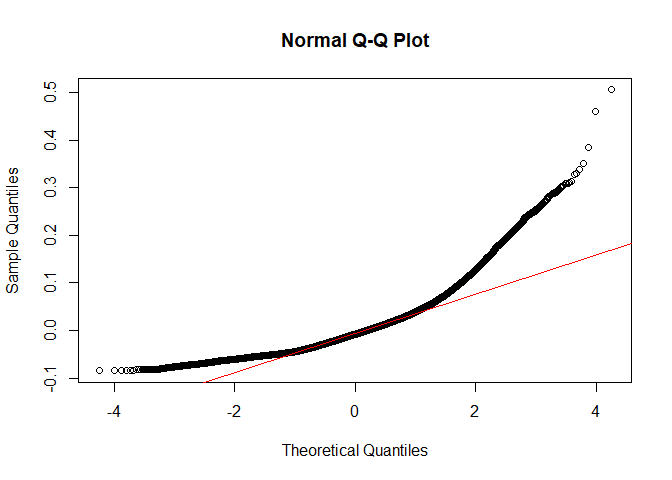
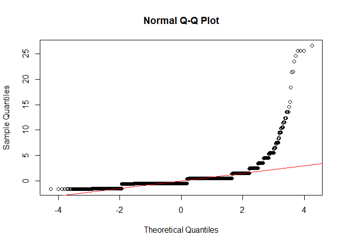
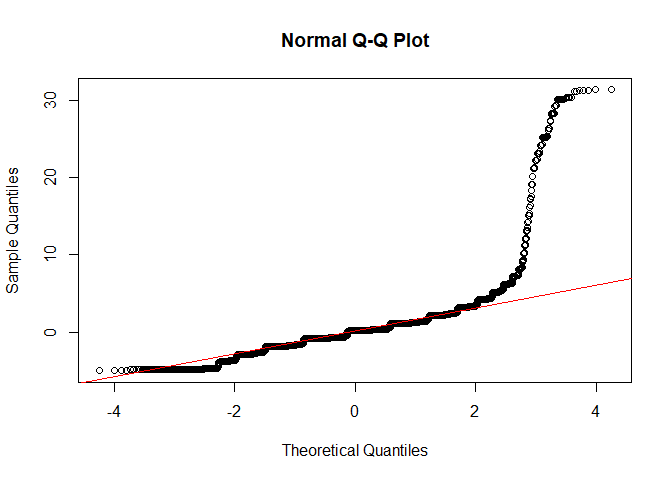

Sentiment Analysis
================
Alina Hagen, Sherman LaCost
2025-07-29

## Data and Text Mining Final Project: Maximizing Success on YouTube’s Trending Page: Content Optimization Strategies Based on Analysis of the Top 200 Videos Over the Last Four Years

**Topic:** Success Factors on YouTube Trending Videos

**Question:** What are common trends among the top trending YouTube
videos in the US, and how do different factors impact their success on
the trending page?

**Goal:** To analyze data from each day’s top 200 trending YouTube
videos from August 2020 to April 2024 and identify success factors among
the most successful videos in the U.S. This analysis will evaluate a
video’s success on the trending page based on the following success
metrics:

- *Engagement Ratio:* The total audience interaction (sum of comments,
  likes, and dislikes) relative to the view count as recorded on the
  final day the video appears on the trending list (representing the
  highest engagement level captured in the dataset)

- *Trending Speed:* How long a video took to reach the trending page

- *Trending Retention:* How long a video remains on the trending page

------------------------------------------------------------------------

## Libraries

``` r
# Libraries / Packages
library(arules)
library(dplyr)
library(ggplot2)
library(ggrepel)
library(grid)
library(gridExtra)
library(jsonlite)
library(kableExtra)
library(knitr)
library(lubridate)
library(purrr)
library(reshape2)
library(stringr)
library(syuzhet)
library(textdata)
library(tidytext)
library(tidyverse)
library(readr)
```

``` r
yt_new <- read_csv("data/cleaned_youtube_data.csv")
```

    ## Rows: 268704 Columns: 14
    ## ── Column specification ────────────────────────────────────────────────────────
    ## Delimiter: ","
    ## chr  (6): video_id, title, channel_title, category_name, description, tags
    ## dbl  (6): views, likes, dislikes, comments, comments_disabled, ratings_disabled
    ## dttm (2): date_published, date_trending
    ## 
    ## ℹ Use `spec()` to retrieve the full column specification for this data.
    ## ℹ Specify the column types or set `show_col_types = FALSE` to quiet this message.

``` r
unique_video_data <- read_csv("data/unique_video_data.csv")
```

    ## Rows: 47124 Columns: 18
    ## ── Column specification ────────────────────────────────────────────────────────
    ## Delimiter: ","
    ## chr  (6): video_id, title, channel_title, category_name, description, tags
    ## dbl  (9): max_views, max_likes, max_dislikes, max_comments, days_until_trend...
    ## dttm (3): date_published, first_date_trending, last_date_trending
    ## 
    ## ℹ Use `spec()` to retrieve the full column specification for this data.
    ## ℹ Specify the column types or set `show_col_types = FALSE` to quiet this message.

## Section 2.1: Sentiment Analysis

Due to data constraints, we used the video description to determine a
video’s overall sentiment. While this method provided valuable insights
into how a video’s sentiment impacts video success, it is a limitation,
as video descriptions may not full repersent the overall emotional tone
of the entire video.

------------------------------------------------------------------------

What are the average success metrics depending on video’s dominant
sentiments?

``` r
yt_new_description <- tibble(text = str_to_lower(unique_video_data$description)) 

#replace NA
yt_new_description[is.na(yt_new_description)] <- ""

#find the emotions based on description
emotions <- get_nrc_sentiment(yt_new_description$text)#find the emotions per entry

yt_new_description <- cbind(yt_new_description, emotions) #merges emotions table with description dataframe

# Summarize the number of items (count) per emotion column
emo_sum <- emotions %>%
  summarise(across(everything(), sum, na.rm = TRUE)) %>%
  pivot_longer(everything(), names_to = "emotion", values_to = "count")

yt_new_description <- cbind(unique_video_data, yt_new_description) 
yt_new_description <- yt_new_description[,-5] # Delete the original Description column
```

``` r
# Calculate average success metrics by dominant sentiment
yt_new_description$dominant_sentiment <- apply(emotions, 1, function(x) {
  max_value <- max(x)
  if (max_value == 0) {
    return("no sentiment/\nno description")
  } else {
    return(names(x)[which.max(x)])
  }
})

average_description_sentiment <- yt_new_description %>%
  group_by(dominant_sentiment) %>%
  summarise(
    total_videos = n(),
    avg_trending_speed = round(mean(days_until_trending),2),
    avg_trending_retention = round(mean(trending_retention),2),
    avg_engagement_ratio = round(mean(engagement_ratio), 3)
  ) %>%
  arrange(desc(total_videos))

#Count of Emotional Elements in Video Descriptions
ggplot(emo_sum, aes(x = reorder(emotion, -count), y = count)) +
  geom_bar(stat = 'identity', fill = "steelblue") +
  labs(title = "Count of Emotional Elements in Video Descriptions", x = "Sentiment", y = "Count")
```

<!-- -->

``` r
#Distribution of Dominant Sentiments across Trending Videos 
ggplot(average_description_sentiment, aes(x = reorder(dominant_sentiment, -total_videos), y = total_videos)) +
  geom_bar(stat = 'identity', fill = "steelblue") +
  labs(title = "Distribution of Dominant Sentiments in Trending Videos", x = "Sentiment", y = "Count")
```

<!-- -->

``` r
# Average views by dominant sentiment
ggplot(average_description_sentiment, aes(x = reorder(dominant_sentiment, -avg_trending_speed), y = avg_trending_speed)) +
  geom_bar(stat = 'identity', fill = "steelblue") +
  labs(title = "Average Trending Speed by Dominant Sentiment", x = "Sentiment", y = "Trending Speed (Days)")
```

<!-- -->

``` r
# Average likes by dominant sentiment
ggplot(average_description_sentiment, aes(x = reorder(dominant_sentiment, -avg_trending_retention), y = avg_trending_retention)) +
  geom_bar(stat = 'identity', fill = "steelblue") +
  labs(title = "Average Trending Retention by Dominant Sentiment", x = "Sentiment", y = "Trending TRetention (Days)")
```

<!-- -->

``` r
# Average comments by dominant sentiment
ggplot(average_description_sentiment, aes(x = reorder(dominant_sentiment, -avg_engagement_ratio), y = avg_engagement_ratio)) +
  geom_bar(stat = 'identity', fill = "steelblue") +
  labs(title = "Average Engagement Ratio by Dominant Sentiment", x = "Sentiment", y = "Engagement Ration ( (likes + comments) / views)")
```

<!-- -->

<table class="table table-striped table-hover table-condensed" style="color: black; width: auto !important; margin-left: auto; margin-right: auto;">

<caption>

Dominant Sentiment Average Success Metrics
</caption>

<thead>

<tr>

<th style="text-align:left;font-weight: bold;background-color: rgba(245, 245, 245, 255) !important;">

dominant_sentiment
</th>

<th style="text-align:right;font-weight: bold;background-color: rgba(245, 245, 245, 255) !important;">

total_videos
</th>

<th style="text-align:right;font-weight: bold;background-color: rgba(245, 245, 245, 255) !important;">

avg_trending_speed
</th>

<th style="text-align:right;font-weight: bold;background-color: rgba(245, 245, 245, 255) !important;">

avg_trending_retention
</th>

<th style="text-align:right;font-weight: bold;background-color: rgba(245, 245, 245, 255) !important;">

avg_engagement_ratio
</th>

</tr>

</thead>

<tbody>

<tr>

<td style="text-align:left;width: 3cm; font-weight: bold;">

positive
</td>

<td style="text-align:right;width: 2cm; ">

21246
</td>

<td style="text-align:right;width: 2cm; ">

1.46
</td>

<td style="text-align:right;width: 2cm; ">

5.85
</td>

<td style="text-align:right;">

0.064
</td>

</tr>

<tr>

<td style="text-align:left;width: 3cm; font-weight: bold;">

anticipation
</td>

<td style="text-align:right;width: 2cm; ">

8430
</td>

<td style="text-align:right;width: 2cm; ">

1.48
</td>

<td style="text-align:right;width: 2cm; ">

5.66
</td>

<td style="text-align:right;">

0.062
</td>

</tr>

<tr>

<td style="text-align:left;width: 3cm; font-weight: bold;">

negative
</td>

<td style="text-align:right;width: 2cm; ">

4803
</td>

<td style="text-align:right;width: 2cm; ">

1.51
</td>

<td style="text-align:right;width: 2cm; ">

5.74
</td>

<td style="text-align:right;">

0.069
</td>

</tr>

<tr>

<td style="text-align:left;width: 3cm; font-weight: bold;">

trust
</td>

<td style="text-align:right;width: 2cm; ">

3401
</td>

<td style="text-align:right;width: 2cm; ">

1.46
</td>

<td style="text-align:right;width: 2cm; ">

5.71
</td>

<td style="text-align:right;">

0.069
</td>

</tr>

<tr>

<td style="text-align:left;width: 3cm; font-weight: bold;">

no sentiment/ no description
</td>

<td style="text-align:right;width: 2cm; ">

        284

</tbody>

</table>

    ## 
    ## **Dominant Sentiments and Success Metrics**
    ##  The bar charts presented help visualize the distribution of dominant sentiments across all videos in this dataset (N = 47,124 unique videos), as well as the average success metrics across different dominant sentiments. One of the most surprising observations was the apparent uniformity across sentiments in terms of trending success. 
    ##  Initially, it was hypothesized that videos with more negative or anger-driven sentiments would stand out, resulting in longer trending retention, quicker trending times, or, at the very least, more engagement. This hypothesis was grounded in the common phenomenon of 'rage-bait' videos—those designed to provoke strong emotional reactions and drive more interactions through upsetting or controversial topics. These videos often capitalize on emotional engagement to boost their traction. 
    ##  However, as shown in the data, no substantial differences were found between the dominant sentiment expressed in the video description and the video's actual performance on the trending page. This finding challenges the assumption that videos with certain emotional tones would inherently perform better or worse. In the next section, we will statistically test these trends to confirm whether the metrics are as similar as they appear. Nevertheless, the lack of a clear relationship between sentiment and success was unexpected and intriguing.

## Section 2.2: Dominant Sentiment Correlation with Success

Do video sentiments have a statistically significant impact on success
metrics? (T-Test / ANOVA hypothesis test)

    ## 
    ## **ANOVA Hypothese:**
    ##  Null Hypothesis (H0): There is no significane difference in success metrics between dominant sentiments.
    ## Alternative Hypothesis (H1): There is significane difference in success metrics between dominant sentiments.

``` r
#Engagement Ratio ANOVA
engage_aov <- aov(engagement_ratio ~ dominant_sentiment, data = yt_new_description)
summary(engage_aov)
```

    ##                       Df Sum Sq Mean Sq F value Pr(>F)    
    ## dominant_sentiment    10   1.93 0.19286   85.17 <2e-16 ***
    ## Residuals          47113 106.69 0.00226                   
    ## ---
    ## Signif. codes:  0 '***' 0.001 '**' 0.01 '*' 0.05 '.' 0.1 ' ' 1

``` r
# Get residuals from the ANOVA model
residuals <- residuals(engage_aov)
# Q-Q plot to check normality visually
qqnorm(residuals)
qqline(residuals, col = "red")
```

<!-- -->

``` r
#Trending Speed ANOVA
speed_aov <- aov(days_until_trending ~ dominant_sentiment, data = yt_new_description)
summary(speed_aov)
```

    ##                       Df Sum Sq Mean Sq F value   Pr(>F)    
    ## dominant_sentiment    10     68   6.842   9.571 4.09e-16 ***
    ## Residuals          47113  33678   0.715                     
    ## ---
    ## Signif. codes:  0 '***' 0.001 '**' 0.01 '*' 0.05 '.' 0.1 ' ' 1

``` r
# Get residuals from the ANOVA model
residuals <- residuals(speed_aov)
# Q-Q plot to check normality visually
qqnorm(residuals)
qqline(residuals, col = "red")
```

<!-- -->

``` r
#Trending Retention ANOVA
retention_aov <- aov(trending_retention ~ dominant_sentiment, data = yt_new_description)
summary(retention_aov)
```

    ##                       Df Sum Sq Mean Sq F value Pr(>F)    
    ## dominant_sentiment    10    662   66.23   16.71 <2e-16 ***
    ## Residuals          47113 186710    3.96                   
    ## ---
    ## Signif. codes:  0 '***' 0.001 '**' 0.01 '*' 0.05 '.' 0.1 ' ' 1

``` r
# Get residuals from the ANOVA model
residuals <- residuals(retention_aov)
# Q-Q plot to check normality visually
qqnorm(residuals)
qqline(residuals, col = "red")
```

<!-- -->

    ## **ANOVA Results:**
    ## 
    ## While the ANOVA results suggest that dominant sentiments in a video's written description might have a statistically significant impact on success metrics, the Quantile-Quantile (Q-Q) plot shows that the residuals don’t follow a normal distribution. This means that the normality assumption for ANOVA is violated, which makes the results less reliable. It’s possible that the significance we found is due to this assumption being violated, which could lead to a higher chance of false positives (Type I error). Because of this, we can’t confidently comment on how the dominant sentiments in a video's written description impact success metrics based on the ANOVA results alone, and we can’t draw a clear conclusion within the scope of this project.
    ## 
    ## 
    ## To get more reliable results in the future, other methods could be used. For example, we could try machine learning tools like Large Language Models (LLMs) to analyze sentiments in more detail or use generalized linear models (GLMs), which don’t require normality. Non-parametric tests like the Kruskal-Wallis test could also help since they don’t rely on the same assumptions. Additionally, advanced natural language processing (NLP) techniques, like topic modeling or multi-dimensional sentiment analysis, could give us a deeper understanding of how sentiment might relate to success metrics. Exploring these tools in a future project could lead to stronger and more reliable findings.
    ## 
    ## 
    ## That being said, while we cannot comment on Dominant Sentiment's impact on success metrics, we can offer some insights into most common sentiments across both trendings videos as a whole and within each channel category

## Section 2.3: Dominant Sentiment Frequency

Are trending videos more commonly positive, negative, or associated with
other emotions?

``` r
video_sentiment_counts <- yt_new_description %>%
  group_by(dominant_sentiment) %>%
  summarise(
    video_count = n()
  )%>%
  arrange(desc(video_count)) %>%
  slice_max(order_by = video_count, n = 5)
```

<table class="table table-striped table-hover table-condensed" style="color: black; width: auto !important; margin-left: auto; margin-right: auto;">

<caption>

Dominant Sentiment Seen on the Trending Page
</caption>

<thead>

<tr>

<th style="text-align:left;font-weight: bold;background-color: rgba(245, 245, 245, 255) !important;">

dominant_sentiment
</th>

<th style="text-align:right;font-weight: bold;background-color: rgba(245, 245, 245, 255) !important;">

video_count
</th>

</tr>

</thead>

<tbody>

<tr>

<td style="text-align:left;width: 3cm; font-weight: bold;">

positive
</td>

<td style="text-align:right;width: 2cm; ">

21246
</td>

</tr>

<tr>

<td style="text-align:left;width: 3cm; font-weight: bold;">

anticipation
</td>

<td style="text-align:right;width: 2cm; ">

8430
</td>

</tr>

<tr>

<td style="text-align:left;width: 3cm; font-weight: bold;">

negative
</td>

<td style="text-align:right;width: 2cm; ">

4803
</td>

</tr>

<tr>

<td style="text-align:left;width: 3cm; font-weight: bold;">

trust
</td>

<td style="text-align:right;width: 2cm; ">

3401
</td>

</tr>

<tr>

<td style="text-align:left;width: 3cm; font-weight: bold;">

no sentiment/ no description
</td>

<td style="text-align:right;width: 2cm; ">

       284

</tbody>

</table>

    ## The top 5 most common sentiments expressed in video descriptions in this dataset were positive, anticipation, negavtive, trust, and no sentiment/no

## Section 2.4: Dominant Sentiment per Channel Category

Do trending videos in certain channel categories lean to specific
sentiments?

``` r
category_sentiment_counts <- yt_new_description %>%
  group_by(category_name, dominant_sentiment) %>%
  summarise(
    video_count = n()
  )%>%
  slice_max(order_by = video_count, n = 2) %>%
  arrange(category_name, desc(video_count)) 
```

    ## `summarise()` has grouped output by 'category_name'. You can override using the
    ## `.groups` argument.

<table class="table table-striped table-hover table-condensed" style="color: black; width: auto !important; margin-left: auto; margin-right: auto;">

<caption>

Top 2 Dominant Sentiments per Channel Cateogry
</caption>

<thead>

<tr>

<th style="text-align:left;font-weight: bold;background-color: rgba(245, 245, 245, 255) !important;">

category_name
</th>

<th style="text-align:left;font-weight: bold;background-color: rgba(245, 245, 245, 255) !important;">

dominant_sentiment
</th>

<th style="text-align:right;font-weight: bold;background-color: rgba(245, 245, 245, 255) !important;">

video_count
</th>

</tr>

</thead>

<tbody>

<tr>

<td style="text-align:left;width: 3cm; font-weight: bold;">

Autos & Vehicles
</td>

<td style="text-align:left;width: 2cm; ">

positive
</td>

<td style="text-align:right;width: 2cm; ">

518
</td>

</tr>

<tr>

<td style="text-align:left;width: 3cm; font-weight: bold;">

Autos & Vehicles
</td>

<td style="text-align:left;width: 2cm; ">

anticipation
</td>

<td style="text-align:right;width: 2cm; ">

154
</td>

</tr>

<tr>

<td style="text-align:left;width: 3cm; font-weight: bold;">

Comedy
</td>

<td style="text-align:left;width: 2cm; ">

positive
</td>

<td style="text-align:right;width: 2cm; ">

905
</td>

</tr>

<tr>

<td style="text-align:left;width: 3cm; font-weight: bold;">

Comedy
</td>

<td style="text-align:left;width: 2cm; ">

anticipation
</td>

<td style="text-align:right;width: 2cm; ">

392
</td>

</tr>

<tr>

<td style="text-align:left;width: 3cm; font-weight: bold;">

Education
</td>

<td style="text-align:left;width: 2cm; ">

positive
</td>

<td style="text-align:right;width: 2cm; ">

775
</td>

</tr>

<tr>

<td style="text-align:left;width: 3cm; font-weight: bold;">

Education
</td>

<td style="text-align:left;width: 2cm; ">

anticipation
</td>

<td style="text-align:right;width: 2cm; ">

93
</td>

</tr>

<tr>

<td style="text-align:left;width: 3cm; font-weight: bold;">

Entertainment
</td>

<td style="text-align:left;width: 2cm; ">

positive
</td>

<td style="text-align:right;width: 2cm; ">

4421
</td>

</tr>

<tr>

<td style="text-align:left;width: 3cm; font-weight: bold;">

Entertainment
</td>

<td style="text-align:left;width: 2cm; ">

anticipation
</td>

<td style="text-align:right;width: 2cm; ">

1766
</td>

</tr>

<tr>

<td style="text-align:left;width: 3cm; font-weight: bold;">

Film & Animation
</td>

<td style="text-align:left;width: 2cm; ">

positive
</td>

<td style="text-align:right;width: 2cm; ">

942
</td>

</tr>

<tr>

<td style="text-align:left;width: 3cm; font-weight: bold;">

Film & Animation
</td>

<td style="text-align:left;width: 2cm; ">

anticipation
</td>

<td style="text-align:right;width: 2cm; ">

308
</td>

</tr>

<tr>

<td style="text-align:left;width: 3cm; font-weight: bold;">

Gaming
</td>

<td style="text-align:left;width: 2cm; ">

positive
</td>

<td style="text-align:right;width: 2cm; ">

3890
</td>

</tr>

<tr>

<td style="text-align:left;width: 3cm; font-weight: bold;">

Gaming
</td>

<td style="text-align:left;width: 2cm; ">

negative
</td>

<td style="text-align:right;width: 2cm; ">

1996
</td>

</tr>

<tr>

<td style="text-align:left;width: 3cm; font-weight: bold;">

Howto & Style
</td>

<td style="text-align:left;width: 2cm; ">

positive
</td>

<td style="text-align:right;width: 2cm; ">

806
</td>

</tr>

<tr>

<td style="text-align:left;width: 3cm; font-weight: bold;">

Howto & Style
</td>

<td style="text-align:left;width: 2cm; ">

anticipation
</td>

<td style="text-align:right;width: 2cm; ">

201
</td>

</tr>

<tr>

<td style="text-align:left;width: 3cm; font-weight: bold;">

Music
</td>

<td style="text-align:left;width: 2cm; ">

positive
</td>

<td style="text-align:right;width: 2cm; ">

2924
</td>

</tr>

<tr>

<td style="text-align:left;width: 3cm; font-weight: bold;">

Music
</td>

<td style="text-align:left;width: 2cm; ">

joy
</td>

<td style="text-align:right;width: 2cm; ">

1044
</td>

</tr>

<tr>

<td style="text-align:left;width: 3cm; font-weight: bold;">

News & Politics
</td>

<td style="text-align:left;width: 2cm; ">

positive
</td>

<td style="text-align:right;width: 2cm; ">

637
</td>

</tr>

<tr>

<td style="text-align:left;width: 3cm; font-weight: bold;">

News & Politics
</td>

<td style="text-align:left;width: 2cm; ">

anticipation
</td>

<td style="text-align:right;width: 2cm; ">

270
</td>

</tr>

<tr>

<td style="text-align:left;width: 3cm; font-weight: bold;">

Nonprofits & Activism
</td>

<td style="text-align:left;width: 2cm; ">

positive
</td>

<td style="text-align:right;width: 2cm; ">

15
</td>

</tr>

<tr>

<td style="text-align:left;width: 3cm; font-weight: bold;">

Nonprofits & Activism
</td>

<td style="text-align:left;width: 2cm; ">

anticipation
</td>

<td style="text-align:right;width: 2cm; ">

2
</td>

</tr>

<tr>

<td style="text-align:left;width: 3cm; font-weight: bold;">

People & Blogs
</td>

<td style="text-align:left;width: 2cm; ">

positive
</td>

<td style="text-align:right;width: 2cm; ">

1515
</td>

</tr>

<tr>

<td style="text-align:left;width: 3cm; font-weight: bold;">

People & Blogs
</td>

<td style="text-align:left;width: 2cm; ">

anticipation
</td>

<td style="text-align:right;width: 2cm; ">

813
</td>

</tr>

<tr>

<td style="text-align:left;width: 3cm; font-weight: bold;">

Pets & Animals
</td>

<td style="text-align:left;width: 2cm; ">

positive
</td>

<td style="text-align:right;width: 2cm; ">

119
</td>

</tr>

<tr>

<td style="text-align:left;width: 3cm; font-weight: bold;">

Pets & Animals
</td>

<td style="text-align:left;width: 2cm; ">

anticipation
</td>

<td style="text-align:right;width: 2cm; ">

29
</td>

</tr>

<tr>

<td style="text-align:left;width: 3cm; font-weight: bold;">

Science & Technology
</td>

<td style="text-align:left;width: 2cm; ">

positive
</td>

<td style="text-align:right;width: 2cm; ">

966
</td>

</tr>

<tr>

<td style="text-align:left;width: 3cm; font-weight: bold;">

Science & Technology
</td>

<td style="text-align:left;width: 2cm; ">

anticipation
</td>

<td style="text-align:right;width: 2cm; ">

186
</td>

</tr>

<tr>

<td style="text-align:left;width: 3cm; font-weight: bold;">

Sports
</td>

<td style="text-align:left;width: 2cm; ">

positive
</td>

<td style="text-align:right;width: 2cm; ">

2594
</td>

</tr>

<tr>

<td style="text-align:left;width: 3cm; font-weight: bold;">

Sports
</td>

<td style="text-align:left;width: 2cm; ">

anticipation
</td>

<td style="text-align:right;width: 2cm; ">

1779
</td>

</tr>

<tr>

<td style="text-align:left;width: 3cm; font-weight: bold;">

Travel & Events
</td>

<td style="text-align:left;width: 2cm; ">

positive
</td>

<td style="text-align:right;width: 2cm; ">

219
</td>

</tr>

<tr>

<td style="text-align:left;width: 3cm; font-weight: bold;">

Travel & Events
</td>

<td style="text-align:left;width: 2cm; ">

anticipation
</td>

<td style="text-align:right;width: 2cm; ">

29
</td>

</tr>

</tbody>

</table>

    ## Suprisingly, all 15 categories of channels had the most prominent sentiment be positivity. After positive sentiments, the next most common sentiments expressed where anticipation (Autos & Vehicles, Comedy, Education, Entertainment, Film & Animation, Howto & Style, News & Politics, Nonprofits & Activism, People & Blogs, Pets & Animals, Science & Technology, Sports, Travel & Events), Negative (Gaming), and Joy (Music)

## Section 2.5: Sentiment Analysis Conclusions

What are the overall sentiments of each Unique Video in the dataset?
(Add Output to Unique.Video_DF) What are the conclusions from the
Sentiment Analysis?

``` r
# Add Overall Video Sentiment to Unique.video_df
unique_video_data$dominant_sentiment <- yt_new_description$dominant_sentiment
```

    ## The analysis of dominant sentiments of YouTube videos revealed no significant relationship between sentiment and trending success, contrary to initial expectations. While the ANOVA results suggested significance of sentiment impact on success metrics, violations of the normality assumption raised concerns about the reliability of these findings. Despite hypotheses suggesting that negative or anger-driven sentiments might lead to longer trending times or higher engagement, the data showed uniformity across sentiment types, indicating that sentiment may not drastically affect a video's performance once it reaches the trending page.
    ##  
    ## However, the statistics did indicate that positively focused content made up the vast majority of videos, accounting for just under half of all videos that reached the US trending page between August 2020 and April 2024 (21,246 out of 47,124 videos). This suggests that videos with more positive subject matter are more likely to make it to the trending page. Once a video is trending, however, the dominant sentiment appears to have questionable impact on its ongoing success that would require more sophisticated machine learning techniques to uncover. For now, we will conclude that dominant sentiment has little effect on the success metrics of trending videos.
    ##  
    ## Based on our analysis, we recommend that our clients do not focus on tailoring content to specific emotional tones in an attempt to improve success. Our findings show that the dominant sentiment expressed in a video does not have a significant impact on its ability to trend or achieve higher success metrics. Therefore, creators should prioritize other factors, such as content quality and community engagement, rather than trying to cater to particular emotional themes.
